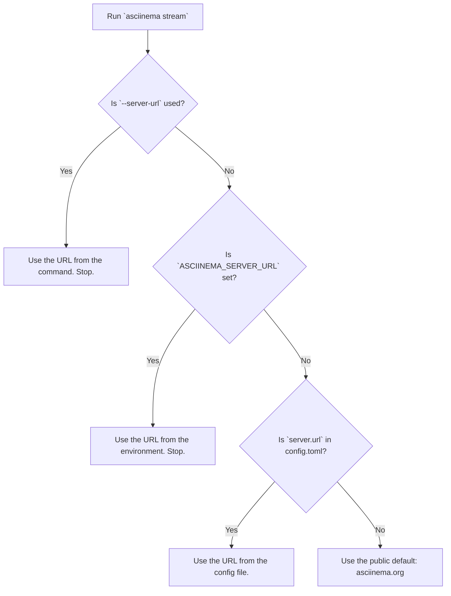

# Chapter 5: Configuration System

In [Chapter 4: Live Terminal Streaming](04_live_terminal_streaming_.md), we explored how to broadcast our terminal sessions to the world, using the public `asciinema.org` server as a relay. This is fantastic for public demos, but what if you want to use `asciinema` in a private or corporate environment? What if you want to change other default behaviors?

You don't need to change the code to do this. `asciinema` has a powerful and flexible **Configuration System** that lets you customize it to your exact needs.

### Your Personal Settings Panel

Think of the configuration system as the "Settings" or "Preferences" panel for `asciinema`. In a graphical application, you might click a gear icon to change the theme or set your default save location. Since `asciinema` is a command-line tool, its settings panel is managed through text files and special variables.

This allows you to control things like:
*   Which server to upload or stream to by default.
*   Whether to automatically capture your terminal's color theme.
*   Default commands to run when you start recording.

Let's work through a common use case: **setting up a private, self-hosted `asciinema` server as your default.**

### The Three Levels of Configuration

`asciinema` has a clever system for managing settings that gives you total control. It looks for configuration in three places, in a specific order of priority.

1.  **Command-Line Options:** The highest priority. These are temporary settings that apply to a *single command* only.
2.  **Environment Variables:** The middle priority. These settings apply to your *current terminal session*.
3.  **Configuration File:** The lowest priority. These are your *permanent, default* settings that apply every time you run `asciinema`.

Let's see how each level helps us solve our goal of using a private server located at `http://internal.corp.net`.

#### Level 1: Command-Line Options (The Quick Override)

If you just want to stream to your internal server *one time*, you can use the `--server-url` option directly on the command line.

```sh
asciinema stream --server-url http://internal.corp.net
```

This tells `asciinema` to ignore all other settings and use this specific URL for this one stream. It's perfect for a quick test or a one-off task.

#### Level 2: Environment Variables (For This Session Only)

Imagine you're working on a project that requires you to stream and upload several recordings to the internal server. Specifying `--server-url` every time would be tedious. Instead, you can set an environment variable for your terminal session.

The environment variable for the server URL is `ASCIINEMA_SERVER_URL`.

```sh
export ASCIINEMA_SERVER_URL="http://internal.corp.net"
```

Now, for as long as this terminal window is open, any `asciinema` command will automatically use your internal server.

```sh
# This will now stream to http://internal.corp.net
asciinema stream

# This will also try to upload to http://internal.corp.net
asciinema upload my_recording.cast
```

This is great for project-specific settings. Once you close the terminal, the setting is gone.

#### Level 3: The Configuration File (Set It and Forget It)

If you *always* want to use your internal server as the default, the best place to set this is in the main configuration file. This file is your permanent settings panel.

The file is located at `~/.config/asciinema/config.toml`. It uses a simple format called TOML, which is designed to be easy for humans to read.

Let's edit this file to set our server URL. If the file or directories don't exist, you can create them.

```sh
# Create the directory if it doesn't exist
mkdir -p ~/.config/asciinema/

# Open the config file in a text editor
nano ~/.config/asciinema/config.toml
```

Now, add the following lines to the file:

```toml
# This section is for all server-related settings
[server]

# Set the default URL for streaming and uploading
url = "http://internal.corp.net"
```

Save the file and exit the editor. That's it! From now on, every time you run `asciinema stream` or `asciinema upload` from *any* terminal, it will use your internal server by default. This is the most convenient way to set your personal preferences.

### How `asciinema` Decides Which Setting to Use

The hierarchy is the key. When you run a command, `asciinema` asks a series of questions to find the right setting.

Let's follow the logic for our server URL example:



This "override system" gives you the perfect balance of permanent defaults and temporary flexibility. Your config file holds your base settings, environment variables can override them for a specific project, and command-line options can override everything for a single command.

### Other Useful Settings

The `config.toml` file can hold many other settings. Here’s a slightly more detailed example:

```toml
# This section controls the 'rec' command
[record]

# Automatically capture the terminal's theme
theme = true

# This section controls the 'play' command
[playback]

# Set the default playback speed to 2x
speed = 2.0

# This is our server setting from before
[server]
url = "http://internal.corp.net"
```

This configuration tells `asciinema` to always save your terminal's colors, play recordings at double speed by default, and use your internal server.

### Conclusion

In this chapter, you've learned how to become the master of your `asciinema` environment. You discovered the three-tiered configuration system: **command-line options** for quick overrides, **environment variables** for session-specific settings, and the **config file** for your permanent defaults. By understanding this hierarchy, you can tweak and customize `asciinema` to perfectly fit any workflow, from public sharing to private corporate use.

We've now covered what `asciinema` does and how you can control it. But how is the tool itself built? What makes it so fast and reliable? In the next chapter, we'll look under the hood at its modern foundation: the [Rust-based Architecture](06_rust_based_architecture_.md).

---

Generated by [AI Codebase Knowledge Builder](https://github.com/The-Pocket/Tutorial-Codebase-Knowledge)