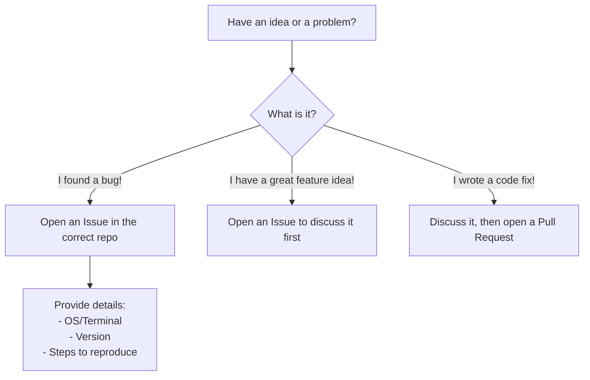

# Chapter 7: Community and Contribution Guidelines

In the previous chapter on [Rust-based Architecture](06_rust_based_architecture_.md), we explored the powerful and efficient engine that makes `asciinema` run. We've seen *what* the tool does, *how* you can control it, and *how* it's built. But a great engine is only part of the story. The most successful open-source projects are powered not just by code, but by people.

Welcome to the `asciinema` community! This final chapter is your guide to becoming a part of the team, whether you're reporting a tiny bug, suggesting a big idea, or writing code yourself.

### The Heart of the Project: The Community

`asciinema` isn't built by a faceless corporation; it's a passion project built by and for its users. This means that every feature, bug fix, and improvement comes from people like you who use the tool and want to make it better.

But for a community to work together effectively, everyone needs to be on the same page. We need a shared understanding of how to communicate respectfully and how to collaborate productively. This is where the community guidelines come in. They are the project's "rulebook," ensuring that working on `asciinema` is a positive and organized experience for everyone.

This "rulebook" is split into two important documents:
1.  **`CODE_OF_CONDUCT.md`**: The social rules for respectful interaction.
2.  **`CONTRIBUTING.md`**: The technical rules for submitting ideas and code.

Let's explore what they mean and how they help you.

### Part 1: The Code of Conduct (Our Social Contract)

Imagine a public park. The park has a few simple rules posted at the entrance: "Be kind to others," "Keep the space clean," "Share the equipment." These rules aren't there to restrict you; they're there to ensure that everyone can enjoy the park together in a safe and welcoming environment.

The `CODE_OF_CONDUCT.md` is `asciinema`'s version of these park rules. It's a pledge that everyone involved in the project—from the core maintainers to a first-time contributor—agrees to uphold.

Its main purpose is to foster an open and harassment-free community. It starts with a clear pledge:

```markdown
In the interest of fostering an open and welcoming environment, we as
contributors and maintainers pledge to making participation in our project and
our community a harassment-free experience for everyone...
```
This document sets the tone for all communication. It reminds us to be respectful, inclusive, and empathetic. It's the foundation of a healthy community and your assurance that you'll be treated with respect when you participate.

### Part 2: The Contribution Guidelines (Our Development Playbook)

Now, imagine you want to donate a new bench to the park. You can't just show up and install it anywhere. There's a process: you talk to the park manager, figure out the best location, and make sure the bench meets safety standards.

The `CONTRIBUTING.md` file is the `asciinema` project's process for accepting new "benches"—whether they are bug reports, feature ideas, or code changes. It provides a clear, step-by-step guide on how to contribute effectively. Following this guide makes life easier for everyone. Your ideas are seen by the right people, and the maintainers can review them efficiently.

Let's look at the most common ways to contribute.

#### Your Journey as a Contributor

Suppose you're using `asciinema` and you have an idea or run into a problem. What's the next step? The `CONTRIBUTING.md` file gives you a clear path.



1.  **Found a Bug?**
    The best way to help is to report it! The guidelines ask you to open an issue on GitHub and provide as much detail as possible.

    From `CONTRIBUTING.md`:
    ```markdown
    Tell us what's the problem and include steps to reproduce it (reliably).
    Including your OS/browser/terminal name and version in the report would be
    great.
    ```
    A good bug report is like a clear map that leads the developers directly to the problem.

2.  **Have a Feature Idea?**
    This is exciting! The first step, according to the guidelines, is to start a discussion by opening an issue. This is crucial because it allows everyone to talk about the idea before any code is written. It helps answer important questions like:
    *   Does this fit with the project's vision?
    *   Has someone already tried this?
    *   What's the best way to implement it?
    This initial discussion saves a lot of time and ensures your hard work won't go to waste.

3.  **Wrote Some Code?**
    If you've fixed a bug or implemented a new feature, that's fantastic! The process is to send a **Pull Request** (a formal proposal to add your code to the main project). The guidelines will ask you to make sure your changes pass all the automated checks and tests. This is like a quality inspection that ensures your new "bench" is safe and well-built.

### Conclusion: You Are Now Part of the Story

Congratulations! You've journeyed through the entire world of `asciinema`. You started as a beginner, learning to record your first session, and have now arrived at the door to the community.

You've learned:
*   How to record, play back, and stream sessions with `asciinema`.
*   The secrets of the lightweight [Asciicast File Format](02_asciicast_file_format_.md).
*   How to customize `asciinema` with its powerful [Configuration System](05_configuration_system_.md).
*   The modern, fast, and reliable [Rust-based Architecture](06_rust_based_architecture_.md) that powers it all.

And now, you understand the most important part: that `asciinema` is a living project shaped by its community. The **Code of Conduct** ensures it's a friendly place, and the **Contribution Guidelines** provide the map for you to leave your mark.

Whether you contribute code, report a bug, or just help someone in a discussion forum, you are now equipped to be a valuable member of the `asciinema` community. Go forth and share your terminal

---

Generated by [AI Codebase Knowledge Builder](https://github.com/The-Pocket/Tutorial-Codebase-Knowledge)