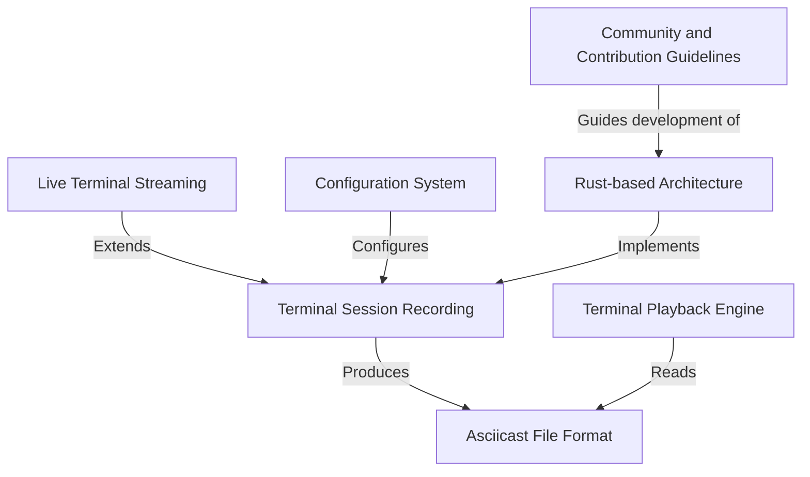

# Tutorial: asciinema

`asciinema` is a command-line tool that lets you **record** your terminal sessions and share them with others. Instead of creating heavy video files, it captures everything as lightweight, text-based *asciicast* files. These recordings can be perfectly replayed in a terminal or used for *live streaming* your command-line work in real-time. The modern version of the tool is built using **Rust** for high performance and reliability.

**Source Repository:** [None](None)

## Chapters

1. [Terminal Session Recording
](01_terminal_session_recording_.md)
2. [Asciicast File Format
](02_asciicast_file_format_.md)
3. [Terminal Playback Engine
](03_terminal_playback_engine_.md)
4. [Live Terminal Streaming
](04_live_terminal_streaming_.md)
5. [Configuration System
](05_configuration_system_.md)
6. [Rust-based Architecture
](06_rust_based_architecture_.md)
7. [Community and Contribution Guidelines
](07_community_and_contribution_guidelines_.md)

---

Generated by [AI Codebase Knowledge Builder](https://github.com/The-Pocket/Tutorial-Codebase-Knowledge)