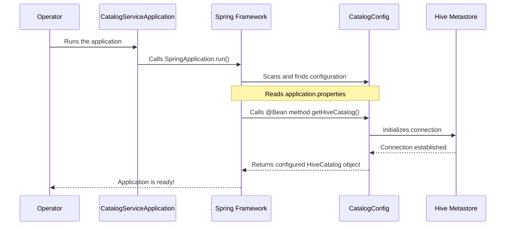

# Chapter 1: Application Entrypoint & Configuration

Welcome to the `rest_catalog` tutorial! If you've ever wondered how a complex service starts up, you're in the right place. In this first chapter, we'll explore the very beginning of the journey: how the application turns on and reads its instructions.

### The "Ignition" and the "Dashboard"

Imagine starting a car. You need two things: an ignition key to start the engine and a dashboard to know your destination, fuel level, and other settings.

*   **Application Entrypoint (`CatalogServiceApplication.java`):** This is our "ignition key". It's a single, simple class that contains the `main` method—the universal starting point for any Java application. Its only job is to kickstart the entire service.
*   **Configuration (`CatalogConfig.java`):** This is our "dashboard" or "control panel". Before the service can do anything useful, it needs to know where to find the Hive Metastore, what security rules to follow, and other vital settings. This class reads all those settings and prepares the necessary components.

Our main goal in this chapter is to understand how we start the `rest_catalog` service and tell it exactly how to connect to our data world.

### The Ignition Key: `CatalogServiceApplication`

Let's look at the file that starts everything. It's surprisingly simple!

**File:** `rest-catalog-service/src/main/java/org/apache/iceberg/CatalogServiceApplication.java`

```java
// This annotation is a shortcut that enables Spring Boot's magic
@SpringBootApplication
public class CatalogServiceApplication {

  // This is the main method, where the Java Virtual Machine (JVM)
  // starts executing our program.
  public static void main(String[] args) {
    SpringApplication.run(CatalogServiceApplication.class, args);
  }
}
```

This tiny class does a huge job:
*   `@SpringBootApplication`: This single annotation tells the Spring Boot framework to automatically configure everything it can, scan for other components (like our configuration class), and set up a web server. It's the "easy button" for starting a modern Java application.
*   `main(String[] args)`: This is the official entrypoint. When you run the application, this is the first piece of your code that gets executed.
*   `SpringApplication.run(...)`: This line hands control over to Spring Boot, which then starts the application, finds our "control panel" (`CatalogConfig`), and gets everything ready.

### The Control Panel: `CatalogConfig`

Once the engine is running, the application immediately looks at `CatalogConfig.java` to get its instructions. This class is responsible for reading settings from an external file and using them to build the core components the service needs to operate.

#### Reading Settings from a File

How does the application know the address of our Hive Metastore? Or the security credentials? It doesn't. We tell it by providing a configuration file (like `application.properties` or `application.yml`). The `CatalogConfig` class uses the `@Value` annotation to read these settings directly into Java variables.

Let's look at a small part of `CatalogConfig.java` to see this in action.

**File:** `rest-catalog-service/src/main/java/org/apache/iceberg/config/CatalogConfig.java`

```java
@Configuration // Marks this class as a source of configuration
public class CatalogConfig {

  // Reads the 'hms.config.warehouse' property from our config file
  @Value("${hms.config.warehouse}")
  private String warehouse;

  // Reads the 'isLocal' property to check if we're in development mode
  @Value("${isLocal}")
  private boolean isLocal;

  // Reads the location of our secure keytab file
  @Value("${kerberos.keytab}")
  private String keytab;
  
  // ... many other configuration values ...
}
```

This code connects our Java application to an external properties file. For example, our `application.properties` file might look like this:

```properties
# Is this a local development setup?
isLocal=true

# Where is the data warehouse located?
hms.config.warehouse=/tmp/warehouse

# (This would be empty in a local setup)
kerberos.keytab=
```

By using `@Value`, we separate our code from our configuration. This means we can run the *same* application in different environments (development, testing, production) just by changing the properties file, without ever touching the Java code!

#### Building the Core Components with `@Bean`

Now that we have the settings, we need to use them to create the actual tools the application will use. In Spring, these reusable objects are called "Beans". We define them in our configuration class using the `@Bean` annotation.

The most important bean we create is the `HiveCatalog`. This object is the bridge between our REST service and the Hive Metastore.

```java
// Inside CatalogConfig.java

@Bean // This method produces a "Bean" that Spring will manage
HiveCatalog getHiveCatalog() throws Exception {
  HiveCatalog hiveCatalog = new HiveCatalog();
  // ... setup logic happens here ...

  // We create a map of properties to initialize the catalog
  Map<String, String> propertyMap = new HashMap<>();

  if (isLocal) {
    propertyMap.put("uri", "thrift://localhost:9083");
    propertyMap.put("warehouse", warehouse); // Uses the value we read earlier
  } else {
    // ... logic for a non-local, secure environment ...
  }

  hiveCatalog.initialize("catalog-service", propertyMap);
  return hiveCatalog;
}
```
This method does a few key things:
1.  It's marked with `@Bean`, telling Spring: "Run this method and manage the `HiveCatalog` object it returns."
2.  It checks the `isLocal` flag we loaded from our properties file.
3.  Based on the environment, it assembles the right connection details.
4.  Finally, it creates and returns a fully configured `HiveCatalog` instance, ready to be used by other parts of the application.

We will dive much deeper into the `HiveCatalog` in the next chapter on [Hive Metastore (HMS) Integration](02_hive_metastore__hms__integration_.md).

### How It All Works Together: The Startup Sequence

Let's visualize the startup process from beginning to end.

1.  An operator runs the application (e.g., from the command line).
2.  The `main` method in `CatalogServiceApplication` is executed.
3.  `SpringApplication.run()` takes over and starts the Spring Boot framework.
4.  Spring scans the project and finds the `@Configuration` class, `CatalogConfig`.
5.  Spring reads the `application.properties` file and injects the values (like `hms.config.warehouse`) into the `CatalogConfig` object.
6.  Spring sees the `@Bean` methods, like `getHiveCatalog()`, and executes them.
7.  The `getHiveCatalog()` method uses the injected values to create and configure a connection to the Hive Metastore.
8.  Once all beans are created, the application is fully started and ready to accept API requests.

Here is a diagram of that flow:


### Diving Deeper: Secure Environments

In a real-world production environment, we can't just connect to the Hive Metastore; we need to do it securely. `CatalogConfig` also handles setting up Kerberos, which is a network authentication protocol that provides secure identity verification.

Think of Kerberos as a strict security guard for your data. You can't just walk in; you need to present a special ticket (a keytab) to prove you are who you say you are.

The configuration class has dedicated logic for this:

```java
// Inside getHiveCatalog() for a non-local environment...
if (!isLocal) {
  // ...
  setKerberosConfiguration(conf);
  UserGroupInformation.setConfiguration(conf);
  // ... more security setup ...
  UserGroupInformation.loginUserFromKeytab(serverPrincipal, keytab);
}
```
And the helper method:
```java
private void setKerberosConfiguration(org.apache.hadoop.conf.Configuration conf) {
    conf.set("hadoop.security.authentication", "kerberos");
    conf.set("kerberos.hive.server2.authentication", "kerberos");
}
```
This code configures the application to use Kerberos authentication, using the `keytab` location we provided in our properties file. This ensures that our service securely connects to the Hive Metastore. We'll explore security in much more detail in the chapters on [Request Authentication & Authorization](05_request_authentication___authorization_.md) and [Secure Data Access (ID Broker Client)](06_secure_data_access__id_broker_client__.md).

### Conclusion

In this chapter, we peeled back the first layer of the `rest_catalog` service. We learned that:
*   `CatalogServiceApplication` is the **ignition key** that starts the application using its simple `main` method.
*   `CatalogConfig` is the **control panel**, using `@Value` to read settings from property files and `@Bean` to build essential components.
*   The most critical component created is the `HiveCatalog`, which acts as the bridge to our data's metadata.

You now understand the fundamental startup and configuration process. With the service running and connected, we're ready to look more closely at its primary partner.

In the next chapter, we'll dive into the heart of the metadata system: the [Chapter 2: Hive Metastore (HMS) Integration](02_hive_metastore__hms__integration_.md).

---

Generated by [AI Codebase Knowledge Builder](https://github.com/The-Pocket/Tutorial-Codebase-Knowledge)