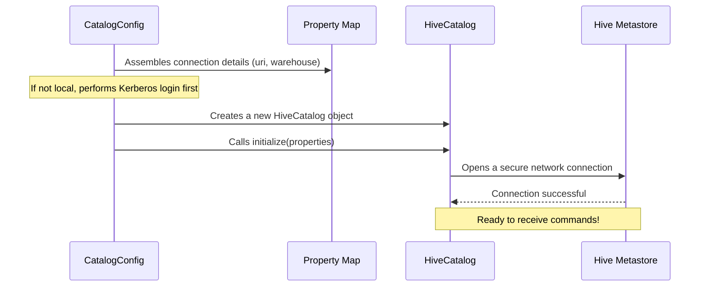

# Chapter 2: Hive Metastore (HMS) Integration

In our last chapter on [Application Entrypoint & Configuration](01_application_entrypoint___configuration_.md), we saw how the `CatalogConfig` class acts like a control panel, starting up the service and creating a critical object called `HiveCatalog`. We briefly described it as the "bridge" to our data's metadata.

Now, let's walk across that bridge. In this chapter, we'll explore what the Hive Metastore is and how our service establishes a secure and reliable connection to it.

### The Library of Your Data

Imagine your company's data is a massive library. The books, magazines, and documents on the shelves are your actual data files (like Parquet or ORC files).

But how do you find anything? You wouldn't just wander around aimlessly. You'd go to the front desk and ask the librarian, who would look up the book in a giant card catalog.

*   **The Hive Metastore (HMS)** is your data's **card catalog**. It doesn't hold the data itself, but it knows everything *about* the data: what databases exist, what tables are in them, what columns each table has, and most importantly, where on the shelves (your data lake storage) to find the actual files. It is the "source of truth" for your metadata.
*   The **`HiveCatalog` object** is our application's personal **librarian**. It's a special client that knows exactly how to speak the language of the Hive Metastore, how to present security credentials, and how to read and update the card catalog on behalf of our users.

Our goal is to understand how we "train" this librarian (`HiveCatalog`) to connect to the right library (HMS) and follow all the security rules. This setup happens once, right at the start, inside our `CatalogConfig` class.

### Training the Librarian: The `getHiveCatalog` Method

As we saw in Chapter 1, the `@Bean` method `getHiveCatalog()` in `CatalogConfig` is responsible for this entire setup process. Let's break down its job into a few simple steps.

#### Step 1: Create an empty `HiveCatalog` instance

The first step is simple: we create a new, unconfigured `HiveCatalog` object. Think of this as hiring a new librarian who has just walked in the door—they are ready to work but don't know anything about our specific library yet.

**File:** `rest-catalog-service/src/main/java/org/apache/iceberg/config/CatalogConfig.java`
```java
@Bean
HiveCatalog getHiveCatalog() throws Exception {
  logger.info("HiveCatalog configuration init");
  HiveCatalog hiveCatalog = new HiveCatalog();

  // More configuration will happen here...

  return hiveCatalog;
}
```
This is the starting point. We have our `hiveCatalog` object, but it's not useful yet.

#### Step 2: Assemble the Connection "Instructions"

Next, we need to give our librarian their instructions. Where is the library? What are the basic rules? We do this by creating a simple map of properties.

The `getHiveCatalogProperties` helper method handles this. It checks if we are in a simple `isLocal` development mode or a more complex production environment.

```java
// Inside CatalogConfig.java
private Map<String, String> getHiveCatalogProperties(...) {
  Map<String, String> propertyMap = new HashMap<>();

  if (isLocal) {
    // For local testing, we connect to a service on our own machine.
    propertyMap.put("uri", "thrift://localhost:9083");
    propertyMap.put("warehouse", warehouse); // The local data folder
  } else {
    // For production, we get these values from config files.
    propertyMap.put("uri", getThriftURI(conf.get("hive.zookeeper.quorum")));
    propertyMap.put("warehouse", conf.get("hive.metastore.warehouse.dir"));
  }
  return propertyMap;
}
```
This method creates a small instruction sheet with two key items:
*   `uri`: The network address of the Hive Metastore. This is like the library's phone number and address. The `thrift://` part specifies the communication protocol.
*   `warehouse`: The root directory in your data lake where all the data is stored. This is like telling the librarian where the main storage warehouse is located.

#### Step 3: The Secure Handshake (For Production)

In a real production environment, you can't just connect to the HMS. You need to prove your identity. This is where Kerberos comes in. Think of it as a high-tech security badge that our service must present.

The `CatalogConfig` class handles this security setup *before* attempting to connect.

```java
// Inside getHiveCatalog()
if (!isLocal) {
  // First, set the security rules.
  setKerberosConfiguration(conf);
  UserGroupInformation.setConfiguration(conf);
  
  // Now, use the keytab file (our secret password file) to log in.
  UserGroupInformation.loginUserFromKeytab(serverPrincipal, keytab);
}
```
This code block tells our application: "We are in a secure environment. Use the provided `keytab` file to get a valid security badge before you do anything else." This login process proves our service's identity to the rest of the network. We'll cover security in much more detail in the chapters on [Request Authentication & Authorization](05_request_authentication___authorization_.md) and [Secure Data Access (ID Broker Client)](06_secure_data_access__id_broker_client_.md).

### Under the Hood: The Initialization Flow

So, what does this process look like from a bird's-eye view? When the application starts, it follows a clear sequence to get the `HiveCatalog` ready.

1.  **Read Settings:** `CatalogConfig` reads all settings, including the HMS address and security details.
2.  **Assemble Properties:** It calls `getHiveCatalogProperties` to create the basic instruction map (`uri`, `warehouse`).
3.  **Secure Login (if needed):** If not in local mode, it performs the Kerberos login.
4.  **Initialize Catalog:** It passes all this configuration to the `HiveCatalog` object, which then establishes a live, authenticated connection to the Hive Metastore.

Here is a diagram of that flow:



### Step 4: Final Initialization

The last step is to give the `HiveCatalog` object all the configuration we've prepared and tell it to "initialize".

```java
// Inside getHiveCatalog()
try {
  // ... security setup happens here if !isLocal ...

  // Give the catalog all the detailed Hadoop configurations (including security)
  hiveCatalog.setConf(conf);
  
  // Give it the simple instruction map and tell it to connect!
  hiveCatalog.initialize("catalog-service", getHiveCatalogProperties(conf));
} catch (Exception e) {
    // ... handle errors ...
}
```
The `.initialize()` method is the magic moment. The `HiveCatalog` takes all the settings, uses the `uri` to find the Hive Metastore, presents its security credentials if needed, and establishes a persistent connection.

Our librarian is now fully trained and on duty at the front desk, ready to serve requests.

### Conclusion

In this chapter, we pulled back the curtain on the service's most important connection. We learned that:

*   The **Hive Metastore (HMS)** is the central "card catalog" for our data's metadata.
*   The **`HiveCatalog` object** is our "librarian"—a client that knows how to securely communicate with the HMS.
*   The `CatalogConfig` class is responsible for a critical startup sequence: creating the `HiveCatalog`, assembling its connection properties, and handling the secure Kerberos login for production environments.

With this connection established, our service is now ready to do useful work. But how do users from the outside world send requests to our librarian? That's where the API comes in.

In the next chapter, we'll build the front door to our service: the [Chapter 3: Catalog Service Endpoint](03_catalog_service_endpoint_.md).

---

Generated by [AI Codebase Knowledge Builder](https://github.com/The-Pocket/Tutorial-Codebase-Knowledge)