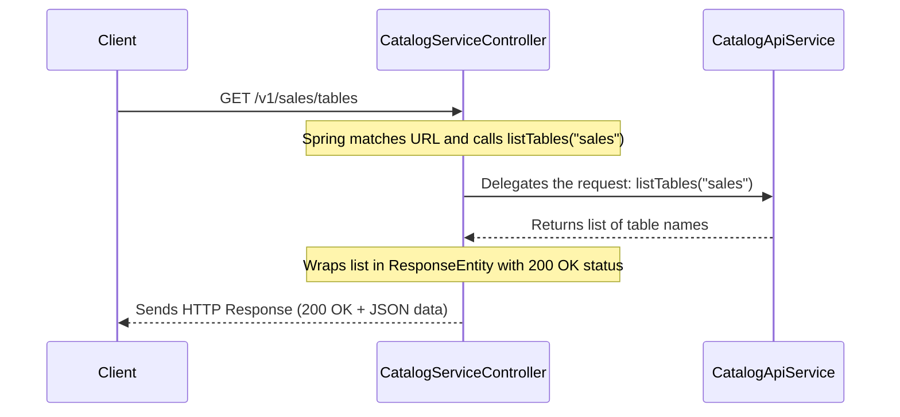

# Chapter 3: Catalog Service Endpoint

In the last chapter on [Hive Metastore (HMS) Integration](02_hive_metastore__hms__integration_.md), we successfully established a connection to our data's "card catalog". Our service now has a fully trained "librarian" (`HiveCatalog`) ready to look up metadata.

But how does a user actually *ask* the librarian a question? They can't walk directly into the server room. They need a public-facing front desk. This chapter is all about building that front desk: the REST API endpoint.

### The Front Desk of Our Service

Imagine our service is a large library. We have the librarian (`HiveCatalog`) in the back, ready to work. But we need a receptionist at the front door to greet visitors, understand what they want, and pass the request along.

*   **The Catalog Service Endpoint** is this **receptionist**. It's the public face of our entire service.
*   It listens for incoming phone calls (HTTP requests) at a specific number (the server address).
*   It understands a menu of specific requests based on the extension dialed (the URL, like `/v1/namespaces/{namespace}/tables`).
*   Its job is **not** to find the book itself, but to cleanly pass the request to the right internal expert (our business logic) who will then talk to the librarian.

This endpoint defines the entire public API—the set of all possible requests clients can make.

### A Simple Request: Listing Tables

Let's follow a common use case: a data analyst wants to see all the tables inside the `sales` database. Using a client tool, they would send a request that looks like this:

**HTTP Request:** `GET /v1/sales/tables`

Our goal is to understand how our service receives this simple request and directs it to the right place. The magic happens inside a special class called `CatalogServiceController`.

### The Receptionist's Rulebook: Spring Annotations

How does a Java class become a web endpoint? In the Spring Boot framework, we use special markers called **annotations**. Think of them as instructions we stick on our code.

Let's look at the file that defines our front desk.

**File:** `rest-catalog-service/src/main/java/org/apache/iceberg/controller/CatalogServiceController.java`

```java
// "This entire class is a receptionist for web requests."
@RestController
// "All requests handled by me must start with the '/v1' path."
@RequestMapping("/v1")
public class CatalogServiceController {
    // ... methods to handle specific requests go here ...
}
```

This code sets up the basic rules:
*   `@RestController`: This is the most important annotation. It tells Spring, "This class isn't for internal calculations. Its job is to listen for web traffic and respond."
*   `@RequestMapping("/v1")`: This sets a prefix for all URLs handled by this class. It's like telling the phone system that our receptionist only answers calls to extensions starting with `v1`. This is great for API versioning.

### Handling a Specific Request

Now, let's see how our controller handles the request to list tables in the `sales` namespace. Inside the `CatalogServiceController`, we have a method specifically for this.

```java
// Inside CatalogServiceController.java

@RequestMapping(
    method = RequestMethod.GET, // We are listening for GET requests
    value = "/namespaces/{namespace}/tables" // at this specific URL pattern
)
public @ResponseBody ResponseEntity<Object> listTables(
    @PathVariable("namespace") String namespace) {
  
    // 1. Delegate the work to the service layer
    Object result = this.catalogApiService.listTables(namespace);
    
    // 2. Package the answer into a formal HTTP response
    return new ResponseEntity<>(result, HttpStatus.OK);
}
```
*Don't worry about `try/catch` blocks for now; we've removed them for simplicity.*

Let's break down this receptionist's instructions:
1.  `@RequestMapping(...)`: This annotation says, "If a request is an HTTP `GET` and its URL matches the pattern `/namespaces/{something}/tables`, execute this method."
2.  `@PathVariable("namespace") String namespace`: This is the clever part. It tells Spring, "See that `{namespace}` placeholder in the URL? Grab whatever value is there (e.g., `"sales"`) and give it to me as a Java `String` variable named `namespace`."
3.  `catalogApiService.listTables(namespace)`: This is the most important step. The controller **does not** do the work itself. It immediately turns to its partner, the `catalogApiService`, and says, "Please list the tables for this namespace."
4.  `new ResponseEntity<>(...)`: Once the `catalogApiService` returns the answer, the controller wraps it up in a standard HTTP response package, including the data and a status code (`HttpStatus.OK` means `200 OK`, or "Everything went well!").

The controller acts as a clean, simple middleman. Its only jobs are to understand the request, delegate it, and format the response.

### How It Works: The Request-Response Flow

Let's visualize the entire journey of our analyst's request.

1.  **Client sends Request:** The analyst's tool sends a `GET` request to `http://our-service/v1/sales/tables`.
2.  **Web Server Receives:** The built-in web server in Spring Boot receives the request.
3.  **Spring Matches URL:** Spring looks at the URL `/v1/sales/tables` and finds the `listTables` method in `CatalogServiceController` is the perfect match.
4.  **Controller Method is Called:** Spring calls `listTables` and, thanks to `@PathVariable`, passes `"sales"` as the `namespace` argument.
5.  **Delegation:** The controller immediately calls the next layer, the `catalogApiService`, to do the actual work.
6.  **Response:** The service layer returns the list of tables. The controller packages this list into a `ResponseEntity` with a `200 OK` status and sends it back.
7.  **Client receives Response:** The analyst sees a list of tables.

Here is a diagram of that flow:



### More Than Just Getting Data

The controller handles all kinds of interactions, not just `GET` requests. For example, to delete a table, a client would send a `DELETE` request. The controller has a different method ready for that.

```java
// Inside CatalogServiceController.java

@RequestMapping(
    method = RequestMethod.DELETE, // Listening for DELETE requests
    value = "/namespaces/{namespace}/tables/{table}"
)
public ResponseEntity<Boolean> dropTable(
    @PathVariable("namespace") String namespace,
    @PathVariable("table") String table) {
  
    // Delegate to the service layer
    this.catalogApiService.dropTable(namespace, table);
    
    // For a successful delete, we don't return data,
    // just a "No Content" success status.
    return new ResponseEntity<>(HttpStatus.NO_CONTENT);
}
```
This method works just like the other one, but it listens for a different HTTP method (`DELETE`) and returns a different success code (`204 No Content`), which is standard practice for delete operations.

### Connecting to the Business Logic

You might be wondering, what is this `catalogApiService` object and where does it come from? It's the entry point to our next layer, the business logic. The controller gets connected to it automatically using another annotation: `@Autowired`.

```java
public class CatalogServiceController {

  private final CatalogApiService catalogApiService;

  // Spring automatically "injects" the service we need right here.
  @Autowired
  CatalogServiceController(CatalogApiService catalogApiService) {
    this.catalogApiService = catalogApiService;
  }
  
  // ... all the request methods ...
}
```
This is called **Dependency Injection**. It's a fancy term for a simple idea: instead of the controller creating its own helper objects, we let the Spring framework provide (or "inject") them. This keeps our code clean and decoupled.

### Conclusion

In this chapter, we built the "front door" for our application. We learned that:
*   The **`CatalogServiceController`** acts as the public-facing receptionist, or REST API endpoint.
*   It uses annotations like **`@RestController`** and **`@RequestMapping`** to listen for specific HTTP requests at different URLs.
*   It uses **`@PathVariable`** to extract dynamic parts from the URL (like a namespace or table name).
*   Its primary job is to **delegate** the actual work to a service layer (`CatalogApiService`) and then package the result into an HTTP response.

We've successfully seen how a client's request enters our service. Now, it's time to follow that request deeper inside.

In the next chapter, we will explore the `CatalogApiService` and see how the actual work gets done in the [Chapter 4: Catalog Business Logic](04_catalog_business_logic_.md).

---

Generated by [AI Codebase Knowledge Builder](https://github.com/The-Pocket/Tutorial-Codebase-Knowledge)