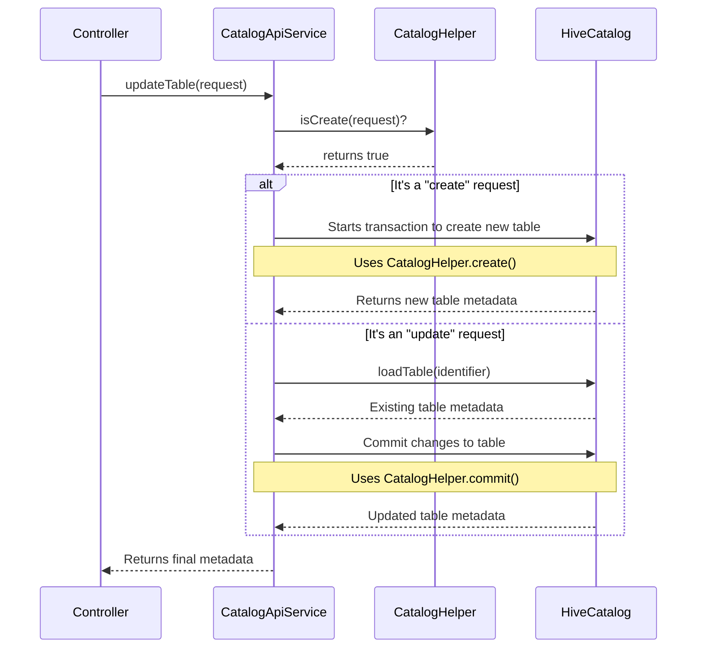

# Chapter 4: Catalog Business Logic

In our last chapter on the [Catalog Service Endpoint](03_catalog_service_endpoint_.md), we built the front desk for our service. We saw how the `CatalogServiceController` acts like a receptionist, greeting incoming requests and passing them on.

But who do they pass the request to? A receptionist doesn't personally go find the books in the library. They hand the request to an expert—someone who knows the exact step-by-step process to fulfill it. This chapter introduces that expert: the business logic layer.

### The Brains of the Operation

If the Controller is the receptionist, then the **`CatalogApiService`** is the **department manager** or the **lead librarian**. This is the brain of our entire service.

*   The receptionist (`Controller`) only knows *what* the user asked for (e.g., "create a new table").
*   The manager (`CatalogApiService`) knows *how* to do it. It contains the detailed, step-by-step instructions for every possible command.
*   It orchestrates the entire process, telling the low-level workers (our `HiveCatalog` object) exactly what to do and in what order.

Our goal is to follow a request from the Controller into this service layer and see how a simple API call is translated into a sequence of complex metadata operations.

### A Simple Request: Listing Tables

Let's revisit a simple request from the previous chapter: a user wants to list all tables in the `sales` namespace.

1.  **Request:** `GET /v1/sales/tables`
2.  **Controller:** The `listTables` method in `CatalogServiceController` is called.
3.  **Delegation:** The controller immediately calls `this.catalogApiService.listTables("sales")`.

Now, let's see what happens inside `CatalogApiService`.

**File:** `rest-catalog-service/src/main/java/org/apache/iceberg/rest/CatalogApiService.java`

```java
@Service // Marks this class as the "business logic" layer
public class CatalogApiService {

  private final HiveCatalog hiveCatalog;

  // Spring provides us with the configured HiveCatalog from Chapter 2
  @Autowired
  public CatalogApiService(HiveCatalog hiveCatalog, ...) {
    this.hiveCatalog = hiveCatalog;
  }
  
  // ... other methods ...
}
```
First, notice the `@Service` annotation. This tells Spring, "This class contains the core business logic." Spring also automatically provides, or "injects," the `HiveCatalog` instance we configured in [Chapter 2](02_hive_metastore__hms__integration_.md), so it's ready to use.

Now for the `listTables` method itself:

```java
// Inside CatalogApiService.java
public Object listTables(String namespace) throws IOException {
  // 1. Directly call the HiveCatalog to do the work
  List<TableIdentifier> listTables = 
      this.hiveCatalog.listTables(Namespace.of(namespace));

  // 2. Prepare the result for the Controller
  StringWriter writer = new StringWriter();
  return CatalogApiUtil.getOutput(writer, listTables);
}
```
This is a straightforward example. The "manager" (`CatalogApiService`) receives the request and sees that it's a simple lookup. It turns to its expert assistant, the `HiveCatalog`, and says, "Please list the tables in this namespace." It then packages the response and hands it back.

### A More Complex Task: Creating a Table

Simple lookups are easy, but what about more complex operations? Let's follow a request to create a new table. This is where the service layer truly shines.

The user sends a `POST` request with details like the table name, schema, and location. The controller passes this information to the `createTable` method in our service.

```java
// Inside CatalogApiService.java
public Object createTable(String namespace, Object body) throws IOException {
  // Step 1: Understand the user's request from the 'body'
  CreateTableRequest createTableRequest = ... ; // (Parsing logic)
  TableIdentifier tableIdentifier = 
      TableIdentifier.of(namespace, createTableRequest.name());

  // Step 2: Build the table step-by-step
  Table table = this.hiveCatalog
      .buildTable(tableIdentifier, createTableRequest.schema())
      .withLocation(createTableRequest.location())
      .withPartitionSpec(createTableRequest.spec())
      .withProperties(createTableRequest.properties())
      .create(); // Step 3: Finalize and commit!

  // Step 4: Prepare the success response
  // ... (Response packaging logic)
}
```
Let's break down the manager's plan:

1.  **Understand the Request:** It first parses the raw request `body` into a structured `CreateTableRequest` object. This is like reading the work order to understand all the details.
2.  **Orchestrate the Build:** This is the core logic. It uses the `hiveCatalog`'s "builder" to construct the new table piece by piece. This is a much safer and cleaner way to build a complex object. It's like telling an assistant:
    *   "Start building a table named `quarterly_reports`..."
    *   "...set its physical location to `/data/sales`..."
    *   "...set its partitioning to be by `sale_date`..."
3.  **Commit the Change:** The final `.create()` call is the command to make it official. The `HiveCatalog` takes all the instructions and communicates with the Hive Metastore to write the new metadata.
4.  **Prepare the Response:** Finally, it packages the newly created table's metadata into a response object to send back to the user.

The service layer translates a single API call into a multi-step, controlled process.

### The Brain in Action: Create vs. Update

Sometimes, an operation is even more complex and requires decision-making. A great example is the `updateTable` method, which handles both creating a new table *and* updating an existing one through the same API endpoint.

How does it know which one to do? The business logic decides.

#### The Internal Flow

When a request comes into `updateTable`, the `CatalogApiService` follows this logic:

1.  It receives the request, which contains a list of requirements.
2.  It asks a helper class (`CatalogHelper`), "Does this request require that the table *does not* exist?"
3.  If the answer is **yes**, it knows this is a "create" operation and follows the path to create a new table from scratch.
4.  If the answer is **no**, it knows this is an "update" operation. It first loads the table's existing metadata and then applies the requested changes.

This decision-making is the heart of business logic. Here's a diagram of that flow:



#### The Code Behind the Decision

Let's look at a simplified version of the code that implements this logic.

**File:** `rest-catalog-service/src/main/java/org/apache/iceberg/rest/CatalogApiService.java`
```java
public Object updateTable(...) throws IOException {
  // ... parse request ...
  UpdateTableRequest updateTableRequest = ...;
  
  TableMetadata finalMetadata;
  // Here is the decision point!
  if (CatalogHelper.isCreate(updateTableRequest)) {
    // Path 1: Create a new table
    finalMetadata = CatalogHelper.create(..., updateTableRequest);
  } else {
    // Path 2: Load the existing table and update it
    Table table = this.hiveCatalog.loadTable(...);
    TableOperations ops = ((BaseTable) table).operations();
    finalMetadata = CatalogHelper.commit(ops, updateTableRequest);
  }

  // Return the final metadata in the response
  return LoadTableResponse.builder()
      .withTableMetadata(finalMetadata).build();
}
```
This `if/else` block is the "brain" at work. It inspects the request and chooses the correct sequence of actions. It delegates the complex, low-level mechanics of committing metadata to a `CatalogHelper` utility, keeping its own logic clean and focused on orchestration.

### Conclusion

In this chapter, we explored the core of our service's intelligence. We learned that:
*   The **`CatalogApiService`** is the **business logic layer**, acting as the "brain" or "manager" of the service.
*   It takes high-level requests from the Controller and translates them into **concrete, step-by-step instructions**.
*   It **orchestrates** operations by calling the underlying `HiveCatalog` and other helpers in the correct sequence.
*   It contains the logic for **complex decisions**, such as choosing between creating a new table or updating an existing one.

We've now seen the full, happy-path flow of a request: from the client, through the Controller, and processed by the Service. But our service is still wide open—anyone can call it and do anything! How do we secure it?

In the next chapter, we'll add a security guard at the front door in [Chapter 5: Request Authentication & Authorization](05_request_authentication___authorization_.md).

---

Generated by [AI Codebase Knowledge Builder](https://github.com/The-Pocket/Tutorial-Codebase-Knowledge)