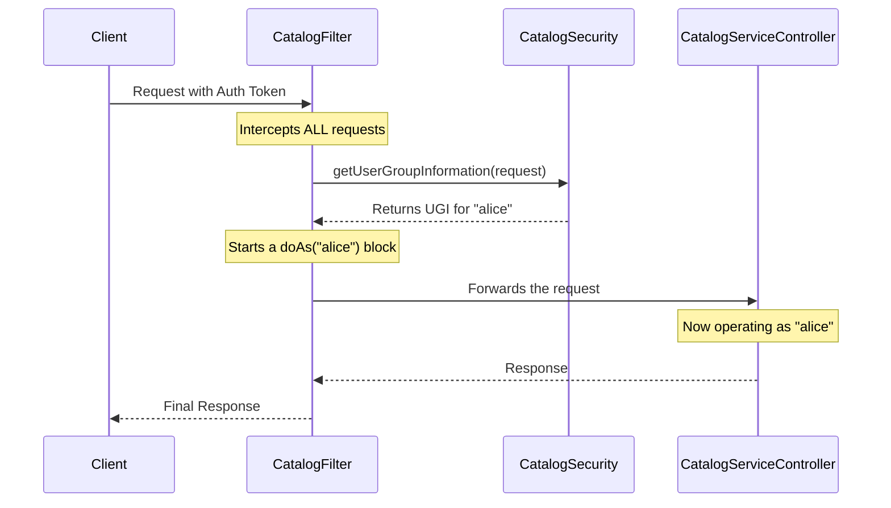

# Chapter 5: Request Authentication & Authorization

In the previous [Chapter 4: Catalog Business Logic](04_catalog_business_logic_.md), we saw how our service's "brain" processes requests, turning a simple API call into a series of metadata operations. Our service now has a front desk, a manager, and a connection to the library's card catalog.

But there's a big problem: our front door is wide open! Anyone can walk in and ask to create, delete, or modify tables. We need a security guard at the entrance to check everyone's ID. This chapter is all about hiring and training that security guard.

### The Security Guard at the Front Door

Before any visitor can even speak to the receptionist (`CatalogServiceController`), they must pass through a security checkpoint. This checkpoint is responsible for two critical questions:

1.  **Authentication ("Who are you?"):** The guard checks your ID (like a JWT token or a special header) to verify you are who you say you are.
2.  **Authorization ("What are you allowed to do?"):** Once your identity is confirmed, the system can later check if you have permission for the specific action you're requesting.

In our service, this security checkpoint is a two-part team:

*   **`CatalogFilter`:** This is the **guard** themselves. They stand at the very entrance and stop *every single request* that comes in. Their only job is to enforce a security check.
*   **`CatalogSecurity`:** This is the **rulebook and ID scanner** the guard uses. It contains the detailed logic for how to inspect credentials and determine if they are valid.

Our goal is to understand how this team works together to secure our entire service, ensuring that only legitimate, identified users can interact with the catalog.

### The Interception: How `CatalogFilter` Works

In the world of web services, a "Filter" is a special piece of code that gets to inspect a request *before* it reaches its final destination. Our `CatalogFilter` is the very first component to see an incoming request.

Let's look at its main job description, the `doFilter` method.

**File:** `rest-catalog-service/src/main/java/org/apache/iceberg/common/CatalogFilter.java`
```java
public class CatalogFilter implements Filter {

  private final CatalogSecurity catalogSecurity;
  
  // ... constructor ...

  @Override
  public void doFilter(ServletRequest request, ServletResponse response, FilterChain chain)
      throws IOException {

    UserGroupInformation clientUgi = null;
    try {
      // Step 1: Ask the "rulebook" to identify the user
      clientUgi = catalogSecurity.getUserGroupInformation(
          (HttpServletRequest)request, (HttpServletResponse)response);
      
      // Step 2: "Impersonate" the user for this request
      clientUgi.doAs(
          (PrivilegedExceptionAction<Boolean>)
              () -> {
                // Step 3: If security check passes, let the request continue
                chain.doFilter(request, response);
                return true;
              });
    } catch (Exception e) {
      // Handle security errors...
    } finally {
      // Clean up after the request is done
      HMSGroup.setGroups(null);
    }
  }
}
```

This code might look complex, but it's a simple three-step process for our security guard:

1.  **Check ID:** The guard (`CatalogFilter`) doesn't know how to read IDs. It hands the request over to its expert partner, the `catalogSecurity` "rulebook," to figure out who the user is.
2.  **Act on Behalf Of:** Once `catalogSecurity` identifies the user (and returns a `UserGroupInformation` object, or `Ugi`), the guard uses `ugi.doAs(...)`. This is a crucial step. It's like the guard telling the rest of the library, "For this one request, pretend you are serving this specific person." This ensures all subsequent actions are performed with the user's permissions, not the service's own powerful permissions.
3.  **Let Them Pass:** If the identity check is successful, `chain.doFilter(request, response)` is called. This tells the system, "Security check is complete. You can now pass the request along to the next stop" (which is our `CatalogServiceController`).

### The ID Check: Inside `CatalogSecurity`

Now, let's open the rulebook. How does `CatalogSecurity` actually verify a user's identity? It's designed to handle a few different scenarios, just like a real security guard might accept a driver's license, a passport, or a special employee badge.

The main method, `getUserGroupInformation`, orchestrates this check.

**File:** `rest-catalog-service/src/main/java/org/apache/iceberg/common/CatalogSecurity.java`
```java
public UserGroupInformation getUserGroupInformation(
      HttpServletRequest request, HttpServletResponse response) throws IOException {
    
  // 1. Extract the user's name from the request
  String userFromHeader = extractUserName(request, response);
  
  // 2. Create a UGI object to represent this user
  UserGroupInformation clientUgi = UserGroupInformation.createProxyUser(
      userFromHeader, UserGroupInformation.getLoginUser());
      
  // 3. Extract and store the user's groups for later use
  String groupsHeader = request.getHeader("X-Knox-Actor-Groups-1");
  if (groupsHeader != null) {
    HMSGroup.set(userFromHeader, groupsHeader);
  }
  
  return clientUgi;
}
```
This process is like a background check:
1.  **Find the Name:** It calls a helper, `extractUserName`, which looks at the request's credentials (like a JWT token in the `Authorization` header) to find the user's name.
2.  **Create an Impersonation Context:** The line `UserGroupInformation.createProxyUser(...)` is key. The service itself is running as a single, powerful system user (our "librarian" from [Chapter 2](02_hive_metastore__hms__integration_.md)). This line creates a temporary identity that says, "I am the system user, but I am currently acting *on behalf of* `userFromHeader`."
3.  **Record Group Memberships:** In many systems, permissions are granted to groups, not just individual users. This step reads a special header (often added by a proxy like Apache Knox) to get the user's groups and stores them in a temporary holder called `HMSGroup`.

### How It All Works Together: The Security Flow

Let's visualize the journey of a secured request from start to finish.

1.  A data scientist sends a request, including an `Authorization: Bearer <token>` header.
2.  The `CatalogFilter` intercepts it before it can go anywhere else.
3.  The filter calls `CatalogSecurity` to validate the token.
4.  `CatalogSecurity` confirms the token is valid and extracts the username, e.g., "alice".
5.  It creates a proxy UGI for "alice".
6.  The `CatalogFilter` then wraps the rest of the processing in a `doAs("alice")` block.
7.  The request is finally passed to the `CatalogServiceController`, which now operates as if "alice" made the call directly.

Here is a diagram of that security handshake:


### Diving Deeper: How is the Username Extracted?

The `extractUserName` method is where the real credential validation happens. It can be configured to work in different ways.

```java
// Simplified logic from CatalogSecurity.java
private String extractUserName(...) throws HttpAuthenticationException {
  if (jwtAuthEnabled) {
    // Scenario 1: JWT Token
    // Look for a "Bearer" token in the Authorization header.
    String signedJwt = extractBearerToken(request, response);
    // Use a validator to check the token's signature and get the user.
    return jwtValidator.validateJWTAndExtractUser(signedJwt);
  } else {
    // Scenario 2: Simple Header (for development/insecure)
    // Just trust a header like 'X-User'.
    return request.getHeader("X-USER");
  }
}
```
This `if/else` logic allows the service to be flexible. In a secure production environment, `jwtAuthEnabled` would be `true`, and it would perform a cryptographic check on the JWT token. In a simpler development setup, it might just trust a header, making testing easier.

### Conclusion

In this chapter, we put a security guard at the front door of our service. We learned that:

*   The **`CatalogFilter`** is a universal **interceptor** that stops every request for a security check.
*   **`CatalogSecurity`** is the **rulebook** containing the logic to validate credentials, like JWTs or trusted proxy headers.
*   The system identifies the user and creates a **proxy user** (`UserGroupInformation`) to represent them.
*   The `doAs` block is a critical concept that ensures all subsequent actions are performed with the **end-user's identity and permissions**.

Our service is now secure. We can reliably identify who is making each request. But our job isn't done. Just because we know the user is "alice" doesn't mean she can access the data files in the data lake. For that, she needs special, short-lived credentials. How do we get those for her?

In the next chapter, we'll explore how our service communicates with another system to securely generate those credentials in [Chapter 6: Secure Data Access (ID Broker Client)](06_secure_data_access__id_broker_client_.md).

---

Generated by [AI Codebase Knowledge Builder](https://github.com/The-Pocket/Tutorial-Codebase-Knowledge)