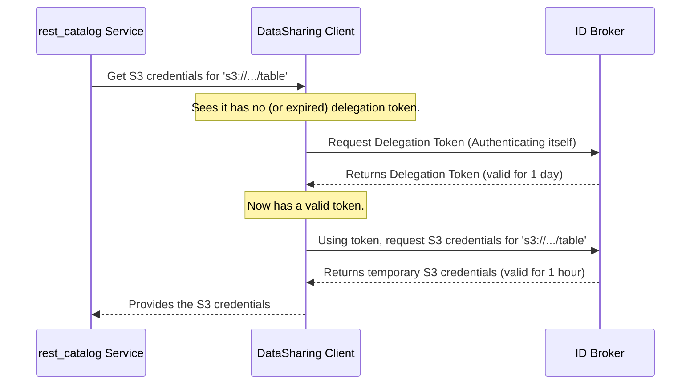

# Chapter 6: Secure Data Access (ID Broker Client)

In our last chapter on [Request Authentication & Authorization](05_request_authentication___authorization_.md), we hired a security guard for our front door. We can now confidently identify every user who makes a request, like our data analyst, "alice".

But a new problem arises. Alice wants to read a table whose data files are stored in a highly secure S3 bucket. Just because we know who she is doesn't mean she can open the locked doors to the data warehouse. Her personal ID won't work on the S3 storage locks. We need to get her a special, temporary keycard. This chapter is about the process of getting that keycard.

### The Problem: Accessing Secure Cloud Data

Imagine your data is stored in a secure vault (an S3 bucket). The `rest_catalog` service can tell a user *which* files to read, but it doesn't give them the key to the vault. Sharing a permanent, master key with every user would be a massive security risk.

Instead, we need a system to issue temporary keys that:
*   Work for a very short period (e.g., one hour).
*   Only grant access to the specific files needed.
*   Are given directly to the user's query engine (like Spark or Trino).

This is where the **ID Broker Client** comes in.

### The Solution: A Quick Trip to the Security Office

Our `rest_catalog` service has a special agent that knows how to talk to a central "Security Office" for our entire data platform. This office is called the **ID Broker**.

*   **The ID Broker:** An external, trusted service whose only job is to create temporary credentials (the "keycards").
*   **The ID Broker Client (`DataSharing.java`):** A component inside our `rest_catalog` service. It acts as a liaison, carrying a request to the ID Broker and bringing back the temporary keycard.

When Alice requests a table, our service will not only give her the table's metadata but will also make a quick trip to the ID Broker on her behalf to fetch a temporary S3 keycard. It bundles this keycard with the response, giving her query engine everything it needs to securely access the data.

### How it Works: The Two-Step Credential Dance

Getting credentials from the ID Broker is a secure, two-step process. Think of it like a government agent needing to access a secure facility.

**Step 1: Get a Delegation Token (Prove who *we* are)**
First, our `rest_catalog` service needs to prove its own identity to the ID Broker. It can't just walk up and ask for keys. It authenticates itself (using its own secure configuration) and receives a short-lived **delegation token**.

*   **Analogy:** The agent shows their official government ID to the front desk of the secure facility. The front desk gives them a special "authorized visitor" badge that's valid for the rest of the day. This badge proves they are allowed to make requests inside. This token is cached so we don't have to do this for every single request.

**Step 2: Get Access Credentials (Ask for what we *need*)**
Now, holding the valid delegation token, our service can make the real request: "Please give me temporary S3 credentials to access the data at `s3://my-bucket/sales_data/`."

*   **Analogy:** The agent, wearing their visitor badge, goes to the records room and says, "I need the key to filing cabinet #123 for the next hour." Because they have the valid badge, the clerk gives them the temporary key.

Let's see this flow in a diagram:



### Diving into the Code

Let's look at the key pieces of code that perform this dance.

#### The Entrypoint: `IdTokenRetriever`

This is a simple helper class that kicks off the entire process. When our service prepares to send a response to the user, it calls this method.

**File:** `rest-catalog-service/src/main/java/org/apache/iceberg/common/IdTokenRetriever.java`
```java
public class IdTokenRetriever {
  // ...

  public static Map<String, String> getJwtToken(Table table) {
    Map<String, String> token = null;
    if (!isLocal) { // We only do this in a secure, non-local environment
      try {
        DataSharing dataSharing = CatalogConfig.getDataSharing();
        // Ask the DataSharing client to get the credentials
        token = dataSharing.getAccessToken(table.location());
      } catch (Exception exception) {
        // ... handle errors ...
      }
    }
    return token;
  }
}
```
This code is straightforward: it gets the `DataSharing` client (our liaison to the ID Broker) and asks it to fetch an "access token" (the temporary credentials) for the table's specific S3 location.

#### The Orchestrator: `DataSharing.getAccessToken`

This is the main method inside our ID Broker client. It orchestrates the two-step dance we described above.

**File:** `rest-catalog-service/src/main/java/org/apache/iceberg/common/DataSharing.java`
```java
public Map<String, String> getAccessToken(String table) {
  IdBrokerDelegationToken idt = delegationToken;

  // Step 1: Check if we have a valid "visitor badge"
  if (idt == null || idt.isRenewalRequired()) {
    synchronized (this) {
      // If not, go get one.
      delegationToken = fetchDelegationToken();
      idt = delegationToken;
    }
  }

  // Step 2: Use the badge to get the temporary "keycard"
  return fetchAccessToken(idt, table);
}
```
This logic perfectly matches our analogy. It first checks if the `delegationToken` is missing or expired. If so, it calls `fetchDelegationToken()` to get a new one. Then, it proceeds to call `fetchAccessToken()` to get the actual S3 credentials.

#### Step 1 in Detail: `fetchDelegationToken`

This method handles the first HTTP call to the ID Broker to authenticate our service.

```java
// Inside DataSharing.java
private IdBrokerDelegationToken fetchDelegationToken() throws IOException {
  // Construct the URL for the ID Broker's token endpoint
  URL delegationTokenUrl = idBrokerUri.resolve(delegationTokenPath).toURL();
  
  // Make a simple HTTP GET request to that URL
  Object result = clientCall(null, delegationTokenUrl, "GET", null);

  // ... (code to parse the token and expiration from the JSON response) ...
  return new IdBrokerDelegationToken(sessionToken, expiration);
}
```
Its job is to make a web request to a known ID Broker URL. The ID Broker recognizes our service (based on network configuration and Kerberos tickets) and returns a JSON response containing the delegation token.

#### Step 2 in Detail: `fetchAccessToken`

With a valid delegation token in hand, this method makes the second HTTP call to get the S3 credentials.

```java
// Inside DataSharing.java
private Map<String, String> fetchAccessToken(IdBrokerDelegationToken idt, String table)
    throws IOException {
  // Construct the URL, including the S3 path we need access to
  URL accessTokenUrl = accessTokenUrl(table);

  // Make the HTTP call, BUT this time we include our delegation token
  // in the "Authorization: Bearer <token>" header.
  Object result = clientCall(idt.getDelegationToken(), accessTokenUrl, "GET", null);
  
  // ... (code to parse the S3 keys from the JSON response) ...
  return tokenRes; // A map containing the S3 keys
}
```
This call is different because it includes the delegation token to prove it's authorized. The URL also contains the specific S3 path, so the ID Broker knows exactly which "room" to issue a keycard for. The broker returns a JSON object with the temporary `AccessKeyId`, `SecretAccessKey`, and `SessionToken`.

### Conclusion

In this chapter, we completed the final piece of our security puzzle. We learned that:

*   Authenticating a user is not enough; the service must also provide a way for the user's tools to **access the physical data** in secure cloud storage.
*   The service uses an **ID Broker Client** (`DataSharing`) to act as a liaison with an external **ID Broker** service.
*   This process involves a secure, two-step dance: first getting a **delegation token** to prove the service's identity, and then using it to fetch **temporary access credentials** (like S3 keys) for a specific data location.

Congratulations! You have journeyed through the entire `rest_catalog` service. You started with the [Application Entrypoint & Configuration](01_application_entrypoint___configuration_.md), saw how it connects to the [Hive Metastore (HMS) Integration](02_hive_metastore__hms__integration_.md), exposed its functionality via the [Catalog Service Endpoint](03_catalog_service_endpoint_.md), processed requests in the [Catalog Business Logic](04_catalog_business_logic_.md), and finally, secured the entire system with both [Request Authentication & Authorization](05_request_authentication___authorization_.md) and the temporary credential system we just explored.

You now have a complete, end-to-end understanding of how a modern, secure, and scalable REST-based Iceberg catalog works.

---

Generated by [AI Codebase Knowledge Builder](https://github.com/The-Pocket/Tutorial-Codebase-Knowledge)