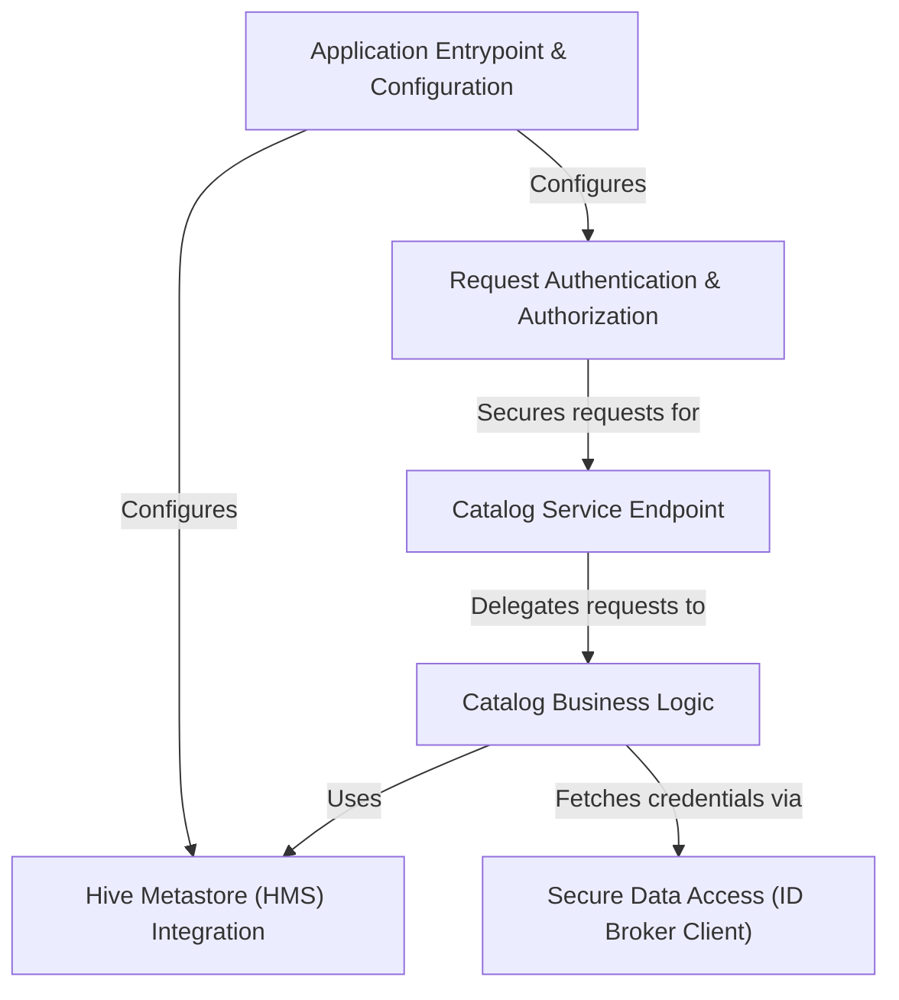

# Tutorial: rest_catalog

This project is a web service that provides a central **REST API** for managing *Apache Iceberg* tables. It acts like a digital librarian for your data, allowing different applications to create, search, and update table information. Under the hood, it uses a **Hive Metastore** to store the metadata and includes security features to control who can access the catalog. It can also securely connect to data stored in the cloud by requesting temporary credentials from an *ID Broker* service.

**Source Repository:** [None](None)

## Chapters

1. [Application Entrypoint & Configuration
](01_application_entrypoint___configuration_.md)
2. [Hive Metastore (HMS) Integration
](02_hive_metastore__hms__integration_.md)
3. [Catalog Service Endpoint
](03_catalog_service_endpoint_.md)
4. [Catalog Business Logic
](04_catalog_business_logic_.md)
5. [Request Authentication & Authorization
](05_request_authentication___authorization_.md)
6. [Secure Data Access (ID Broker Client)
](06_secure_data_access__id_broker_client__.md)

---

Generated by [AI Codebase Knowledge Builder](https://github.com/The-Pocket/Tutorial-Codebase-Knowledge)