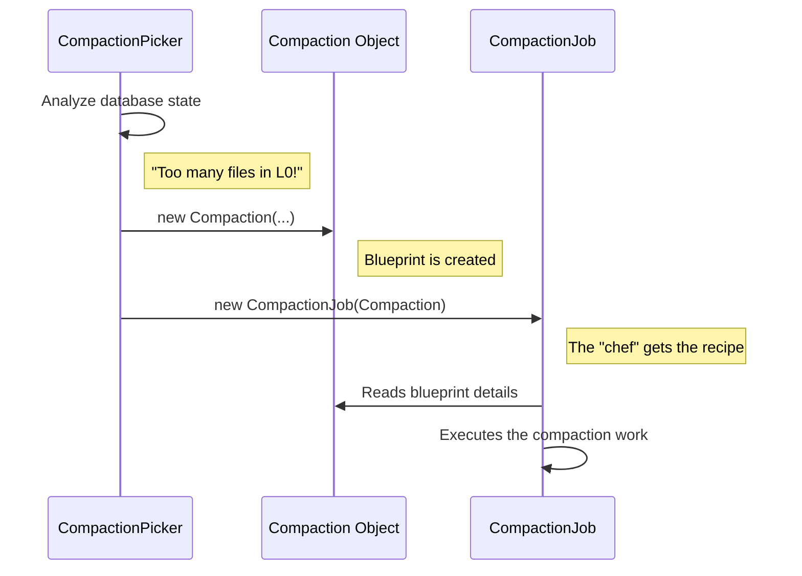

# Chapter 1: Compaction

Welcome to your first step in understanding RocksDB's compaction process! Before we can talk about doing any work, we need a plan. In RocksDB, that plan is called a `Compaction`.

Imagine your desk is getting cluttered with sticky notes, drafts, and old documents. To clean it up, you first decide *what* you're going to organize. You might say: "I'm going to take this pile of notes (inputs), merge them into a single, neat document (output), and file it in my 'Projects' drawer (output level)."

That decision-making process creates a plan. You haven't started sorting or writing yet, but you have a clear work order. This is exactly what a `Compaction` object is in RocksDB.

### What is a `Compaction`?

A `Compaction` is a blueprint or a work order for a single cleanup task. It's an **immutable** object, meaning once it's created, it cannot be changed. It's like a printed recipe: it tells you everything you need to know before you start cooking, but it doesn't do the cooking itself.

This "recipe" contains crucial information:
*   **Input Files**: Which exact files (SSTs) should be read and processed.
*   **Output Level**: Which level the new, compacted files should be written to.
*   **Reason**: Why is this compaction happening? (e.g., to reduce file count, clean up old data).
*   **Settings**: Other details, like the target size for the new files.

The actual "chef" that reads this recipe and does the cooking is a different component, the [CompactionJob](03_compactionjob_.md), which we'll meet in a later chapter. For now, let's focus on understanding the recipe itself.

### The `Compaction` Blueprint

Let's look at the structure that defines this blueprint. The class is defined in `compaction.h`.

```cpp
// location: compaction.h

// A Compaction encapsulates metadata about a compaction.
class Compaction {
 public:
  // ... constructor and methods ...

  // Outputs will go to this level
  int output_level() const { return output_level_; }

  // Returns the list of input files for a given level
  const std::vector<FileMetaData*>* inputs(
      size_t compaction_input_level) const;

 private:
  const std::vector<CompactionInputFiles> inputs_;
  const int start_level_;
  const int output_level_;
  uint64_t max_output_file_size_;
  CompactionReason compaction_reason_;
  // ... other members ...
};
```

This class is essentially a container for all the parameters needed for one compaction task. When RocksDB decides it's time to clean up, it creates an instance of this `Compaction` class, filling it with all the necessary details.

For example, a `Compaction` object might be created with the following information:
*   **Inputs**: Files `A`, `B`, and `C` from Level-0.
*   **Output Level**: Level-1.
*   **Reason**: `kLevelL0FilesNum` (too many files in Level-0).
*   **Max Output File Size**: 256 MB.

### A Special Case: The Trivial Move

Not all cleanups are complicated. Sometimes, the plan is incredibly simple. Imagine you have a single, perfectly organized report on your desk that just needs to be moved into the correct filing cabinet drawer. You don't need to merge it or rewrite it. You just move it.

This is called a "trivial move" in RocksDB. The `Compaction` object has a helper method to check for this easy scenario.

```cpp
// location: compaction.cc

bool Compaction::IsTrivialMove() const {
  // Can we just move the file instead of rewriting it?
  // This is a simplified check.
  if (num_input_levels() != 1 || num_input_files(0) != 1) {
    return false; // Not a trivial move if we have multiple inputs.
  }

  // Also check if the file overlaps with files in the next level.
  // (Simplified for this example)
  if (OverlapsWithGrandparents()) {
     return false;
  }

  return true;
}
```
If `IsTrivialMove()` returns `true`, RocksDB can perform a huge optimization: instead of reading all the data from the input file and writing it to a new file, it can simply move the existing file to the output level. This saves a lot of time and effort!

### Under the Hood: The Lifecycle of a `Compaction`

A `Compaction` object doesn't just appear out of thin air. It's the first step in a larger process. While we'll cover the other components in detail later, here is a quick preview of how a `Compaction` fits into the overall workflow.



1.  **The Foreman (`CompactionPicker`)**: A component called the [CompactionPicker](02_compactionpicker_.md) constantly monitors the database. It's like a foreman on a construction site, looking for work that needs to be done.
2.  **Creating the Blueprint (`Compaction`)**: When the `CompactionPicker` decides a cleanup is necessary, it gathers all the required information (which files to use, where they should go) and creates a `Compaction` object.
3.  **Hiring the Chef (`CompactionJob`)**: The `Compaction` blueprint is then handed over to a [CompactionJob](03_compactionjob_.md). The `CompactionJob` is the worker that reads the blueprint and performs the actual, heavy-lifting work of reading, merging, and writing files.

### Conclusion

You've now learned about the most fundamental concept in the compaction process: the `Compaction` object. It's the immutable blueprint, the recipe, the work order. It defines **what** needs to be done, but doesn't do the work itself. It's the critical first step that makes the entire cleanup process possible.

But how does RocksDB decide *when* to create this blueprint and *what* instructions to put in it? That's the job of the foreman. In our next chapter, we'll explore the [CompactionPicker](02_compactionpicker_.md), the clever component responsible for creating these plans.

---

Generated by [AI Codebase Knowledge Builder](https://github.com/The-Pocket/Tutorial-Codebase-Knowledge)