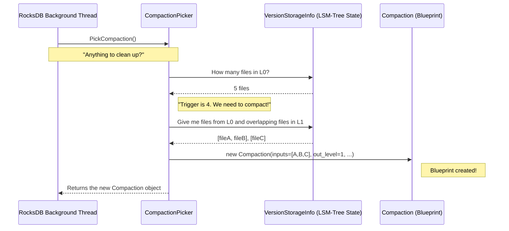

# Chapter 2: CompactionPicker

In the [previous chapter](01_compaction_.md), we learned about the `Compaction` object—the blueprint for a cleanup job. We established that this blueprint doesn't just appear from nowhere. Someone has to decide that a cleanup is necessary and then create the plan.

Meet the **`CompactionPicker`**, the scheduler or strategist for RocksDB's cleanup crew.

### The Factory Manager

Imagine a busy factory floor (our LSM-tree). Over time, different areas get cluttered with half-finished products and raw materials (our SST files). If left unchecked, the whole factory would grind to a halt.

To prevent this, a manager walks the floor, constantly monitoring everything. They might notice:
*   "The receiving area (Level-0) is overflowing with small boxes! We need to consolidate them."
*   "The assembly line for Level-2 is getting too big and slow. We need to optimize it."

This manager is the `CompactionPicker`. It analyzes the state of the database and decides **when** a cleanup is needed and **what** needs to be cleaned up. When it identifies a problem, it creates a `Compaction` blueprint and hands it off.

### What is a `CompactionPicker`?

A `CompactionPicker` is a class responsible for creating `Compaction` objects. Its main job is to implement the logic for a specific **compaction style**. Different styles have different rules for cleaning up, so each one gets its own specialized `CompactionPicker`.

Think of it like having different managers with different philosophies:
*   **`LevelCompactionPicker`**: A manager who follows a strict, hierarchical process. Files from Level-0 are always compacted into Level-1, Level-1 into Level-2, and so on. This is great for managing read performance.
*   **`UniversalCompactionPicker`**: A manager who likes to wait and then bundle many files from the same level together in one big go. This can be more efficient for writes.
*   **`FIFOCompactionPicker`**: A "First-In, First-Out" manager. When the database gets too big, this manager simply throws away the oldest files. This is useful for cache-like data where old information is no longer needed.

These are just different implementations of the same core role, defined by the `CompactionPicker` base class.

```cpp
// location: db/compaction/compaction_picker.h

class CompactionPicker {
 public:
  // ...
  // The main decision-making function.
  // Returns a new Compaction blueprint, or nullptr if nothing to do.
  virtual Compaction* PickCompaction(
      const std::string& cf_name, const MutableCFOptions& mutable_cf_options,
      const MutableDBOptions& mutable_db_options, VersionStorageInfo* vstorage,
      LogBuffer* log_buffer,
      SequenceNumber earliest_memtable_seqno = kMaxSequenceNumber) = 0;

  // Does the database need any cleanup at all?
  virtual bool NeedsCompaction(const VersionStorageInfo* vstorage) const = 0;
  // ...
};
```
The key method here is `PickCompaction`. RocksDB periodically calls this method. The picker inspects the current state of the LSM-tree (provided in `vstorage`) and decides if a compaction is warranted. If yes, it returns a new `Compaction` object; otherwise, it returns `nullptr`.

### An Example: The Level Style Manager (`LevelCompactionPicker`)

Let's see how the `LevelCompactionPicker` makes its decisions. It has a clear set of priorities.

**Priority 1: Is Level-0 too crowded?**
Level-0 is special because its files can overlap. Too many files here can slow down reads. So, the first thing the picker checks is the number of files in L0.

```cpp
// location: db/compaction/compaction_picker_level.cc (Simplified Logic)

if (vstorage->NumLevelFiles(0) > options.level0_file_num_compaction_trigger) {
  // Too many files in L0!
  // Pick all L0 files and some overlapping L1 files.
  // Create a plan to merge them into new files in L1.
  return new Compaction(...);
}
```
If there are more files in Level-0 than the configured trigger, the picker immediately creates a `Compaction` to merge them into Level-1.

**Priority 2: Is any other level too big?**
If L0 is fine, the picker checks the other levels. It calculates a "compaction score" for each level. A score greater than 1 means the level has grown beyond its target size.

```cpp
// (Simplified Logic continued)

// Find the level with the highest score > 1
if (vstorage->GetCompactionScore() >= 1.0) {
  int level_to_compact = vstorage->GetCompactionLevel();

  // Pick a file from that level and its overlapping files
  // from the next level. Create a plan to merge them.
  return new Compaction(...);
}
```
The picker finds the level with the worst score and creates a `Compaction` to merge some of its files into the next level (e.g., L2 -> L3). If no level needs compaction, it returns `nullptr`.

### Under the Hood: A Picker's Shift

Let's visualize the `CompactionPicker`'s role in the grand scheme of things.


1.  A background thread in RocksDB wakes up and decides it's time to check for potential cleanups.
2.  It calls `PickCompaction()` on the configured picker (e.g., `LevelCompactionPicker`).
3.  The picker queries the `VersionStorageInfo` to get the current state of the LSM-tree.
4.  Based on its rules, it determines that a compaction is needed (e.g., L0 has too many files).
5.  It gathers the necessary input files and creates a `Compaction` object, which acts as the work order.
6.  It returns this work order to the background thread.

### The Right Manager for the Job

RocksDB is flexible. You can choose your compaction style, which means you're choosing which `CompactionPicker` to use. Each one is a separate class, designed for a specific strategy.

Here are the headers for our other two "managers":

**The Universal Manager:**
```cpp
// location: db/compaction/compaction_picker_universal.h
class UniversalCompactionPicker : public CompactionPicker {
  // ... implements PickCompaction with Universal Style logic
};
```

**The FIFO Manager:**
```cpp
// location: db/compaction/compaction_picker_fifo.h
class FIFOCompactionPicker : public CompactionPicker {
  // ... implements PickCompaction with FIFO Style logic
};
```

By separating the "what" (`Compaction`) from the "when/why" (`CompactionPicker`), RocksDB makes it easy to plug in different cleanup strategies without changing the core machinery.

### Conclusion

You've now met the manager of the compaction process, the `CompactionPicker`. It's the brain behind the operation, constantly analyzing the database and strategically deciding what work needs to be done. It's the component that turns a "messy" state into a concrete, actionable plan—the `Compaction` object.

But a plan is useless without someone to execute it. We have the blueprint, and we know how it was created. Now, who actually rolls up their sleeves, reads the input files, merges the data, and writes the new output files?

In our next chapter, we'll meet the worker who does all the heavy lifting: the **[CompactionJob](03_compactionjob_.md)**.

---

Generated by [AI Codebase Knowledge Builder](https://github.com/The-Pocket/Tutorial-Codebase-Knowledge)