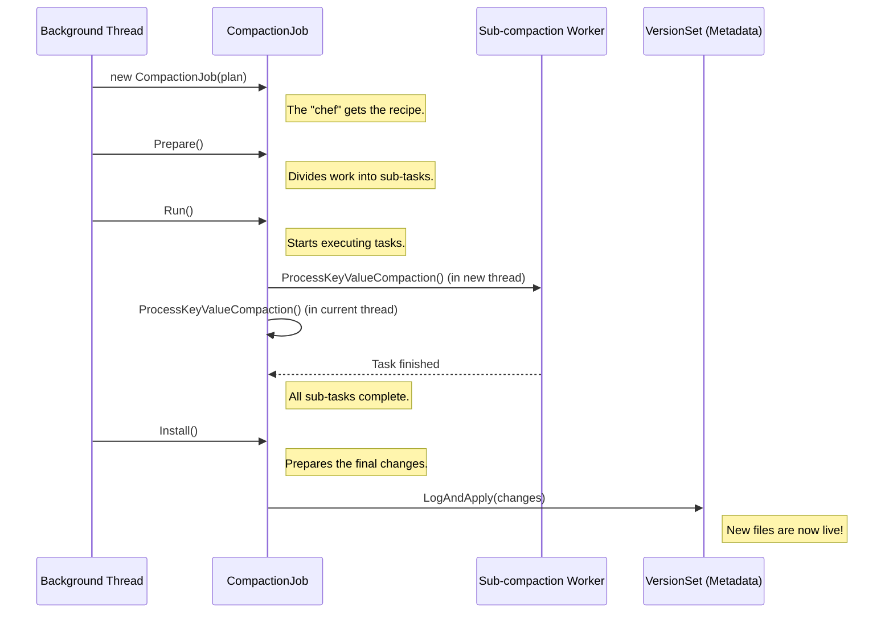

# Chapter 3: CompactionJob

In the [previous chapter](02_compactionpicker_.md), we met the `CompactionPicker`, the strategic manager who decides *when* a cleanup is needed and creates a `Compaction` plan. This plan is like a detailed recipe for tidying up a part of our database.

But a recipe is just a piece of paper. You need a chef to read it, gather the ingredients, and do the actual cooking. In RocksDB, that chef is the **`CompactionJob`**.

### The Project Manager for a Cleanup Task

If a `Compaction` is the blueprint, the `CompactionJob` is the project manager and construction crew rolled into one. It takes the blueprint and brings it to life. It's a short-lived, stateful object that exists only to execute one single `Compaction` plan from start to finish.

The `CompactionJob` is responsible for:
1.  **Preparation**: Reading the blueprint and preparing the work site. This might involve splitting a very large task into smaller, parallel sub-tasks.
2.  **Execution**: Rolling up its sleeves and doing the heavy lifting. It reads data from the old files, merges it, and writes the new, clean files.
3.  **Installation**: Once the new files are built and ready, it updates the database's official records to use the new files and discard the old ones.

### The Three Stages of a `CompactionJob`

The entire life of a `CompactionJob` can be understood by three main functions: `Prepare()`, `Run()`, and `Install()`. Let's follow a job through these stages.

#### Stage 1: `Prepare()` - Planning the Work

Before starting a big project, a good manager breaks it down into manageable pieces. This is what `Prepare()` does. If the compaction is large enough, RocksDB can parallelize the work to finish it faster. `Prepare()` is responsible for figuring out how to split the work.

It does this by finding "boundary keys" that can divide the total range of keys into several smaller, roughly equal-sized chunks.

```cpp
// location: db/compaction/compaction_job.cc (Simplified Logic)

void CompactionJob::Prepare() {
  auto* c = compact_->compaction;

  // Check if this job is big enough to be split into sub-tasks.
  if (c->ShouldFormSubcompactions()) {
    // Analyze the input files and find good key-range boundaries
    // to split the work.
    GenSubcompactionBoundaries();
  }

  // Create a list of sub-compaction tasks. If we didn't split,
  // there will be only one task in the list.
  // ...
}
```

After `Prepare()` is done, the `CompactionJob` has a clear list of one or more sub-tasks, each responsible for a specific slice of the key range.

#### Stage 2: `Run()` - Doing the Heavy Lifting

This is where the real work happens. The `Run()` method orchestrates the execution of all the sub-tasks created during the `Prepare()` stage. If there are multiple sub-tasks, it launches them in separate background threads to run in parallel.

```cpp
// location: db/compaction/compaction_job.cc (Simplified Logic)

Status CompactionJob::Run() {
  // We have N sub-tasks. Let's launch N-1 of them in new threads.
  std::vector<port::Thread> thread_pool;
  for (size_t i = 1; i < compact_->sub_compact_states.size(); i++) {
    thread_pool.emplace_back(&CompactionJob::ProcessKeyValueCompaction, this, ...);
  }

  // We'll use the current thread to work on the first sub-task.
  ProcessKeyValueCompaction(&compact_->sub_compact_states[0]);

  // Wait for all the other threads to finish their work.
  for (auto& thread : thread_pool) {
    thread.join();
  }

  // ... check for errors and finalize ...
  return status;
}
```

The core of the work is done inside `ProcessKeyValueCompaction`. This function creates a special iterator to read from all the input files, merges the data, and writes the new, compacted data to output files. We'll learn more about the iterator it uses in the chapter on [CompactionIterator](05_compactioniterator_.md).

#### Stage 3: `Install()` - Making it Official

Once `Run()` completes successfully, we have a set of brand-new, shiny SST files. But the database doesn't know about them yet! It's still using the old, messy input files.

The `Install()` stage is the final, critical step. It atomically updates the database's central metadata (the `MANIFEST` file) to:
1.  **Add** the new files to the LSM-tree's structure.
2.  **Remove** the old input files.

This is like a grand opening for a new highway. The moment `Install()` is complete, all new read requests will start using the new files, and the old ones are scheduled for deletion.

```cpp
// location: db/compaction/compaction_job.cc (Simplified Logic)

Status CompactionJob::Install(const MutableCFOptions& mutable_cf_options) {
  // `edit` is a list of changes we want to make.
  VersionEdit* const edit = compaction->edit();

  // Add all our newly created files to the change list.
  for (const auto& sub_compact : compact_->sub_compact_states) {
    sub_compact.AddOutputsEdit(edit);
  }

  // Mark all the old input files for deletion in the change list.
  compaction->AddInputDeletions(edit);

  // Atomically commit these changes to the database's version metadata.
  return versions_->LogAndApply(
      compaction->column_family_data(), mutable_cf_options, edit, ...);
}
```

### Under the Hood: A Job's Lifecycle

Let's visualize the entire process from when a `CompactionJob` is created to when its work becomes visible.



This flow ensures that compactions are performed efficiently (with parallelism) and safely. The database state is only changed at the very end, in one atomic `Install()` step. If anything goes wrong during `Run()`, the new files are simply discarded, and the database remains in its original, consistent state.

### Conclusion

You've now met the workhorse of the cleanup process: the `CompactionJob`. It's the executor that takes a `Compaction` plan and makes it a reality. Through its `Prepare`, `Run`, and `Install` phases, it reliably and efficiently rewrites parts of the database to keep it healthy and performant.

So far, we've treated the merging process inside the `CompactionJob` as a black box. The job reads key-value pairs, and writes key-value pairs. But what if we want to inspect the data during this process? What if we want to modify or even delete certain keys as they are being compacted?

That's where our next component comes in. In the next chapter, we'll explore the [CompactionFilter](04_compactionfilter_.md), a powerful tool that lets you hook into the very heart of a `CompactionJob`.

---

Generated by [AI Codebase Knowledge Builder](https://github.com/The-Pocket/Tutorial-Codebase-Knowledge)