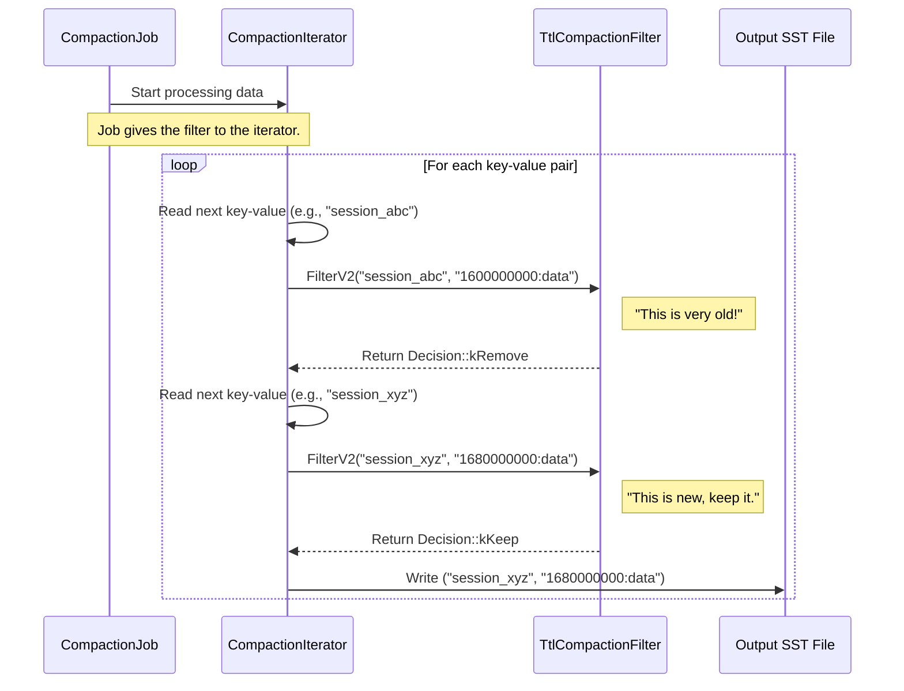

# Chapter 4: CompactionFilter

In the [previous chapter](03_compactionjob_.md), we learned about the `CompactionJob`, the diligent worker that reads old data, merges it, and writes new, clean files. It’s like an efficient assembly line, processing items (our key-value pairs) one by one.

But what if we need to perform some quality control on that assembly line? What if we want to inspect each item and decide if it's still good enough to keep? For example, what if we want to automatically throw away data that has expired?

This is where the **`CompactionFilter`** comes in. It’s a custom quality control inspector that you can place right on the compaction assembly line.

### The Quality Control Inspector

Imagine our database stores user sessions that should expire after 30 days. We could write a separate program to scan the whole database and delete old sessions, but that would be slow and inefficient.

A much better way is to teach the database's own cleanup crew how to spot expired data. The `CompactionFilter` allows us to do exactly that. It's a hook you provide to the `CompactionJob`. As the job processes each key-value pair, it hands it to your filter. Your filter can then say:
*   "This one's good, **keep it**."
*   "This one's expired, **remove it**."
*   "This one needs a little change, **modify its value**."

This gives you a powerful way to enforce your own application's rules (like Time-To-Live, or TTL) without changing the core database engine.

### What is a `CompactionFilter`?

A `CompactionFilter` is a class you define that inherits from a base class provided by RocksDB. The most important method you need to implement is `FilterV2()`.

```cpp
// location: rocksdb/compaction_filter.h (Simplified)

class CompactionFilter {
 public:
  enum Decision {
    kKeep,
    kRemove,
    kChangeValue,
    // ... other decisions
  };

  // The database calls this method for each key-value pair.
  virtual Decision FilterV2(int level, const Slice& key,
                            ValueType value_type, const Slice& existing_value,
                            std::string* new_value,
                            std::string* skip_until) const = 0;
};
```
When a `CompactionJob` runs, it calls your `FilterV2` method for each key-value pair.
*   **`level`**: The level being compacted.
*   **`key`** and **`existing_value`**: The data being inspected.
*   **Return `Decision`**: Your verdict on what to do with this data.

### Example: Building a TTL Filter

Let's build a simple `CompactionFilter` to remove keys that are older than 30 days. Let's assume our values are prefixed with a timestamp, like `"1672531200:some_session_data"`.

```cpp
// Our custom TTL filter
class TtlCompactionFilter : public CompactionFilter {
 public:
  Decision FilterV2(...) const override {
    // 1. Parse the timestamp from the value.
    uint64_t timestamp = ParseTimestamp(existing_value);

    // 2. Get the current time.
    uint64_t now = GetCurrentTimeInSeconds();

    // 3. Check if it's older than 30 days (in seconds).
    if (now > timestamp + (30 * 24 * 60 * 60)) {
      // It's expired! Tell RocksDB to remove it.
      return Decision::kRemove;
    }

    // It's still fresh. Tell RocksDB to keep it.
    return Decision::kKeep;
  }
  // ... other required methods ...
};
```
With this simple class, we've taught RocksDB our application's data retention policy. Whenever a compaction runs, it will automatically clean up expired session data for us!

### Under the Hood: The Filter in Action

So how does RocksDB actually use our filter? It's not the `CompactionJob` itself that calls the filter directly. Instead, the `CompactionJob` uses a helper called the [CompactionIterator](05_compactioniterator_.md). This iterator is responsible for reading all the input data, and it's *this* iterator that holds a pointer to our filter.

Let's see the workflow:



The `CompactionIterator` acts as the intermediary. It fetches a key-value pair, asks our filter for a decision, and then acts on that decision—either dropping the data or writing it to the new output file.

We can see this logic inside the iterator's code.

```cpp
// location: db/compaction/compaction_iterator.cc (Simplified)

bool CompactionIterator::InvokeFilterIfNeeded(...) {
  if (!compaction_filter_) { // If no filter is set, do nothing.
    return true;
  }

  // Call the user's filter method.
  CompactionFilter::Decision filter = compaction_filter_->FilterV2(...);

  // Act on the decision.
  if (filter == CompactionFilter::Decision::kRemove) {
    // Change the key's type to a deletion marker internally.
    // The key won't be written to the output file.
    ikey_.type = kTypeDeletion;
    iter_stats_.num_record_drop_user++;
  } else if (filter == CompactionFilter::Decision::kChangeValue) {
    // Use the new value provided by the filter.
    value_ = compaction_filter_value_;
  }
  // ... and so on for other decisions.

  return true;
}
```
This snippet shows how your custom `Decision` directly controls the flow inside the database's core compaction logic.

### A Word of Caution

`CompactionFilter` is a powerful feature, but it comes with two important caveats:

1.  **It must be fast.** Your filter's code runs for *every single key-value pair* in a compaction. Any slow logic here will directly slow down the entire cleanup process.
2.  **It only runs during compaction.** If a piece of data is "hot" and never gets selected for compaction, your filter will never see it. This means a TTL filter doesn't guarantee *immediate* deletion. The data is only removed the next time it's part of a compaction.

### Conclusion

You've now learned about the `CompactionFilter`, your personal quality-control inspector on the RocksDB assembly line. It provides a simple yet powerful hook to inject application-specific logic directly into the database's data management lifecycle, enabling features like TTLs, custom data scrubbing, and schema migrations on the fly.

We've mentioned that the filter works hand-in-hand with a special iterator. This iterator is the real engine that merges data from multiple files and drives the compaction forward. In the next chapter, we'll dive deep into the heart of the `CompactionJob` and explore the **[CompactionIterator](05_compactioniterator_.md)**.

---

Generated by [AI Codebase Knowledge Builder](https://github.com/The-Pocket/Tutorial-Codebase-Knowledge)