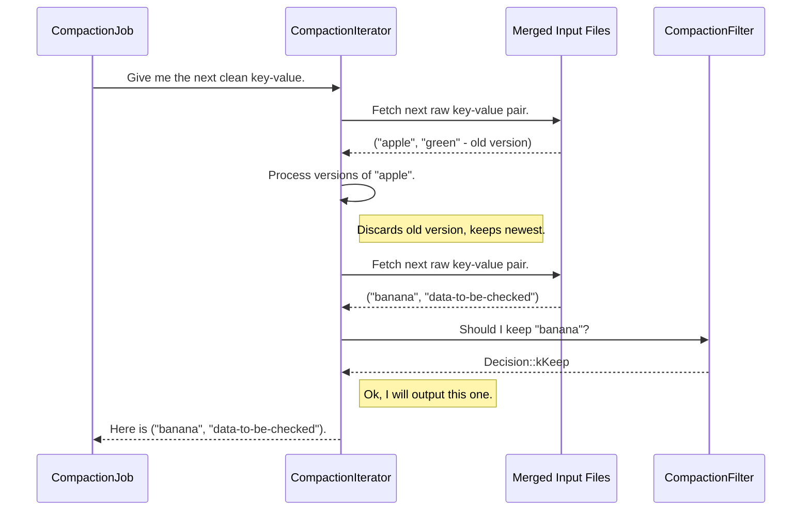

# Chapter 5: CompactionIterator

In our [previous chapter](04_compactionfilter_.md), we learned about the `CompactionFilter`, a custom inspector we can place on the database's cleanup assembly line. This inspector can look at each key-value pair and decide whether to keep, remove, or change it.

But who is the tireless worker on this assembly line? Who actually pulls the raw data from all the input files, presents it to our inspector, and then acts on the verdict? Meet the **`CompactionIterator`**.

### The Assembly Line Worker

Imagine the [CompactionJob](03_compactionjob_.md) as the foreman of a cleanup project. The foreman's job is to manage the overall process, but they don't handle every single nut and bolt. For that, they rely on a skilled assembly line worker.

The `CompactionIterator` is that worker. It's the core engine that drives the data processing part of a compaction. Its job is to:
1.  Sit at a conveyor belt that brings a sorted stream of key-value pairs from all input files.
2.  Look at multiple versions of the same key and intelligently merge them into one.
3.  Discard items that are old, obsolete, or marked for deletion.
4.  Show the current item to our [CompactionFilter](04_compactionfilter_.md) for a final quality check.
5.  Produce a single, clean, sorted stream of key-value pairs ready to be written into new files.

Essentially, it turns a messy, multi-file input into a clean, single-stream output.

### How It Merges Data

The magic of the `CompactionIterator` is in how it handles multiple versions of the same data. Remember, RocksDB is an LSM-tree, so a key like `"user:123"` might exist in several different files, each representing a different update over time. The iterator's job is to find the *most recent* version and discard all others.

Let's walk through a simple example. A compaction is merging two files:

*   **File A (Newer):** Contains `("apple", "red")` and `("grape", "purple")`.
*   **File B (Older):** Contains `("apple", "green")` and `("banana", "yellow")`.

The `CompactionIterator` sits on top of a special `MergingIterator` that provides a single, sorted view of both files:
`("apple", "red")`, `("apple", "green")`, `("banana", "yellow")`, `("grape", "purple")`

Here’s how the `CompactionIterator` processes this stream:

1.  **It sees `("apple", "red")`**. This is the first time it has seen the key "apple". It knows this is the most recent version because it came from the newer file.
2.  **It sees `("apple", "green")`**. It recognizes this is the same key ("apple") but an older version. It discards this record.
3.  **It sees `("banana", "yellow")`**. This is a new key. It processes it.
4.  **It sees `("grape", "purple")`**. This is another new key. It processes it.

The final, clean output stream produced by the `CompactionIterator` is:
`("apple", "red")`, `("banana", "yellow")`, `("grape", "purple")`

This output stream is then passed along to be written into a new, consolidated SST file.

### Under the Hood: The Iterator in Action

The `CompactionIterator` doesn't work alone. It's created and used by the `CompactionJob` and collaborates closely with the `CompactionFilter`.

Let's visualize the workflow when the `CompactionJob` wants to process the next piece of data.



This cycle repeats for every key in the input files. The `CompactionIterator` is the central coordinator, pulling raw data, applying compaction rules, consulting the filter, and producing the final clean record.

### A Glimpse at the Code

We can see this relationship in the code. The `CompactionJob` creates a `CompactionIterator`, passing it all the necessary components.

```cpp
// location: db/compaction/compaction_job.cc (Simplified)

void CompactionJob::ProcessKeyValueCompaction(SubcompactionState* sub_compact) {
  // ... setup ...
  
  auto c_iter = std::make_unique<CompactionIterator>(
      input, // The merged view of all input files
      cfd->user_comparator(),
      &merge, // A helper for merge operations
      &existing_snapshots_,
      compaction_filter, // Our custom inspector
      ...);

  c_iter->SeekToFirst();
  while (c_iter->Valid()) {
    // Add the iterator's clean output to the new file.
    sub_compact->AddToOutput(*c_iter, ...);
    c_iter->Next(); // Ask the iterator to process the next key.
  }
  // ... cleanup ...
}
```
The `CompactionJob`'s main loop simply trusts the `CompactionIterator` to do the right thing. It calls `c_iter->Next()` and blindly accepts the resulting `c_iter->key()` and `c_iter->value()` as the clean, correct output.

The most interesting logic is inside the iterator itself, specifically where it calls our `CompactionFilter`.

```cpp
// location: db/compaction/compaction_iterator.cc (Simplified)

bool CompactionIterator::InvokeFilterIfNeeded(...) {
  if (!compaction_filter_) { // Nothing to do if no filter is set.
    return true;
  }
  
  // Ask the user-provided filter for its decision.
  CompactionFilter::Decision filter = compaction_filter_->FilterV2(...);

  // Act on the filter's decision.
  if (filter == CompactionFilter::Decision::kRemove) {
    // Internally mark this key for removal.
    // It will be skipped and not written to the output.
    ikey_.type = kTypeDeletion; 
    iter_stats_.num_record_drop_user++;
  } else if (filter == CompactionFilter::Decision::kChangeValue) {
    // The filter provided a new value, so we'll use that instead.
    value_ = compaction_filter_value_;
  }
  return true;
}
```
This shows how the `CompactionIterator` directly translates the `Decision` from your filter into an action. Your simple `kRemove` return value causes the iterator to skip writing the record entirely, effectively deleting it.

### Conclusion

You have now met the `CompactionIterator`, the true workhorse of the compaction process. It is the engine at the heart of the `CompactionJob` that meticulously processes every key-value pair, merges different versions, drops obsolete data, and works with the `CompactionFilter` to clean the data according to your rules.

The `CompactionIterator` produces a beautiful, clean stream of key-value pairs. But where does this stream go? How does it get turned back into the SST files that make up the database? That's the job of our next component. In the next chapter, we'll explore **[CompactionOutputs](06_compactionoutputs_.md)**, the component responsible for building the new files.

---

Generated by [AI Codebase Knowledge Builder](https://github.com/The-Pocket/Tutorial-Codebase-Knowledge)