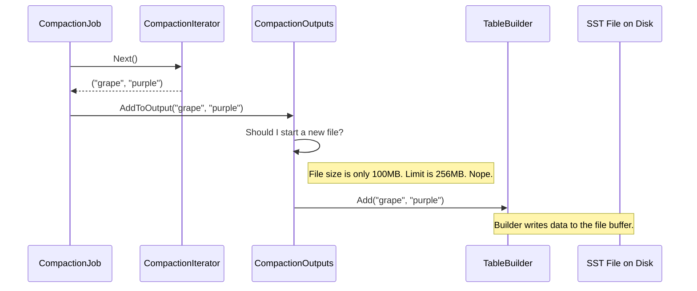

# Chapter 6: CompactionOutputs

In the [previous chapter](05_compactioniterator_.md), we met the `CompactionIterator`, the assembly line worker that produces a single, clean, sorted stream of key-value pairs. It takes messy inputs and hands us a perfect sequence of data.

But a stream of data isn't a file. What happens next? Who takes this perfect stream and packages it into the final product—the new SST files that will live on disk?

Meet **`CompactionOutputs`**, the packaging department of our compaction factory.

### The Packaging Department

Imagine our `CompactionIterator` is placing perfectly sorted and cleaned products onto a conveyor belt. At the end of the belt is the packaging station. This station's job is to:

1.  Take products from the belt and place them into a box (`TableBuilder`).
2.  Keep an eye on the box's weight. Once it reaches a certain limit (e.g., 256 MB), seal it, label it, and start a new, empty box.
3.  Keep a list of all the boxes filled during this shift.

This is precisely what `CompactionOutputs` does. It takes the clean key-value stream, writes it into new SST files, and intelligently decides when to finish one file and start another.

### What is `CompactionOutputs`?

`CompactionOutputs` is an abstraction that manages the creation of one or more new SST files for a single compaction task. It's the "output" stage of the process, responsible for:

*   **Creating Files**: Using a `TableBuilder` to write the key-value stream from the `CompactionIterator` into a new SST file.
*   **Splitting Files**: Monitoring the size of the current output file. If it gets too big, `CompactionOutputs` finalizes the current file and starts a new one. This prevents SST files from becoming monstrously large.
*   **Tracking Outputs**: Maintaining a list of all the `FileMetaData` for the new files it has created.

It's the component that turns the logical stream of clean data into physical, ready-to-use files.

### How a `CompactionJob` Uses It

The `CompactionOutputs` object doesn't run the show; it's a tool used by the [CompactionJob](03_compactionjob_.md) (via a helper called `SubcompactionState`). The job's main loop is simple: get a clean key from the iterator, and hand it to `CompactionOutputs`.

Here's a simplified view of the `CompactionJob`'s main loop:

```cpp
// location: db/compaction/compaction_job.cc (Highly Simplified)

void CompactionJob::ProcessKeyValueCompaction(...) {
  // `sub_compact` holds our CompactionOutputs object.
  // `c_iter` is our CompactionIterator.

  c_iter->SeekToFirst();
  while (c_iter->Valid()) {
    // 1. Get a clean key-value pair from the iterator.
    // 2. Hand it off to the packaging department.
    sub_compact->AddToOutput(*c_iter, ...); 

    // 3. Move to the next key-value pair.
    c_iter->Next();
  }
}
```

The `CompactionJob` doesn't need to know about file sizes or how many files have been created. It just trusts `CompactionOutputs` to handle all the packaging details correctly.

### Under the Hood: The Packaging Process

Let's follow a single key-value pair as it goes from the `CompactionIterator` to a new SST file on disk.



1.  The `CompactionJob` gets a clean key, `"grape"`, from the `CompactionIterator`.
2.  It calls `AddToOutput` on its `CompactionOutputs` object.
3.  `CompactionOutputs` first asks itself a crucial question: "Is the current file full?" It checks this using a helper method called `ShouldStopBefore`.
4.  In this case, the file is not yet full, so it takes the key-value pair and passes it to its internal `TableBuilder`.
5.  The `TableBuilder` handles the complex task of writing the data into the SST file format.

This process repeats. Eventually, `ShouldStopBefore` will return `true`, triggering the creation of a new file.

### Diving into the Code

Let's look at the two key methods inside `CompactionOutputs` that make this happen.

First, `AddToOutput`, which receives the key and decides what to do.

```cpp
// location: db/compaction/compaction_outputs.cc (Simplified)

Status CompactionOutputs::AddToOutput(const CompactionIterator& c_iter, ...) {
  // 1. Check if we need to finish the current file and start a new one.
  if (ShouldStopBefore(c_iter) && HasBuilder()) {
    FinishCompactionOutputFile(...); // Seal the current box.
  }

  // 2. If we don't have a file open, create one.
  if (!HasBuilder()) {
    OpenCompactionOutputFile(...); // Get a new empty box.
  }

  // 3. Add the key-value to the current file's builder.
  builder_->Add(c_iter.key(), c_iter.value());
  
  // Update our internal file size estimate.
  current_output_file_size_ = builder_->EstimatedFileSize();
  return Status::OK();
}
```

The logic is just like our packaging analogy. The most important decision is made in `ShouldStopBefore`. Let's see how it works.

```cpp
// location: db/compaction/compaction_outputs.cc (Simplified)

bool CompactionOutputs::ShouldStopBefore(const CompactionIterator& c_iter) {
  // There are many reasons to split a file, but this is the most common one.
  
  // Has the current file reached its target size?
  if (current_output_file_size_ >= compaction_->max_output_file_size()) {
    // Yes! Time to start a new file.
    return true;
  }
  
  // Other checks (e.g., for key ranges) go here...
  
  return false;
}
```

This simple check is the heart of automatic file splitting. By constantly checking the file size before adding a new key, `CompactionOutputs` ensures that SST files stay within their configured size limits, which is critical for keeping the LSM-tree balanced and healthy.

### Conclusion

You've now seen the final step in the compaction assembly line: `CompactionOutputs`. It's the unsung hero that takes the clean, logical stream of data from the `CompactionIterator` and expertly packages it into one or more physical SST files. It manages the details of file creation, splitting based on size, and tracking the final results.

So far, we've seen how a `CompactionJob` can run in parallel by breaking its work into smaller key ranges. Each of these parallel tasks needs to manage its own iterators and outputs. How does RocksDB manage the state for each of these "sub-jobs"? In our next chapter, we'll explore the container that holds all of this together: the **[SubcompactionState](07_subcompactionstate_.md)**.

---

Generated by [AI Codebase Knowledge Builder](https://github.com/The-Pocket/Tutorial-Codebase-Knowledge)