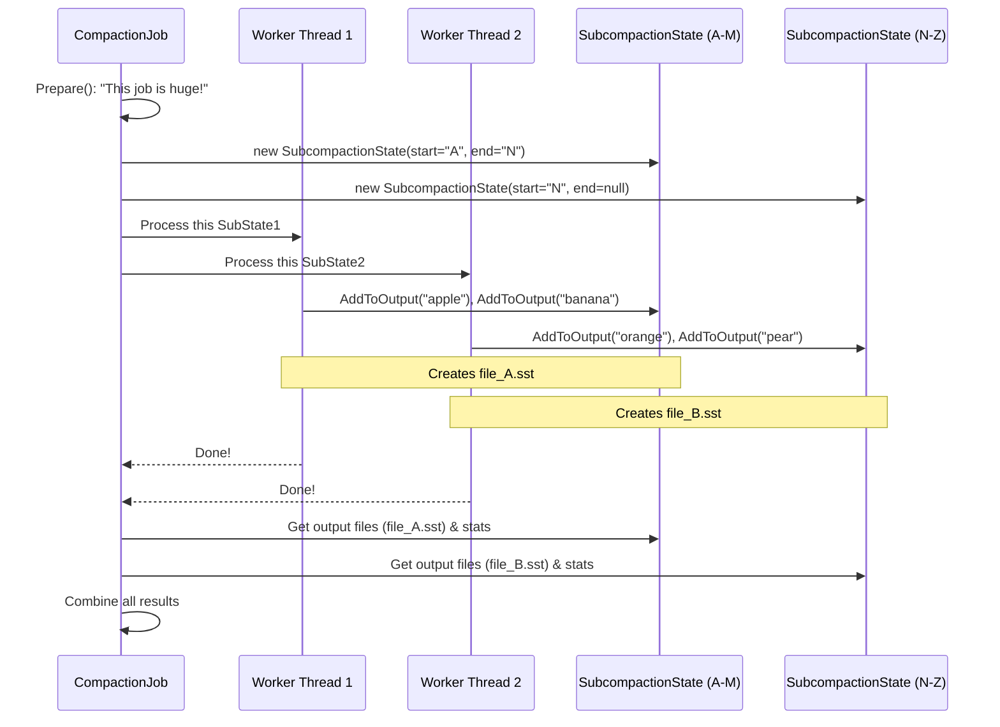

# Chapter 7: SubcompactionState

In the [previous chapter](06_compactionoutputs_.md), we learned about `CompactionOutputs`, the packaging department that takes a clean stream of data and turns it into shiny new SST files. We saw that it's smart enough to split a large output into multiple files.

But what if the *input* is gigantic? What if a single cleanup job needs to process terabytes of data? Doing that in one long, single-threaded task would take forever. To speed things up, RocksDB can break a big compaction job into smaller pieces and run them in parallel.

This brings up a new challenge: if you have multiple workers cleaning different sections of the database at the same time, how does each worker keep track of its own progress, its own output files, and its own statistics without messing up the others?

This is the problem that **`SubcompactionState`** solves.

### The Team of Editors

Imagine you have to edit a massive 1,000-page book. Doing it yourself would be slow. A better approach is to hire a team of three editors. You tell them:
*   **Editor A**: You handle pages 1-333.
*   **Editor B**: You handle pages 334-666.
*   **Editor C**: You handle pages 667-1000.

Each editor works on their own section simultaneously. Each one needs their own "state" to manage their work:
*   Their assigned page range.
*   The stack of new, edited pages they've produced.
*   A notepad to jot down stats, like how many typos they fixed.

A `SubcompactionState` is like the project folder for one of these editors. It's a container that holds all the information for a single, parallel unit of work within a larger [CompactionJob](03_compactionjob_.md).

### What is a `SubcompactionState`?

A `SubcompactionState` is a stateful object that represents one "sub-compaction". When a `CompactionJob` decides to parallelize its work, it creates several `SubcompactionState` objects. Each one is responsible for a non-overlapping slice of the total key range.

Each `SubcompactionState` manages its own:
*   **Boundaries (`start`, `end`):** The key range it's assigned to. For example, all keys from "grape" up to (but not including) "orange".
*   **Outputs (`compaction_outputs_`):** Its own personal instance of [CompactionOutputs](06_compactionoutputs_.md). This ensures that the files created by one sub-compaction don't get mixed up with files from another.
*   **Statistics (`compaction_job_stats`):** Its own set of counters for things like keys read, keys written, and keys dropped.
*   **Status (`status`):** The final result (success or failure) of its individual task.

After all the sub-compactions are done, the `CompactionJob` gathers the results from each `SubcompactionState` and combines them to complete the overall job.

### Under the Hood: A Parallel Compaction

Let's see how a `CompactionJob` uses `SubcompactionState` to run a job in parallel.


1.  **Prepare:** The `CompactionJob` analyzes the work and decides to split it. It creates two `SubcompactionState` objects, one for keys "A" through "M" and another for "N" through "Z".
2.  **Run:** The job launches two worker threads. It gives one thread a pointer to `SubState1` and the other a pointer to `SubState2`.
3.  **Execute:** Each thread works independently on its own slice of the data, writing its results into its own `SubcompactionState`. `Thread1` creates `file_A.sst`, and `Thread2` creates `file_B.sst`. They don't interfere with each other.
4.  **Install:** Once both threads are finished, the `CompactionJob` collects the list of new files (`file_A.sst`, `file_B.sst`) and the statistics from both `SubcompactionState` objects and registers them with the database.

This "divide and conquer" strategy makes large compactions much faster.

### A Glimpse at the Code

Let's look at the structure of `SubcompactionState`. It's essentially a bundle of all the objects one parallel task needs.

```cpp
// location: db/compaction/subcompaction_state.h (Simplified)

class SubcompactionState {
 public:
  const Compaction* compaction; // The overall plan

  // The key-range for this specific task
  const std::optional<Slice> start, end;

  // The result of this task
  Status status;

  // Stats for this task only
  CompactionJobStats compaction_job_stats;
  
  // The packaging department for this task
  CompactionOutputs& Current() const;

 private:
  CompactionOutputs compaction_outputs_;
  // ... other members ...
};
```
This class is the "project folder" for our editor analogy. It contains everything one editor needs to do their work in isolation.

The `CompactionJob` is responsible for creating and dispatching these "folders". Here's how it launches the worker threads:

```cpp
// location: db/compaction/compaction_job.cc (Simplified Logic)

Status CompactionJob::Run() {
  // We have a vector of sub-compaction tasks.
  // compact_->sub_compact_states is a std::vector<SubcompactionState>
  
  // Launch a thread for each sub-task from 1 to N-1.
  std::vector<port::Thread> thread_pool;
  for (size_t i = 1; i < compact_->sub_compact_states.size(); i++) {
    thread_pool.emplace_back(&CompactionJob::ProcessKeyValueCompaction, this,
                             &compact_->sub_compact_states[i]); // Pass a pointer
  }

  // Use the main thread for the first sub-task.
  ProcessKeyValueCompaction(&compact_->sub_compact_states[0]);

  // Wait for all threads to finish.
  for (auto& thread : thread_pool) {
    thread.join();
  }
  
  // ... combine results from all sub_compact_states ...
  return status;
}
```
Notice how each thread is given a pointer to a *different* `SubcompactionState` object. This is the key to safe parallelism. The worker function `ProcessKeyValueCompaction` then operates solely on the state object it was given.

```cpp
// location: db/compaction/compaction_job.cc (Simplified)

// This function runs in a worker thread
void CompactionJob::ProcessKeyValueCompaction(SubcompactionState* sub_compact) {
  // `c_iter` is a CompactionIterator that reads data only within
  // the sub_compact's start/end boundaries.
  
  while (c_iter->Valid()) {
    // Add the clean key to this sub-compaction's output files.
    sub_compact->AddToOutput(*c_iter, ...);
    c_iter->Next();
  }
  
  // All work is recorded in the sub_compact object.
  sub_compact->status = ...;
}
```

### Conclusion

You've now learned about `SubcompactionState`, the container that makes parallel compactions possible. It acts as an isolated workspace for each unit of work, holding its own boundaries, outputs, and statistics. By dividing a large `CompactionJob` into multiple `SubcompactionState`s, RocksDB can process massive amounts of data much more quickly by using multiple CPU cores at once.

So far, we have discussed how compaction happens on a single machine, even if it's in parallel. But what if a machine is already busy with user queries? What if we could offload the heavy work of compaction to a completely different set of machines? In our next chapter, we'll explore the objects that make this possible: **[CompactionServiceInput / CompactionServiceResult](08_compactionserviceinput___compactionserviceresult_.md)**.

---

Generated by [AI Codebase Knowledge Builder](https://github.com/The-Pocket/Tutorial-Codebase-Knowledge)