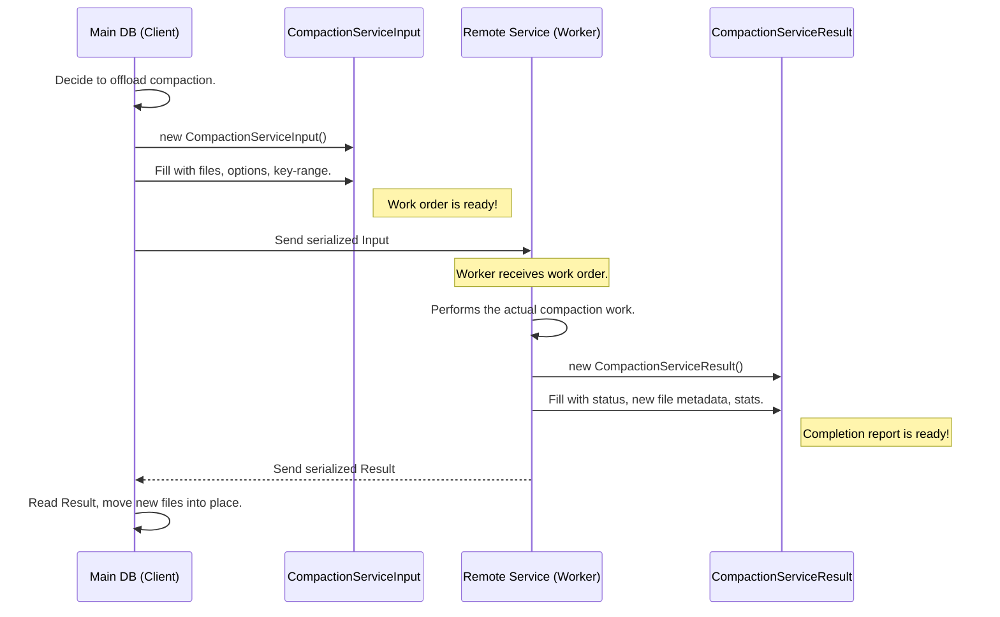

# Chapter 8: CompactionServiceInput / CompactionServiceResult

In the [previous chapter](07_subcompactionstate_.md), we saw how a large compaction job can be split into smaller parallel tasks using `SubcompactionState` to speed up work on a single machine. This is great, but what if our main database server is already busy handling user requests? The CPU and disk I/O from compaction can interfere with user traffic.

What if we could send the heavy lifting of compaction to a completely different set of machines? This would free up our main server to focus on what it does best: serving live queries.

To do this, we need a way to package up all the instructions for the job and a way to receive the results. This is where **`CompactionServiceInput`** and **`CompactionServiceResult`** come in. They are the shipping manifests for remote compactions.

### The Remote Factory Work Order

Imagine our main database is the headquarters (HQ) of a company. It's busy with customers and doesn't have time for a big manufacturing project. Instead, it outsources the work to a remote factory that has all the right tools and workers.

1.  **The Work Order (`CompactionServiceInput`)**: HQ can't just tell the factory "clean up some files." It needs to send a very detailed work order. This package must include the blueprints (`Options`), a list of raw materials (`input_files`), and specific instructions (`key_range`). This work order is the `CompactionServiceInput`.

2.  **The Delivery Report (`CompactionServiceResult`)**: Once the factory finishes building the new parts, it sends them back to HQ. Along with the parts, it sends a detailed report: "Here are the new items we made (`output_files`), they passed quality control (`status`), and here are the production stats (`stats`)." This report is the `CompactionServiceResult`.

HQ can then take the new, finished parts and seamlessly integrate them into its main assembly line.

### What is `CompactionServiceInput`?

`CompactionServiceInput` is a structure that bundles all the necessary information for a remote worker to perform a compaction. It’s a self-contained package that can be sent over the network.

It contains everything the remote worker needs to know, such as:
*   **`input_files`**: Which SST files to read.
*   **`output_level`**: Which level the new files are for.
*   **`column_family`**: The options (like `CompactionFilter` settings) for the specific column family being compacted.
*   **`db_options`**: The overall database settings.
*   **`begin` / `end`**: The specific key range this remote job is responsible for (just like a [SubcompactionState](07_subcompactionstate_.md)).

Let's look at its definition.

```cpp
// location: db/compaction/compaction_job.h

struct CompactionServiceInput {
  // Database and Column Family settings
  ColumnFamilyDescriptor column_family;
  DBOptions db_options;

  // Which files to read and where to write the output
  std::vector<std::string> input_files;
  int output_level;

  // The key range this job is responsible for
  bool has_begin;
  std::string begin;
  bool has_end;
  std::string end;
  // ... and other details like snapshots, db_id, etc.
};
```
When RocksDB decides to offload a compaction, the [CompactionJob](03_compactionjob_.md) on the main server fills out this structure. It's then serialized (turned into a string of bytes) and sent to the remote compaction service.

### What is `CompactionServiceResult`?

After the remote worker finishes its job, it needs to send the results back. The `CompactionServiceResult` is the structure used for this. It contains all the information the main server needs to integrate the newly created files.

Its key fields are:
*   **`status`**: Did the remote job succeed or fail?
*   **`output_files`**: A list of metadata for all the new SST files that were created. This includes their names, key ranges, and sequence numbers.
*   **`stats`**: A `CompactionJobStats` object with performance metrics from the remote job.

Here is its definition:

```cpp
// location: db/compaction/compaction_job.h

struct CompactionServiceResult {
  Status status;

  // Metadata for the new files created by the remote worker
  std::vector<CompactionServiceOutputFile> output_files;
  int output_level;

  // The path where the files are stored on shared storage
  std::string output_path;

  // Performance statistics
  CompactionJobStats stats;
  // ... other stats ...
};
```
The main server receives this structure, checks the `status`, and if it's successful, it can move the new files from the shared `output_path` into its own database directory and update its metadata. The old input files can then be safely deleted.

### Under the Hood: A Remote Trip

Let's trace the journey of a remote compaction job.



The code that manages this lives inside the `CompactionJob`. Let's look at a highly simplified version of how it prepares the `Input` package.

```cpp
// location: db/compaction/compaction_service_job.cc (Simplified)

// This runs on the Main DB server.
CompactionServiceJobStatus ProcessWithCompactionService(...) {
  // 1. Create the input package.
  CompactionServiceInput input_data;
  input_data.output_level = compaction->output_level();
  input_data.column_family.options = cfd->GetLatestCFOptions();
  input_data.snapshots = existing_snapshots_;

  // 2. Add all the input files to the list.
  for (const auto& level : *(compaction->inputs())) {
    for (const auto& file : level.files) {
      input_data.input_files.emplace_back(file->filename);
    }
  }

  // 3. Serialize and send to remote service (details omitted).
  // ... db_options_.compaction_service->StartV2(info, input_data); ...
}
```

After the remote service is done, the main server's `CompactionJob` receives the `CompactionServiceResult` and uses it to install the new files.

```cpp
// location: db/compaction/compaction_service_job.cc (Simplified)

// ... waiting for the remote job to complete ...

  // 4. Receive and deserialize the result.
  CompactionServiceResult result_data;
  CompactionServiceResult::Read(binary_result, &result_data);
  
  // 5. If successful, move the new files into our DB.
  if (result_data.status.ok()) {
    for (const auto& file : result_data.output_files) {
      // Rename the file from the remote path to our local path.
      fs_->RenameFile(remote_path + file.file_name, local_path);

      // Add the file's metadata to our database version.
      sub_compact->Current().AddOutput(file.meta, ...);
    }
  }
```
This elegant mechanism allows RocksDB to cleanly separate the "decision to compact" from the "work of compacting."

### Conclusion

Congratulations on completing the final chapter! You've learned about `CompactionServiceInput` and `CompactionServiceResult`, the data structures that act as work orders and completion reports for offloading compaction to remote machines. This powerful feature allows high-traffic databases to maintain their performance by delegating heavy background tasks to a dedicated fleet of workers.

Over the course of this tutorial, you have journeyed through the entire lifecycle of a RocksDB compaction:
*   We started with the **[Compaction](01_compaction_.md)**, the immutable blueprint for a cleanup job.
*   We met the **[CompactionPicker](02_compactionpicker_.md)**, the strategist that decides when and what to compact.
*   We followed the **[CompactionJob](03_compactionjob_.md)**, the workhorse that executes the plan.
*   We saw how to inject custom logic with a **[CompactionFilter](04_compactionfilter_.md)**.
*   We dove into the **[CompactionIterator](05_compactioniterator_.md)**, the core engine that merges and cleans data.
*   We learned how **[CompactionOutputs](06_compactionoutputs_.md)** packages the clean data into new files.
*   We explored how **[SubcompactionState](07_subcompactionstate_.md)** enables parallelism on a single machine.
*   And finally, we saw how **`CompactionServiceInput / Result`** enables parallelism across a distributed fleet.

You now have a solid, foundational understanding of one of RocksDB's most critical internal processes. Well done

---

Generated by [AI Codebase Knowledge Builder](https://github.com/The-Pocket/Tutorial-Codebase-Knowledge)