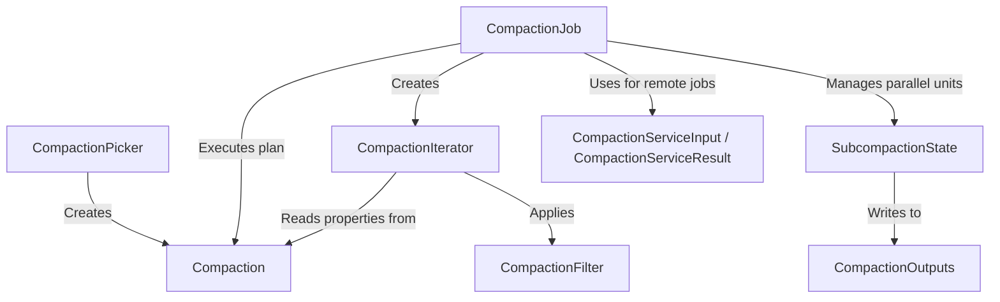

# Tutorial: compaction

The `compaction` project is the database's automated *housekeeper*, essential for maintaining high performance and managing storage space. Its main function is a process called **compaction**, which intelligently merges many small, fragmented data files into fewer, larger, and more organized ones. During this process, it cleans up data by removing old or deleted records and applying custom retention rules, which ultimately saves disk space and makes reading data from the database significantly faster.

**Source Repository:** [None](None)

## Chapters

1. [Compaction
](01_compaction_.md)
2. [CompactionPicker
](02_compactionpicker_.md)
3. [CompactionJob
](03_compactionjob_.md)
4. [CompactionFilter
](04_compactionfilter_.md)
5. [CompactionIterator
](05_compactioniterator_.md)
6. [CompactionOutputs
](06_compactionoutputs_.md)
7. [SubcompactionState
](07_subcompactionstate_.md)
8. [CompactionServiceInput / CompactionServiceResult
](08_compactionserviceinput___compactionserviceresult_.md)

---

Generated by [AI Codebase Knowledge Builder](https://github.com/The-Pocket/Tutorial-Codebase-Knowledge)