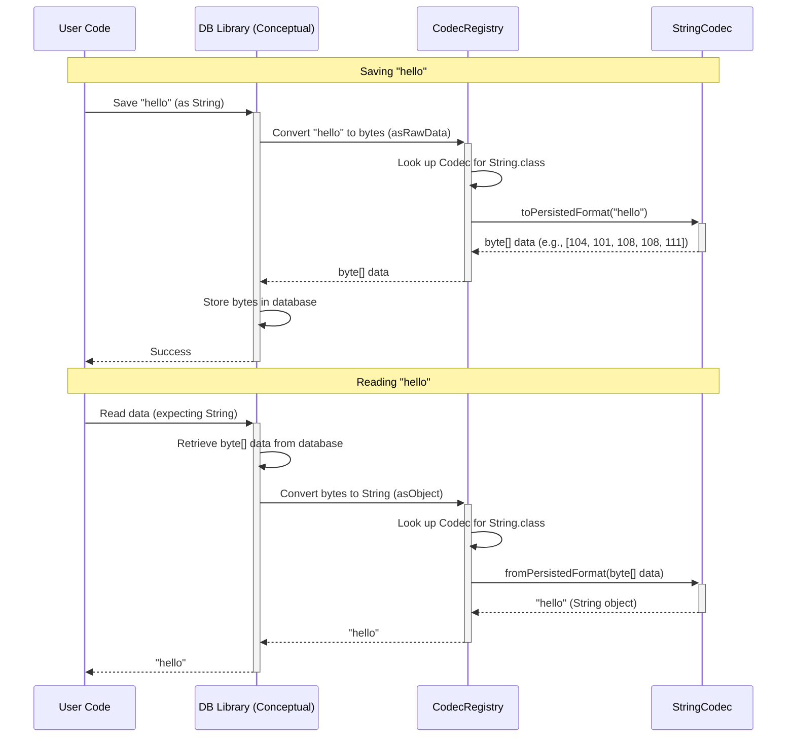

# Chapter 1: Codec / CodecRegistry

Welcome to the `db` tutorial! We're excited to guide you through the essential concepts of this database library. Let's start with the very foundation: how does the database understand your Java objects?

## The Problem: Speaking Different Languages

Imagine you have a Java program. You work with familiar things like `String`s (text), `Long`s (numbers), maybe even your own custom objects like `UserProfile`.

```java
String userName = "Alice";
Long userId = 12345L;
// Maybe even: UserProfile profile = new UserProfile("Alice", 12345L);
```

Now, you want to save this information in a database. Here's the catch: most high-performance databases don't store "Strings" or "Longs" directly. They store raw **byte arrays** – just sequences of bytes, like `[65, 108, 105, 99, 101]` for "Alice".

How do we translate between the "language" of Java objects that your program speaks and the "language" of byte arrays that the database understands?

This is where `Codec` and `CodecRegistry` come in!

## The Solution: Translators and a Translation Dictionary

Think of it like translating between spoken languages and written text:

1.  **`Codec` (The Translator):** A `Codec` is like a specialized translator for *one specific language (Java type)*. For example, there's a `StringCodec` that knows exactly how to translate a Java `String` into a byte array (this is called **serialization**) and how to translate a byte array back into a Java `String` (this is called **deserialization**). Similarly, there's a `LongCodec` for `Long` numbers, an `IntegerCodec` for `Integer` numbers, and you can even create custom `Codec`s for your own Java classes.

2.  **`CodecRegistry` (The Translation Dictionary/Registry):** You wouldn't hire just one translator if you needed to handle many languages. You'd have a registry or directory of translators. The `CodecRegistry` is exactly that! It keeps track of all the available `Codec`s. When the database needs to save or load an object, it asks the `CodecRegistry`: "Hey, I have a `String` object here. Which `Codec` should I use?" The `CodecRegistry` looks up its list and says, "Use the `StringCodec`!"

So, the core idea is:
*   **`Codec`:** Handles translation for *one* Java type <-> byte array.
*   **`CodecRegistry`:** Manages *all* the `Codec`s and helps find the right one for any given Java type.

## How It Works (The Big Picture)

You usually don't interact with individual `Codec`s or the `CodecRegistry` directly when performing simple database operations like saving or retrieving data. The `db` library uses them automatically behind the scenes.

Imagine you want to save the user's name:

1.  **Your Code:** You tell the database library, "Save this `String` 'Alice' with the key 'userName'." (We'll learn how to do this precisely in later chapters like [DBStore](04_dbstore_.md)).
2.  **`db` Library:** Before storing, it needs to convert "Alice" into bytes.
3.  **`CodecRegistry`:** The library asks the `CodecRegistry`, "What's the `Codec` for `String`?" The registry provides the `StringCodec`.
4.  **`StringCodec`:** The library uses the `StringCodec`'s `toPersistedFormat` method to convert "Alice" into a byte array (e.g., `[65, 108, 105, 99, 101]`).
5.  **Database:** The resulting byte array is stored.

And when reading data back:

1.  **Your Code:** "Get the value for 'userName', I expect it to be a `String`."
2.  **Database:** Retrieves the stored byte array (e.g., `[65, 108, 105, 99, 101]`).
3.  **`db` Library:** Needs to convert these bytes back into a `String`.
4.  **`CodecRegistry`:** The library asks, "What's the `Codec` for `String`?" It gets the `StringCodec`.
5.  **`StringCodec`:** The library uses the `StringCodec`'s `fromPersistedFormat` method to convert the byte array back into the `String` "Alice".
6.  **Your Code:** You receive the `String` "Alice".

Simple, right? The `Codec` and `CodecRegistry` handle all the translation work seamlessly.

## A Peek Under the Hood

Let's look a bit closer at how this translation happens.

### The `Codec` Interface (Simplified)

Every `Codec` basically needs to know how to do two things:

1.  `toPersistedFormat(YourJavaObject object)`: Takes your Java object and returns a `byte[]`.
2.  `fromPersistedFormat(byte[] data)`: Takes a `byte[]` from the database and returns your Java object.

Here's a glimpse of the `StringCodec`'s job (simplified):

```java
// From StringCodec.java (simplified concept)
public class StringCodec implements Codec<String> {

    // Converts a String object into bytes (using UTF-8 encoding)
    @Override
    public byte[] toPersistedFormat(String object) {
        if (object == null) {
            return EMPTY_BYTE_ARRAY; // Handle nulls
        }
        // Use standard Java way to get bytes from a String
        return object.getBytes(StandardCharsets.UTF_8);
    }

    // Converts bytes back into a String object (using UTF-8 encoding)
    @Override
    public String fromPersistedFormat(byte[] rawData) {
        if (rawData == null) {
            return null; // Handle nulls
        }
        // Use standard Java way to create a String from bytes
        return new String(rawData, StandardCharsets.UTF_8);
    }

    // ... other methods ...
}
```

And the simplest `Codec` of all, `ByteArrayCodec`, just passes the bytes through unchanged because the Java type *is* already `byte[]`!

```java
// From ByteArrayCodec.java
public final class ByteArrayCodec implements Codec<byte[]> {
    // ... (singleton setup) ...

    @Override
    public byte[] toPersistedFormat(byte[] bytes) {
        return bytes; // No conversion needed!
    }

    @Override
    public byte[] fromPersistedFormat(byte[] bytes) {
        return bytes; // No conversion needed!
    }

    // ... other methods ...
}
```

### The `CodecRegistry` In Action

The `CodecRegistry` holds a map internally, linking Java types (`Class` objects like `String.class`, `Long.class`) to their corresponding `Codec` instances (`StringCodec.get()`, `LongCodec.get()`).

When you set up your database (using [DBStoreBuilder](03_dbstorebuilder_.md), which we'll cover later), a `CodecRegistry` is usually created with default `Codec`s for common types:

```java
// From CodecRegistry.java
public static class Builder {
    // ... map to store Class -> Codec ...
    public <T> Builder addCodec(Class<T> type, Codec<T> codec) { /* ... */ }
    public CodecRegistry build() { /* ... */ }
}

public static Builder newBuilder() {
    // Adds common codecs automatically!
    return new Builder()
        .addCodec(String.class, StringCodec.get())
        .addCodec(Long.class, LongCodec.get())
        .addCodec(Integer.class, IntegerCodec.get())
        .addCodec(byte[].class, ByteArrayCodec.get())
        .addCodec(Boolean.class, BooleanCodec.get());
}
```

When the library needs to convert data, it uses methods like `asRawData` (object to bytes) or `asObject` (bytes to object) on the `CodecRegistry`.

```java
// From CodecRegistry.java (simplified)
public <T> byte[] asRawData(T object) {
    // 1. Find the right Codec for the object's class
    Codec<T> codec = getCodec(object); // Uses the internal map

    // 2. Use the Codec to convert the object to bytes
    return codec.toPersistedFormat(object);
}

public <T> T asObject(byte[] rawData, Class<T> format) {
    // 1. Find the right Codec for the target class 'format'
    Codec<T> codec = getCodecFromClass(format); // Uses the internal map

    // 2. Use the Codec to convert bytes back to an object
    return codec.fromPersistedFormat(rawData);
}
```

Let's visualize the flow when saving and reading data using a sequence diagram:



This diagram shows how the user code interacts conceptually with the database library, which then uses the `CodecRegistry` to find the correct `Codec` (`StringCodec` in this case) to perform the translation between the `String` object and the byte array stored in the database.

## Conclusion

You've learned about the crucial role of `Codec` and `CodecRegistry`!

*   **`Codec`:** Translates a *single* specific Java type to/from the raw byte arrays stored in the database (serialization/deserialization).
*   **`CodecRegistry`:** Acts as a directory, holding all the available `Codec`s and providing the correct one when needed.

Together, they form the bridge allowing your Java application to communicate effectively with the underlying byte-oriented database storage. You generally don't need to manage them directly for basic operations, but understanding them is key to knowing how your data is handled.

Now that we understand how data *types* are converted, let's move on to how we define the *structure* of our database, such as tables or columns.

Next up: [Chapter 2: DBDefinition / DBColumnFamilyDefinition](02_dbdefinition___dbcolumnfamilydefinition_.md)

---

Generated by [AI Codebase Knowledge Builder](https://github.com/The-Pocket/Tutorial-Codebase-Knowledge)