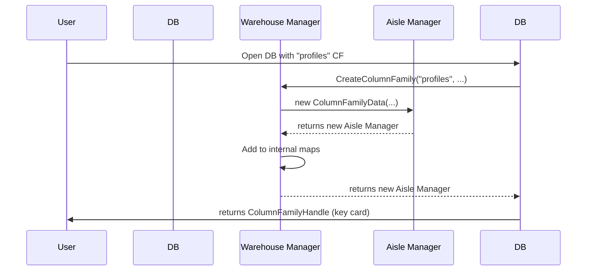

# Chapter 1: Column Family Management

Welcome to your journey into the internals of `db`! This is the very first chapter, and we're starting with a foundational concept that brings powerful organization to your data: **Column Families**.

### What's a Column Family, and Why Do I Need It?

Imagine your database is a giant warehouse. If you just threw everything onto the floor, it would be a chaotic mess! You wouldn't know where to find anything. Instead, you organize the warehouse into aisles, with each aisle dedicated to a specific type of item: one for electronics, one for groceries, another for tools, and so on.

A **Column Family** is exactly like an aisle in our warehouse. It's a way to logically group related data inside a single database.

Let's take a concrete example. Suppose we're building a social media app. We need to store two main types of data:
1.  **User Profiles**: Small pieces of data (username, email, join date). We access these very frequently.
2.  **User Posts**: Potentially large blocks of text or images. We might access these less often than profiles.

It would be inefficient to store them in the same way. We might want to use different compression settings for posts to save space, or give the user profile data a larger memory budget for faster access.

Column Families allow us to do this. We can create a `profiles` column family and a `posts` column family within the *same database*, and configure each one independently. This gives us the power of having multiple "tables" like in a traditional relational database, but with the flexibility and performance of a key-value store.

### The User's View: Handles to Your Data

When you work with column families, you don't interact with the complex internal machinery directly. Instead, you get a simple `ColumnFamilyHandle`. Think of this as the key card that gives you access to a specific aisle in our warehouse.

Let's see how you would open a database with our `profiles` and `posts` column families.

First, you define the column families you want. One is always the `default` column family, which exists even if you don't specify any others.

```cpp
// 1. Define the options for each column family.
// We'll use default options for simplicity.
rocksdb::ColumnFamilyOptions cf_options;

// 2. List the column families you want to create.
std::vector<rocksdb::ColumnFamilyDescriptor> column_families;
column_families.push_back(rocksdb::ColumnFamilyDescriptor(
    rocksdb::kDefaultColumnFamilyName, cf_options));
column_families.push_back(rocksdb::ColumnFamilyDescriptor(
    "profiles", cf_options));
column_families.push_back(rocksdb::ColumnFamilyDescriptor(
    "posts", cf_options));
```
Here, we're telling `db` that we want three column families: `default`, `profiles`, and `posts`.

Next, we open the database and get our "key cards" (`ColumnFamilyHandle`s).

```cpp
// 3. A vector to hold our handles (our "key cards").
std::vector<rocksdb::ColumnFamilyHandle*> handles;

// 4. Open the database with the defined column families.
rocksdb::DB* db;
rocksdb::DBOptions db_options;
db_options.create_if_missing = true;
rocksdb::Status status = rocksdb::DB::Open(db_options, "/tmp/testdb",
                                          column_families, &handles, &db);
assert(status.ok());
```

After this code runs, our `handles` vector will contain three pointers, one for each column family. We can now use these handles to write and read data from the correct "aisle".

```cpp
// Write a user profile to the "profiles" column family (handle at index 1)
db->Put(rocksdb::WriteOptions(), handles[1], "user123", "jane_doe");

// Write a post to the "posts" column family (handle at index 2)
db->Put(rocksdb::WriteOptions(), handles[2], "post456", "My first day!");

// Read the user profile back
std::string profile_value;
db->Get(rocksdb::ReadOptions(), handles[1], "user123", &profile_value);
// profile_value now contains "jane_doe"
```
Notice how we pass the specific `handle` to `Put` and `Get`. This tells `db` exactly which column family (which aisle) to operate on.

### Under the Hood: The Aisle Manager (`ColumnFamilyData`)

So what happens inside `db` when you use a column family? For every `ColumnFamilyHandle` you have, there is a corresponding internal object called `ColumnFamilyData`.

If the `ColumnFamilyHandle` is your key card, `ColumnFamilyData` is the **Aisle Manager**. It's a powerful internal class that holds *everything* about a single column family:
*   Its unique ID and name.
*   Its specific configuration (compression, memory limits, etc.).
*   Pointers to the actual data structures holding its key-value pairs.

This is critical because it's what allows each column family to be independent. The "profiles" Aisle Manager has its own rules and data separate from the "posts" Aisle Manager.

Let's look at a simplified view of `ColumnFamilyData` from `column_family.h`.

```cpp
// Simplified from column_family.h
class ColumnFamilyData {
 public:
  // thread-safe
  uint32_t GetID() const { return id_; }
  const std::string& GetName() const { return name_; }

  // ... other methods ...

 private:
  const uint32_t id_;
  const std::string name_;

  // Pointers to data structures for THIS column family
  MemTable* mem_;         // In-memory data
  MemTableList imm_;     // Recently flushed in-memory data
  Version* current_;     // On-disk data files (SSTs)
  SuperVersion* super_version_; // A consistent point-in-time view

  // ... many other fields ...
};
```
Don't worry about all the new terms like `MemTable` or `Version` just yet! They are the core data structures we will explore in upcoming chapters. For now, just know that `ColumnFamilyData` is the central hub that manages all these components for a *single* column family.

*   `mem_` points to the in-memory data, which we'll cover in [Chapter 2: In-Memory Writes and Durability (MemTable & WAL)](02_in_memory_writes_and_durability__memtable___wal__.md).
*   `current_` and `super_version_` manage the different versions of your data on disk, a topic for [Chapter 4: Versioning and Point-in-Time Views (SuperVersion)](04_versioning_and_point_in_time_views__superversion__.md).

### The Warehouse Manager (`ColumnFamilySet`)

If `ColumnFamilyData` is the aisle manager, then who manages all the aisle managers? That's the job of `ColumnFamilySet`.

`ColumnFamilySet` is the **Warehouse Manager**. It's a single object inside the database that keeps a list of all `ColumnFamilyData` objects. It knows about every column family that exists, what their names and IDs are, and how to find them.

When you open a database or create a new column family, the `ColumnFamilySet` is responsible for creating the new `ColumnFamilyData` object (the aisle manager) and adding it to its master list.

Here is a simplified diagram of how these pieces fit together when you open a database:



The user only ever sees the `ColumnFamilyHandle`, but this simple interaction kicks off a coordinated effort between the `DB`, the `ColumnFamilySet` (Warehouse Manager), and the `ColumnFamilyData` (Aisle Manager) to set everything up correctly.

Let's peek at the code in `column_family.cc` that handles this creation.

```cpp
// Simplified from ColumnFamilySet::CreateColumnFamily in column_family.cc
ColumnFamilyData* ColumnFamilySet::CreateColumnFamily(
    const std::string& name, uint32_t id, /*...*/) {
  
  // 1. Create the new "Aisle Manager"
  ColumnFamilyData* new_cfd = new ColumnFamilyData(
      id, name, /*...*/);

  // 2. Add it to the "Warehouse Manager's" lists
  column_families_.insert({name, id});
  column_family_data_.insert({id, new_cfd});

  // 3. Link it into the list of all column families
  // ... linking logic ...
  
  return new_cfd;
}
```
This function is the heart of column family creation. It instantiates the `ColumnFamilyData` object and registers it so the database can keep track of it.

### Conclusion

You've just learned about one of the most powerful organizational features in `db`!

*   **Column Families** are like aisles in a warehouse, allowing you to group and configure related data independently within a single database.
*   You interact with them through a **`ColumnFamilyHandle`**, your "key card" for a specific aisle.
*   Internally, each column family is managed by a **`ColumnFamilyData`** object (the "Aisle Manager"), which holds all its unique settings and data.
*   The entire collection of column families is orchestrated by the **`ColumnFamilySet`** (the "Warehouse Manager").

This ability to partition data is fundamental. It not only keeps your application organized but also allows you to fine-tune performance for different types of data.

Now that we understand how data is organized into logical groups, our next step is to see what happens when you actually write a key-value pair. Where does it go first?

In the next chapter, we'll dive into the world of in-memory writes. See you there!

**Next**: [Chapter 2: In-Memory Writes and Durability (MemTable & WAL)](02_in_memory_writes_and_durability__memtable___wal__.md)

---

Generated by [AI Codebase Knowledge Builder](https://github.com/The-Pocket/Tutorial-Codebase-Knowledge)