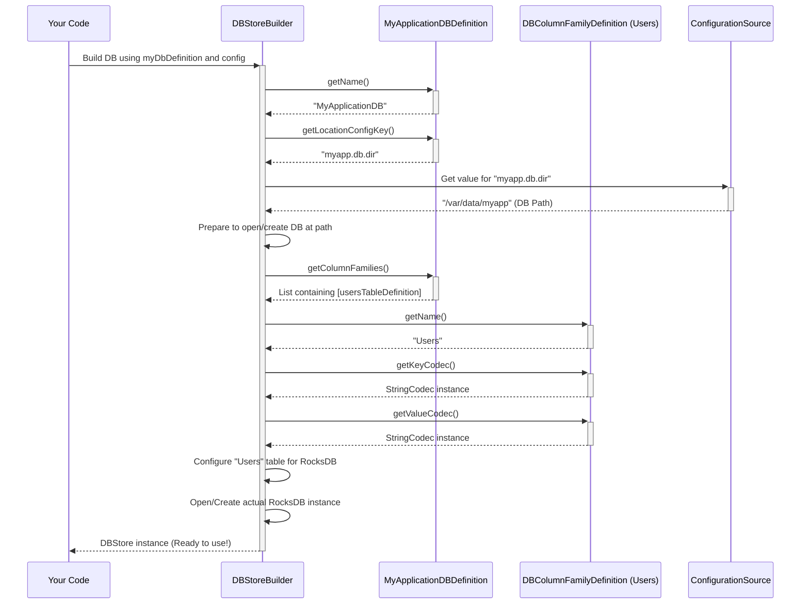

# Chapter 2: DBDefinition / DBColumnFamilyDefinition

In [Chapter 1: Codec / CodecRegistry](01_codec___codecregistry_.md), we learned how the `db` library translates your Java objects into byte arrays that the database can understand, using `Codec`s managed by a `CodecRegistry`. That's great for handling *individual pieces* of data.

But how do we organize this data? How do we tell the library, "I need a place to store user profiles, keyed by their username" or "I need another place to store product information, keyed by product ID"?

We need a way to define the overall *structure* of our database.

## The Problem: Designing the Filing Cabinet

Imagine you're setting up a physical filing cabinet for an office. Before you start putting documents in, you need a plan:

1.  **Overall Cabinet:** What's the cabinet called? Where will it be located in the office?
2.  **Drawers:** How many drawers does it have? What will you call each drawer (e.g., "User Files", "Product Specs")?
3.  **Drawer Contents:** What *kind* of documents go into each drawer? Does "User Files" hold folders keyed by name, containing user profile sheets? Does "Product Specs" hold folders keyed by ID, containing specification documents?

Similarly, before using our `db` library, we need to define:

1.  The overall database (its name, where its files live).
2.  The different "tables" or "sections" within the database (like drawers).
3.  What kind of keys and values each table will store (the type of "documents").

This is where `DBDefinition` and `DBColumnFamilyDefinition` come in! They are the blueprints for our database structure.

## The Solution: Blueprints for Your Database

1.  **`DBColumnFamilyDefinition` (The Drawer Blueprint):**
    *   This defines *one single table* (also often called a "Column Family" in the underlying RocksDB technology).
    *   It specifies:
        *   The **name** of the table (e.g., "Users", "Products").
        *   The **Java type** of the **keys** used in this table (e.g., `String` for usernames, `Long` for product IDs).
        *   The **Java type** of the **values** stored in this table (e.g., `UserProfile` objects, `ProductSpec` objects, or even just `String`s).
        *   Crucially, it holds the specific `Codec`s needed to translate these key and value types (connecting back to Chapter 1!).

2.  **`DBDefinition` (The Filing Cabinet Blueprint):**
    *   This defines the *entire database*.
    *   It specifies:
        *   The **name** of the database (e.g., "MyApplicationDB").
        *   A **configuration key** that tells the library where to find the database files on disk (e.g., "hdds.myapplication.db.dir").
        *   It holds a collection of all the `DBColumnFamilyDefinition`s that belong in this database (all the drawer blueprints).

Think of `DBDefinition` as the master plan for the whole filing cabinet, and each `DBColumnFamilyDefinition` as the detailed plan for a single drawer within it.

## How to Use Them: Creating the Blueprints

Let's define a simple database for storing user information. We'll need one table called "Users" where the key is the username (`String`) and the value is some user data (let's keep it simple and use a `String` for now, maybe representing their email address).

**Step 1: Define the "Drawer" (Table) - `DBColumnFamilyDefinition`**

We need to create an instance of `DBColumnFamilyDefinition`. Its constructor takes the table name, the key `Codec`, and the value `Codec`.

```java
import org.apache.hadoop.hdds.utils.db.DBColumnFamilyDefinition;
import org.apache.hadoop.hdds.utils.db.Codec;
import org.apache.hadoop.hdds.utils.db.StringCodec; // Assuming this exists

// Get the Codec instances we need (from Chapter 1 concepts)
Codec<String> stringCodec = StringCodec.get();

// Define the "Users" table
DBColumnFamilyDefinition<String, String> usersTableDefinition =
    new DBColumnFamilyDefinition<>(
        "Users",        // 1. Table Name
        stringCodec,    // 2. Key Codec (for String keys)
        stringCodec     // 3. Value Codec (for String values)
    );

System.out.println("Defined table: " + usersTableDefinition.getName());
System.out.println("Key Type: " + usersTableDefinition.getKeyType().getSimpleName());
System.out.println("Value Type: " + usersTableDefinition.getValueType().getSimpleName());
```

*Explanation:*
*   We import the necessary classes.
*   We get instances of the `Codec`s we need. Here, we assume `StringCodec.get()` gives us a ready-to-use `Codec` for `String`s (like the one discussed in Chapter 1).
*   We create the `DBColumnFamilyDefinition` by providing:
    1.  The name "Users".
    2.  The `stringCodec` for translating keys.
    3.  The `stringCodec` for translating values.
*   The output shows the name and the inferred Java types (`String`, `String`) derived from the provided `Codec`s.

**Step 2: Define the "Filing Cabinet" - `DBDefinition`**

Now we define the overall database that will *contain* our "Users" table. `DBDefinition` is an *interface*, so we typically create a class that implements it. A convenient way is often to extend the helper class `DBDefinition.WithMap`.

```java
import org.apache.hadoop.hdds.utils.db.DBDefinition;
import org.apache.hadoop.hdds.utils.db.DBColumnFamilyDefinition;
import java.util.Map;

// Assume usersTableDefinition from previous step exists

public class MyApplicationDBDefinition extends DBDefinition.WithMap {

    // Define the configuration key for the DB location
    public static final String DB_LOCATION_CONFIG_KEY = "myapp.db.dir";

    // Store our table definition
    public final DBColumnFamilyDefinition<String, String> usersTable;

    public MyApplicationDBDefinition() {
        // Initialize the table definition field
        this.usersTable = usersTableDefinition; // Use the one from Step 1

        // Create a map to hold all table definitions
        Map<String, DBColumnFamilyDefinition<?, ?>> columnFamilyMap =
            DBColumnFamilyDefinition.newUnmodifiableMap(this.usersTable);

        // Pass the map to the superclass constructor
        super(columnFamilyMap);
    }

    @Override
    public String getName() {
        return "MyApplicationDB"; // The logical name of the database
    }

    @Override
    public String getLocationConfigKey() {
        return DB_LOCATION_CONFIG_KEY; // The key to look up the path
    }
}

// --- How you might use it (conceptual) ---
MyApplicationDBDefinition myDbDefinition = new MyApplicationDBDefinition();
System.out.println("DB Name: " + myDbDefinition.getName());
System.out.println("Location Key: " + myDbDefinition.getLocationConfigKey());
System.out.println("Column Families: " + myDbDefinition.getColumnFamilyNames());
```

*Explanation:*
*   We create a class `MyApplicationDBDefinition` extending `DBDefinition.WithMap`.
*   We define a constant `DB_LOCATION_CONFIG_KEY` which will be used later to tell the library where to store the database files (e.g., in a configuration file, you might have `myapp.db.dir = /var/data/myapp`).
*   In the constructor, we take our `usersTableDefinition` (from Step 1) and put it into a `Map`. The key of the map is the table name ("Users"), and the value is the `DBColumnFamilyDefinition` object itself. The helper `DBColumnFamilyDefinition.newUnmodifiableMap` makes this easy.
*   We pass this map to the `super` constructor (`DBDefinition.WithMap`).
*   We implement `getName()` to return the database's logical name.
*   We implement `getLocationConfigKey()` to return our defined configuration key.
*   The `DBDefinition.WithMap` automatically provides the `getColumnFamilies()` method based on the map we passed in.
*   The output shows the database name, location key, and the names of the tables ("Column Families") it contains.

Now we have a complete blueprint (`MyApplicationDBDefinition`) describing our database structure!

## Under the Hood: Configuration Objects

`DBDefinition` and `DBColumnFamilyDefinition` are primarily *configuration holders*. They don't perform database operations themselves. Instead, they provide the necessary information to other parts of the `db` library, particularly the [DBStoreBuilder](03_dbstorebuilder_.md) (which we'll see in the next chapter), so it knows how to set up the actual database correctly.

Here's a simplified view of how the `DBStoreBuilder` might use these definitions:



*Explanation:*
1.  Your code tells the `DBStoreBuilder` to create a database using your `MyApplicationDBDefinition` and some configuration source (which provides the actual path for `myapp.db.dir`).
2.  The builder asks the `DBDefinition` for the database name and location key.
3.  It uses the location key to find the actual directory path from the configuration.
4.  It asks the `DBDefinition` for the list of all `DBColumnFamilyDefinition`s.
5.  For each `DBColumnFamilyDefinition` (like our "Users" one), it asks for its name and the key/value `Codec`s.
6.  The builder uses all this information (DB path, table names, codecs) to configure and create the actual low-level database instance (e.g., RocksDB).
7.  Finally, it returns a [DBStore](04_dbstore_.md) object, which you use for actual read/write operations.

**Code Internals:**

*   `DBColumnFamilyDefinition.java`: This class is quite straightforward. It mainly stores the `tableName`, `keyCodec`, and `valueCodec` provided in its constructor. Methods like `getName()`, `getKeyCodec()`, `getValueCodec()`, `getKeyType()`, and `getValueType()` simply return these stored values or types derived from the codecs.

    ```java
    // Simplified snippet from DBColumnFamilyDefinition.java
    public class DBColumnFamilyDefinition<KEY, VALUE> {
        private final String tableName;
        private final Codec<KEY> keyCodec;
        private final Codec<VALUE> valueCodec;
        // ... (constructor stores these) ...

        public String getName() { return tableName; }
        public Codec<KEY> getKeyCodec() { return keyCodec; }
        public Codec<VALUE> getValueCodec() { return valueCodec; }
        public Class<KEY> getKeyType() { return keyCodec.getTypeClass(); }
        public Class<VALUE> getValueType() { return valueCodec.getTypeClass(); }
        // ...
    }
    ```

*   `DBDefinition.java`: This is an interface. The `WithMap` helper class (which we used) takes care of storing the column family definitions in a `Map` and provides default implementations for `getColumnFamilies()` and `getColumnFamily(String name)` based on that map. You only need to implement `getName()` and `getLocationConfigKey()`.

    ```java
    // Simplified snippet from DBDefinition.java (WithMap helper)
    public abstract class WithMap implements WithMapInterface {
        private final Map<String, DBColumnFamilyDefinition<?, ?>> map;
        // ... (constructor stores the map) ...

        @Override
        public final Map<String, DBColumnFamilyDefinition<?, ?>> getMap() {
            return map;
        }

        // Provided by WithMapInterface using the map:
        // - getColumnFamilies() -> returns map.values()
        // - getColumnFamilies(String name) -> returns map.get(name)
        // - getColumnFamily(String name) -> returns map.get(name) if unique

        // You MUST implement these in your subclass:
        // public abstract String getName();
        // public abstract String getLocationConfigKey();
    }
    ```

These definition classes act as the structured, type-safe way to communicate your desired database schema to the rest of the `db` library.

## Conclusion

You've now learned about the essential blueprints for defining your database structure:

*   **`DBColumnFamilyDefinition`:** Defines a single table (Column Family) - its name, key type, value type, and the specific `Codec`s for translation. It's the blueprint for one drawer.
*   **`DBDefinition`:** Defines the entire database - its name, location configuration key, and holds all the `DBColumnFamilyDefinition`s. It's the master blueprint for the whole filing cabinet.

Together, they provide a clear, Java-based way to specify the schema of your database *before* you create it.

With our data translation (`Codec`) and database structure (`DBDefinition`) defined, how do we actually *build* the database instance based on this blueprint?

Next up: [Chapter 3: DBStoreBuilder](03_dbstorebuilder_.md)

---

Generated by [AI Codebase Knowledge Builder](https://github.com/The-Pocket/Tutorial-Codebase-Knowledge)