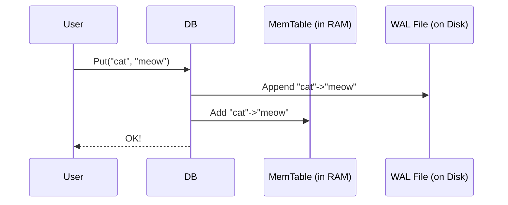

# Chapter 2: In-Memory Writes and Durability (MemTable & WAL)

In the [previous chapter](01_column_family_management_.md), we learned how `db` organizes data into different "aisles" called Column Families. It's a great way to keep related data together and configure it independently.

Now, let's zoom in and see what happens when you actually write a new key-value pair. If you just called `db->Put("cat", "meow")`, where does that data go? Does it go straight to a file on your hard drive? Not quite! To be fast, `db` is a bit more clever.

### The Challenge: Fast AND Safe Writes

Imagine you're a barista at a busy coffee shop. You have two goals:
1.  **Be Fast**: You need to take orders quickly so the line doesn't get too long.
2.  **Be Safe**: You must *never* lose an order, even if you get distracted or the power flickers.

If you tried to carve every order into a stone tablet, you'd be "safe" (the order would be permanent), but incredibly slow. The entire coffee shop would grind to a halt.

On the other hand, if you just tried to remember every order in your head, you'd be fast, but it's risky. What if you forget one?

`db` faces the exact same problem. Writing directly to its final, organized files on disk (the SST files we'll learn about later) would be too slow for a high-performance database. But just keeping new data in memory is too risky.

The solution? `db` does both at the same time, using two key components: the **MemTable** and the **Write-Ahead Log (WAL)**.

### The Solution Part 1 (Speed): The `MemTable`

The **`MemTable`** (short for "Memory Table") is our fast, in-memory scratchpad. Think of it as the barista's personal notepad.

When you write a new key-value pair, it's first placed into the `MemTable`. Because the `MemTable` lives entirely in your computer's RAM, this operation is lightning-fast.

*   **Fast Writes**: Adding data to the `MemTable` is as quick as updating any data structure in memory.
*   **Fast Reads**: When you try to read a key, `db` checks the `MemTable` first. This means you can immediately read back the data you just wrote, without waiting for it to be written to a slow disk.

Each **Column Family** has its own `MemTable`. So, a write to your `profiles` column family goes into the `profiles` MemTable, and a write to `posts` goes into its own `posts` MemTable.

Here is a simplified look at the `MemTable` class definition. It's the central C++ object that manages this in-memory data.

```cpp
// Simplified from memtable.h
class MemTable {
 public:
  // Add an entry to the memtable.
  Status Add(SequenceNumber seq, ValueType type, const Slice& key,
             const Slice& value, ...);

  // Get an entry from the memtable.
  bool Get(const LookupKey& key, std::string* value, Status* s, ...);

 private:
  // The data structure that actually stores the keys and values.
  // This is usually a sorted data structure called a SkipList.
  std::unique_ptr<MemTableRep> table_;

  // A special memory allocator for the table, for efficiency.
  ConcurrentArena arena_;

  // Total data size of all data inserted.
  std::atomic<uint64_t> data_size_;
  
  // ... other fields for stats and management ...
};
```
When you call `Put()`, `db` eventually calls the `MemTable::Add` method. This method takes your key and value, allocates a bit of memory for them inside its `arena_`, and inserts them into the `table_`.

### The Solution Part 2 (Safety): The Write-Ahead Log (WAL)

The `MemTable` is fast, but it's not safe. If your server loses power, everything in RAM—including your `MemTable`—is gone forever!

This is where the **Write-Ahead Log (WAL)** comes in. The WAL is our safety net. Think of it as the coffee shop's **permanent receipt roll**.

The WAL is a simple log file on disk. Every time you write data to the `MemTable`, `db` *also* appends that same data to the end of the WAL file.

*   **Why is this fast?** Appending to the end of a file is a sequential disk write, which is *much* faster than the random writes required to update `db`'s complex data files.
*   **Why is this safe?** The data is now on disk. If the server crashes, the `MemTable` in memory is lost, but the WAL file is still there, safe and sound.

When `db` restarts after a crash, it does the following:
1.  It finds the WAL file.
2.  It reads through the WAL from start to finish, like re-reading the receipt roll.
3.  For each entry in the WAL, it re-inserts the key-value pair into a new, empty `MemTable`.

By the time it's done "replaying" the WAL, the `MemTable` is fully restored to its pre-crash state. **No data has been lost!**

This process is managed internally by the `log::Writer` class, which is responsible for appending records to the WAL file.

```cpp
// Simplified from log_writer.h
namespace log {
class Writer {
 public:
  // Adds a record to the log file.
  IOStatus AddRecord(const Slice& slice);

 private:
  // The destination file on disk.
  std::unique_ptr<WritableFileWriter> dest_;
};
}
```
This simple `AddRecord` function is the key to durability. It takes your data and ensures it's written out to the log file.

### Putting It All Together: The `Put` Operation

So, when you call `db->Put("cat", "meow")`, here is what happens under the hood:



1.  Your application calls `Put()`.
2.  `db` writes the change `"cat" -> "meow"` into the **Write-Ahead Log** file on disk. This makes it durable.
3.  `db` also inserts the change into the **`MemTable`** in memory. This makes it visible to new reads.
4.  Only after the change is safely in the WAL does `db` return "OK" to your application.

This two-step process gives us the best of both worlds: the blazing speed of in-memory writes and the crash-proof safety of on-disk logging.

The internal `MemTable::Add` function is where the key-value pair gets stored in memory.

```cpp
// Simplified from MemTable::Add in memtable.cc
Status MemTable::Add(SequenceNumber seq, ValueType type, const Slice& key,
                     const Slice& value) {
    
  // 1. Calculate memory needed and allocate it from an Arena (a memory pool).
  const size_t encoded_len = /* calculate size for key, value, etc. */;
  char* buf = arena_.Allocate(encoded_len);

  // 2. Copy the key and value into the new memory buffer.
  //    (This also includes internal info like a sequence number).
  EncodeKeyValue(buf, key, value, seq, type);

  // 3. Insert the new entry into our in-memory data structure (the skiplist).
  table_->Insert(buf);

  // 4. Update memory usage statistics.
  data_size_ += encoded_len;
  num_entries_++;

  return Status::OK();
}
```
At the same time, this data (or a batch of data) is passed to the `log::Writer` to be appended to the WAL file, ensuring it can be recovered. The class responsible for coordinating WAL files is the `WalManager` (defined in `wal_manager.h`).

### Conclusion

You've just learned the fundamental principle behind how `db` achieves fast, durable writes. It's a classic database technique that balances speed and safety perfectly.

*   Writes first go to an in-memory **`MemTable`** for high-speed access. This is like a barista's scratchpad.
*   Simultaneously, writes are appended to an on-disk **Write-Ahead Log (WAL)** for durability. This is the permanent receipt roll.
*   If the system crashes, `db` can perfectly rebuild the `MemTable` by replaying the WAL, ensuring no data is ever lost.

This system works great, but we can make it even more efficient. What if we have 1,000 writes coming in at once? Do we write to the WAL 1,000 separate times? Or can we group them together?

In the next chapter, we'll explore how `db` batches writes together to make the process even faster.

**Next**: [Chapter 3: Write Batching and Serialization (WriteThread)](03_write_batching_and_serialization__writethread__.md)

---

Generated by [AI Codebase Knowledge Builder](https://github.com/The-Pocket/Tutorial-Codebase-Knowledge)