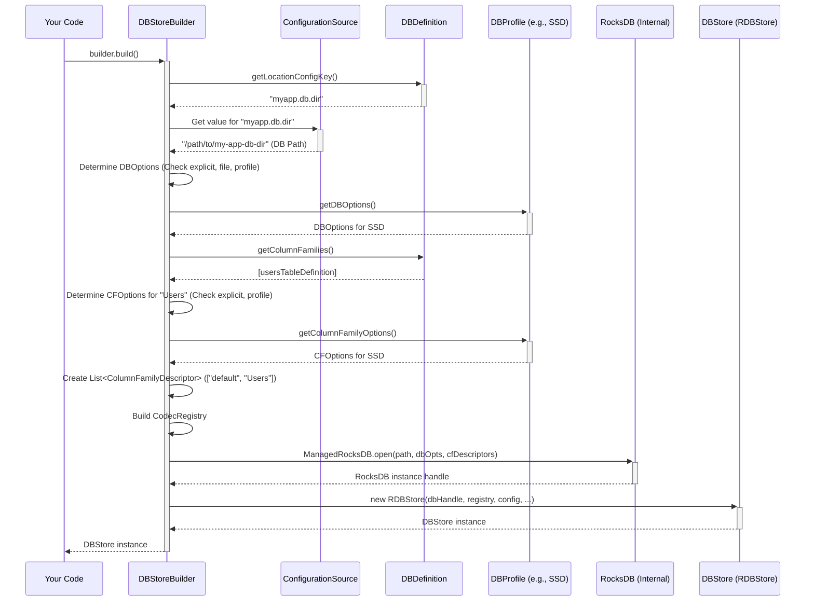

# Chapter 3: DBStoreBuilder

In [Chapter 2: DBDefinition / DBColumnFamilyDefinition](02_dbdefinition___dbcolumnfamilydefinition_.md), we learned how to create the blueprints (`DBDefinition` and `DBColumnFamilyDefinition`) that describe the structure of our database – like designing the layout of a filing cabinet and its drawers.

But how do we take those blueprints and actually *build* the physical filing cabinet? How do we specify where it should go, what materials (performance settings) to use, and maybe add some custom labels (Codecs)?

## The Problem: From Blueprint to Reality

Imagine you have the architectural plans (`DBDefinition`) for your filing cabinet. Now you need a skilled worker or a setup tool to:

1.  Read the plans.
2.  Know where to place the cabinet (the directory path on your disk).
3.  Decide on the quality of materials (performance profiles like SSD or DISK).
4.  Potentially use special instructions from a separate configuration file.
5.  Assemble the final, ready-to-use cabinet.

This "setup tool" is exactly what `DBStoreBuilder` does for our database. It takes the definition, configuration, and other settings, and constructs the actual `DBStore` object that you'll use to interact with the database.

## The Solution: The Database Construction Kit - `DBStoreBuilder`

Think of `DBStoreBuilder` as the **construction foreman** or a **setup wizard** for your database. It's a builder class specifically designed to configure and create an instance of a [DBStore](04_dbstore_.md).

Here's what the `DBStoreBuilder` helps you do:

*   **Specify the Database:** It determines the database's name and the location (directory path) where its files will be stored. This often comes from the `DBDefinition`.
*   **Define the Structure:** It registers the tables (Column Families) that should be created within the database, again, often using the `DBDefinition`.
*   **Apply Configuration:** It allows you to set various configuration options:
    *   **Performance Profiles:** Choose pre-defined settings optimized for SSDs or HDDs (`DBProfile`).
    *   **File-Based Config:** Load detailed RocksDB settings from `.ini` files for advanced tuning (`DBConfigFromFile`).
    *   **Specific Options:** Tweak individual settings like memory buffer sizes or logging.
*   **Manage Translations:** It lets you add custom [Codec / CodecRegistry](01_codec___codecregistry_.md) instances if your application uses data types not covered by the defaults.
*   **Build the `DBStore`:** Finally, its `build()` method takes all this configuration and constructs the actual, usable `DBStore` object.

Essentially, `DBStoreBuilder` gathers all the necessary pieces of information and uses them to assemble your database instance.

## How to Use It: Building Our `MyApplicationDB`

Let's continue with the example from Chapter 2, where we defined `MyApplicationDBDefinition`. Now, we'll use `DBStoreBuilder` to actually create the database based on that definition.

**Step 1: Get a `DBStoreBuilder` Instance**

The easiest way is to use the static factory method `DBStoreBuilder.newBuilder()` and pass it your application's configuration (`ConfigurationSource`) and your `DBDefinition`.

```java
import org.apache.hadoop.hdds.conf.OzoneConfiguration;
import org.apache.hadoop.hdds.utils.db.DBStore;
import org.apache.hadoop.hdds.utils.db.DBStoreBuilder;
import java.io.IOException;
import java.io.File;

// Assume MyApplicationDBDefinition from Chapter 2 exists
// Assume usersTableDefinition from Chapter 2 exists

public class BuildMyDatabase {

    public static void main(String[] args) throws IOException {
        // 1. Create a configuration object (provides settings like paths)
        OzoneConfiguration conf = new OzoneConfiguration();
        // IMPORTANT: Set the DB location defined in our DBDefinition
        // Usually this comes from a config file, but we set it manually here
        conf.set(MyApplicationDBDefinition.DB_LOCATION_CONFIG_KEY,
                 "./my-app-db-dir"); // Store DB in a subdirectory

        // Ensure the parent directory exists
        File dbParentDir = new File("./my-app-db-dir");
        dbParentDir.mkdirs();

        // 2. Create our DB definition instance
        MyApplicationDBDefinition dbDefinition = new MyApplicationDBDefinition();

        // 3. Get the builder using the definition and configuration
        DBStoreBuilder builder = DBStoreBuilder.newBuilder(conf, dbDefinition);

        System.out.println("DBStoreBuilder created for: " + dbDefinition.getName());
        // Builder now knows about the "Users" table and required codecs
        // from the definition. It also knows the location key.
    }
}
```

*Explanation:*
1.  We create a `ConfigurationSource` (using `OzoneConfiguration` here). This object holds settings, like the path where the database files should be stored.
2.  **Crucially**, we set the value for the `DB_LOCATION_CONFIG_KEY` ("myapp.db.dir") that we defined in our `MyApplicationDBDefinition`. This tells the builder *where* to put the database files. We also create the directory.
3.  We create an instance of our `MyApplicationDBDefinition`.
4.  We call `DBStoreBuilder.newBuilder(conf, dbDefinition)`. This creates the builder and automatically configures it with the name, location key, tables ("Users"), and required codecs (`StringCodec`) found in `dbDefinition`.

**Step 2: (Optional) Customize the Builder**

The builder often gets most of what it needs from the `DBDefinition`. However, you can further customize it.

```java
import org.apache.hadoop.hdds.utils.db.DBProfile;
// ... other imports from previous snippet ...

public class BuildMyDatabase {
    public static void main(String[] args) throws IOException {
        // ... (Setup conf, dbDefinition as before) ...

        DBStoreBuilder builder = DBStoreBuilder.newBuilder(conf, dbDefinition);

        // OPTIONAL: Apply a standard performance profile (e.g., for SSDs)
        builder.setProfile(DBProfile.SSD);
        System.out.println("Applied DB Profile: " + DBProfile.SSD);

        // OPTIONAL: Add another table manually (not from definition)
        // builder.addTable("AuditLog"); // Requires Codecs to be added too

        // OPTIONAL: Add a custom codec if needed
        // builder.addCodec(MyCustomObject.class, new MyCustomObjectCodec());
        // System.out.println("Added custom codec for MyCustomObject");

        // OPTIONAL: Open in read-only mode (e.g., for inspection tools)
        // builder.setOpenReadOnly(true);
        // System.out.println("Set to open in read-only mode");

        // ... (Next step: build) ...
    }
}
```

*Explanation:*
*   `setProfile(DBProfile.SSD)`: Applies a set of pre-configured RocksDB options optimized for solid-state drives. There's also `DBProfile.DISK`. This is a common way to tune performance without diving into deep details.
*   `addTable()`: You *can* add tables directly to the builder, but it's generally better practice to define them in your `DBDefinition`. If you add them here, you also need to ensure the corresponding key/value codecs are registered using `addCodec()`.
*   `addCodec()`: Registers a translator for a specific Java type, just like we discussed in [Chapter 1: Codec / CodecRegistry](01_codec___codecregistry_.md). The builder manages its own `CodecRegistry`. Codecs from the `DBDefinition` are added automatically.
*   `setOpenReadOnly()`: Tells the builder to open the database in a mode that prevents any modifications.

**Step 3: Build the `DBStore`**

This is the final step where the builder takes all the configuration and actually creates the database instance.

```java
// ... (Inside main method, after getting and configuring the builder) ...

        try {
            System.out.println("Building DBStore...");
            // The magic happens here!
            DBStore store = builder.build();

            System.out.println("DBStore built successfully!");
            System.out.println("DB Location: " + store.getDbLocation());

            // Now you can use the 'store' object to interact with the DB
            // (We'll cover this in the next chapter)

            // IMPORTANT: Close the store when you're done
            store.close();
            System.out.println("DBStore closed.");

        } catch (IOException e) {
            System.err.println("Error building DBStore: " + e.getMessage());
            e.printStackTrace();
        }
```

*Explanation:*
*   `builder.build()`: This is the command that triggers the construction. The builder performs several actions internally (see next section) and returns a `DBStore` object.
*   If successful, you get a `DBStore` instance ready to use. We print its location to confirm it used the path we configured.
*   **Crucially**, you must call `store.close()` when you are finished with the database to release resources properly. A `try-with-resources` block is often the best way to ensure this happens.

Now we have successfully used `DBStoreBuilder` to create our database based on the `MyApplicationDBDefinition` blueprint!

## Under the Hood: The Building Process

What actually happens inside the `builder.build()` method? It's a sequence of steps to gather configuration and prepare the underlying RocksDB database.

1.  **Validation:** Checks if essential things like the database name and path are set.
2.  **Configuration Resolution:**
    *   Determines the final database directory path by looking up the `locationConfigKey` (from `DBDefinition`) in the provided `ConfigurationSource`.
    *   Figures out the main database options (`DBOptions`) and options for each table (`ColumnFamilyOptions`). It prioritizes sources like this:
        *   Explicitly set options (`setDBOptions`, `setDefaultCFOptions`).
        *   Options loaded from a `.ini` file (if `DBConfigFromFile` finds one matching the DB name).
        *   Options from the selected `DBProfile` (`setProfile`).
        *   Default profile options (`HDDS_DEFAULT_DB_PROFILE`).
        *   Applies specific overrides from the configuration (like logging settings, write buffer sizes from `OZONE_METADATA_STORE_ROCKSDB_CF_WRITE_BUFFER_SIZE`).
3.  **Table Preparation:** Creates a list of `ColumnFamilyDescriptor` objects. Each descriptor pairs a table name (e.g., "Users", "default") with its resolved `ColumnFamilyOptions`.
4.  **Codec Registry:** Builds the final `CodecRegistry` containing all default codecs plus any added via `addCodec()` or derived from the `DBColumnFamilyDefinition`s.
5.  **RocksDB Instantiation:** Uses the resolved path, `DBOptions`, and the list of `ColumnFamilyDescriptor`s to open or create the actual RocksDB instance using `ManagedRocksDB.open(...)`. This involves interacting with the file system and the native RocksDB library.
6.  **Wrapper Creation:** Wraps the underlying RocksDB instance, the `CodecRegistry`, and other configuration into a `DBStore` object (specifically, an `RDBStore` instance).
7.  **Return:** Returns the fully constructed `RDBStore` object.

Let's visualize this configuration gathering:



**Code Internals:**

*   `DBStoreBuilder.java`: This class holds fields for `dbname`, `dbPath`, `configuration`, `rocksDBOption`, `defaultCfOptions`, `cfOptions` (map of table name to its specific options), the `CodecRegistry.Builder`, etc.
*   The `newBuilder(ConfigurationSource, DBDefinition)` method calls `applyDBDefinition`, which extracts the name, path key, tables, and codecs from the definition and stores them in the builder's fields.
    ```java
    // Simplified snippet from DBStoreBuilder.java applyDBDefinition
    private void applyDBDefinition(DBDefinition definition) {
        File metadataDir = getDBDirPath(definition, configuration);
        setName(definition.getName());
        setPath(Paths.get(metadataDir.getPath())); // Resolves path key

        for (DBColumnFamilyDefinition cfDef : definition.getColumnFamilies()) {
            addTable(cfDef.getName(), cfDef.getCfOptions()); // Add table
            addCodec(cfDef.getKeyType(), cfDef.getKeyCodec()); // Add codecs
            addCodec(cfDef.getValueType(), cfDef.getValueCodec());
        }
    }
    ```
*   The `build()` method orchestrates the process described above. It calls helper methods like `makeTableConfigs()` to finalize the options for each table (applying defaults if needed) and `getDefaultDBOptions()` to determine the main DB settings, considering profiles and `.ini` files via `DBConfigFromFile.java`.
    ```java
    // Simplified snippet from DBStoreBuilder.java build() method
    public DBStore build() throws IOException {
        // ... (validation) ...
        Set<TableConfig> tableConfigs = makeTableConfigs(); // Finalize CF options

        try {
            if (rocksDBOption == null) {
                // Tries .ini file, then profile, applies logging etc.
                rocksDBOption = getDefaultDBOptions(tableConfigs);
            }
            // ... (setup write options, stats) ...
            File dbFile = getDBFile(); // Final path + name

            // Core creation step
            return new RDBStore(dbFile, rocksDBOption, /* stats */,
                /* writeOpts */, tableConfigs, registry.build(),
                openReadOnly, /* jmx */, /* etc */);
        } finally {
             tableConfigs.forEach(TableConfig::close); // Clean up temp options
        }
    }
    ```
*   `DBProfile.java`: An enum defining sets of pre-configured `ManagedDBOptions` and `ManagedColumnFamilyOptions` for common scenarios like SSD or DISK.
*   `DBConfigFromFile.java`: Contains logic to look for a `.ini` file (e.g., `MyApplicationDB.ini`) in the config directory and load RocksDB options from it if found.

The builder acts as a central point, collecting information from various sources (`DBDefinition`, `ConfigurationSource`, profiles, direct calls) before constructing the final `DBStore`.

## Conclusion

You've learned that `DBStoreBuilder` is the essential tool for configuring and constructing your `DBStore` instance.

*   It acts like a **setup wizard**, taking blueprints (`DBDefinition`), location/settings (`ConfigurationSource`), performance choices (`DBProfile`), and custom codecs (`addCodec`).
*   It allows fine-grained **customization** of database options.
*   Its `build()` method performs the actual **assembly** process, interacting with the underlying RocksDB library.

We started with data translation ([Codec / CodecRegistry](01_codec___codecregistry_.md)), defined the structure ([DBDefinition / DBColumnFamilyDefinition](02_dbdefinition___dbcolumnfamilydefinition_.md)), and now we've built the database instance using `DBStoreBuilder`. What can we *do* with the `DBStore` object we just created?

Next up: [Chapter 4: DBStore](04_dbstore_.md)

---

Generated by [AI Codebase Knowledge Builder](https://github.com/The-Pocket/Tutorial-Codebase-Knowledge)