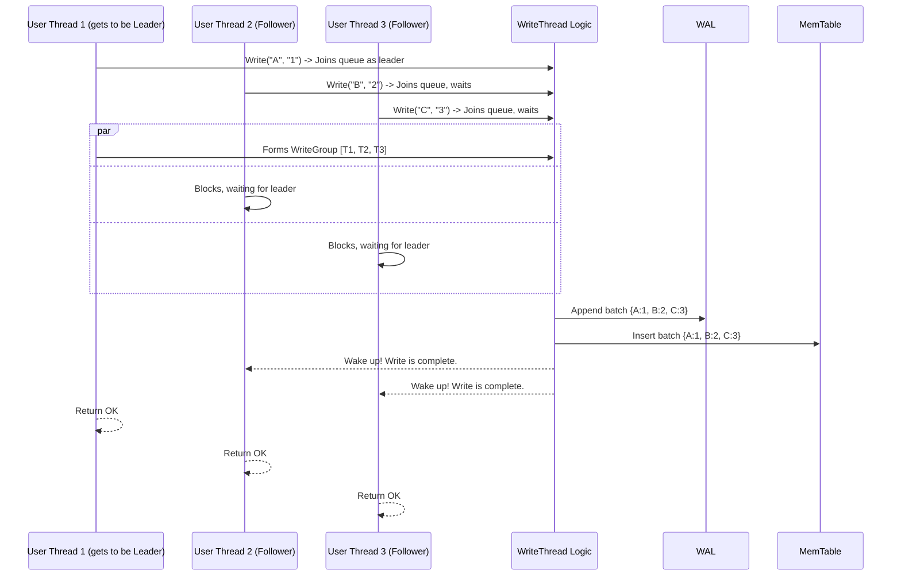

# Chapter 3: Write Batching and Serialization (WriteThread)

In the [previous chapter](02_in_memory_writes_and_durability__memtable___wal__.md), we saw how `db` uses the `MemTable` and `WAL` to make individual writes both fast and safe. It's like a barista writing down your order on a notepad (`MemTable`) and on a permanent receipt roll (`WAL`).

But what happens at a *really* busy coffee shop during the morning rush? If ten customers place their orders at the exact same time, does the barista run to the WAL ten times? That sounds inefficient! A smart barista would group those ten orders, write them all down at once, and then start making the drinks.

`db` is a smart barista. It uses a powerful mechanism to handle a rush of concurrent write requests efficiently: **Write Batching**.

### The Problem: A Traffic Jam of Writes

Imagine your application is incredibly popular, and hundreds of users are trying to save data at the same time. This creates a flood of `Put()` calls.

If `db` handled each one sequentially, it would create a bottleneck:
1.  Thread 1 writes to WAL, writes to MemTable.
2.  Thread 2 writes to WAL, writes to MemTable.
3.  Thread 3 writes to WAL, writes to MemTable.
4.  ...and so on.

Even though writing to the WAL is a fast "append" operation, it's still a disk I/O. Doing hundreds of tiny disk I/Os per second is much slower than doing one large I/O. Furthermore, each write needs to take a lock to update the `MemTable`, causing threads to wait on each other. We can do better!

### The Solution: The `WriteThread` Bouncer

`db` solves this with a component called the **`WriteThread`**. Think of it as a bouncer at a popular club. Instead of letting people in one at a time, the bouncer waits for a small group to form, and then lets the whole group in at once.

Here's how it works in `db`:
1.  Multiple threads call `Put()` at the same time.
2.  They don't write to the WAL or `MemTable` immediately. Instead, they line up in a queue managed by the `WriteThread`.
3.  The **first thread in line is elected "leader"** of the group.
4.  The leader gathers all the waiting "follower" threads behind it into a single **`WriteGroup`**.
5.  The leader is responsible for doing the work for the *entire group*. It merges everyone's data into one big `WriteBatch`.
6.  It writes this single, large batch to the **WAL** (one disk I/O instead of many).
7.  It then applies all the changes to the **`MemTable`** (with minimal locking).
8.  Finally, the leader wakes up all the follower threads and tells them, "Our group's data is now safely written!"

The followers don't do any work. They just wait patiently until the leader is done. This "group commit" strategy dramatically improves performance under heavy write loads.

### Under the Hood: The Writer's Queue

Let's see how this is implemented. When your thread calls `db->Write()`, `db` creates a small object to represent your request. This object is a `WriteThread::Writer`.

The `Writer` struct is like a ticket for a person waiting to get into the club. It holds their `WriteBatch` and their current status (are they waiting, are they the leader, is their write done?).

```cpp
// Simplified from write_thread.h
struct WriteThread {
  struct Writer {
    WriteBatch* batch;    // The data to be written
    // ... other options ...

    std::atomic<uint8_t> state; // STATE_INIT, STATE_GROUP_LEADER, etc.
    Writer* link_older;   // Pointer to the writer in front of us
    Writer* link_newer;   // Pointer to the writer behind us

    // ... status and other fields ...
  };
};
```
These `Writer` objects are linked together into a queue. When a new write comes in, the `WriteThread::LinkOne` function adds it to the back of the queue.

```cpp
// Simplified from WriteThread::LinkOne in write_thread.cc
// This function links a new writer `w` to the back of the queue.
bool WriteThread::LinkOne(Writer* w, std::atomic<Writer*>* newest_writer) {
  // `newest_writer` points to the current back of the queue.
  Writer* writers = newest_writer->load();

  // Link our new writer's `link_older` to the current end of the queue.
  w->link_older = writers;

  // Atomically set the new writer `w` as the *new* back of the queue.
  if (newest_writer->compare_exchange_weak(writers, w)) {
    // If the queue was empty before us, we are the leader!
    return (writers == nullptr);
  }
  // ... retry logic if another thread linked itself in at the same time ...
}
```

This simple linked-list logic allows multiple threads to safely add themselves to the write queue. The very first one to find an empty queue becomes the leader.

### The Life of a Write Operation

Let's trace the entire process with a diagram. Imagine three users are trying to write data at the same time.



The main entry point for this logic is in `DBImpl::WriteImpl`.

```cpp
// Simplified from DBImpl::WriteImpl in db_impl/db_impl_write.cc
Status DBImpl::WriteImpl(const WriteOptions& write_options, WriteBatch* my_batch, ...) {
  
  // 1. Create a "Writer" object for this request.
  WriteThread::Writer w(write_options, my_batch, ...);

  // 2. Join the queue. This call will block until our write is done.
  write_thread_.JoinBatchGroup(&w);

  // 3. If we become the leader, we execute the code below.
  //    Followers just wait inside JoinBatchGroup.
  if (w.state == WriteThread::STATE_GROUP_LEADER) {
    
    // 4. The leader gathers followers into a `write_group`.
    WriteThread::WriteGroup write_group;
    write_thread_.EnterAsBatchGroupLeader(&w, &write_group);

    // 5. The leader writes the whole group to the WAL and MemTable.
    // (Simplified logic for illustration)
    MergedBatch merged = MergeBatches(write_group);
    WriteToWAL(merged);
    InsertIntoMemTable(merged);

    // 6. The leader wakes up the followers.
    write_thread_.ExitAsBatchGroupLeader(write_group, status);
  }

  // 7. By the time we get here, our write is complete! Return status.
  return w.FinalStatus();
}
```
As a user of `db`, you just call `Put()` or `Write()` and all this complex coordination happens automatically. If you're the only one writing, you become a leader of a group of one and proceed immediately. If many threads are writing, one becomes the leader and does the work for everyone else, making the whole system much more efficient.

The actual function that inserts the batched data into the memtables is `WriteBatchInternal::InsertInto`, which we saw being used for recovery in the previous chapter. Here, it's used for live writes.

```cpp
// Simplified from write_batch_internal.h
class WriteBatchInternal {
  static Status InsertInto(
      WriteThread::WriteGroup& write_group, // The group of writes
      SequenceNumber sequence,
      ColumnFamilyMemTables* memtables,
      // ... other params ...
  );
}
```
The leader calls this function, passing the entire `write_group`. The function then iterates through all the `Writer`s in the group and applies their individual batches to the correct `MemTable` for each [Column Family](01_column_family_management_.md).

### Conclusion

You've just learned how `db` achieves incredible write performance under pressure!

*   Instead of processing writes one-by-one, `db` uses a **`WriteThread`** to group concurrent writes together.
*   One write becomes the **leader**, gathering followers into a **`WriteGroup`**.
*   The leader performs a single, large write to the **WAL** and a single batched update to the **`MemTable`**.
*   This process, often called a "group commit", significantly reduces disk I/O and lock contention, boosting throughput.

We've seen how `db` organizes data into Column Families, how it makes writes durable with the WAL, and how it batches writes for efficiency. But with all these writes happening, how does a reader get a clean, consistent snapshot of the data at a single point in time?

In the next chapter, we'll explore how `db` manages data versions to provide exactly that.

**Next**: [Chapter 4: Versioning and Point-in-Time Views (SuperVersion)](04_versioning_and_point_in_time_views__superversion__.md)

---

Generated by [AI Codebase Knowledge Builder](https://github.com/The-Pocket/Tutorial-Codebase-Knowledge)