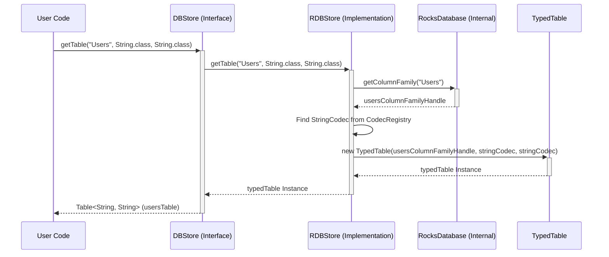

# Chapter 4: DBStore

In [Chapter 3: DBStoreBuilder](03_dbstorebuilder_.md), we learned how to use the `DBStoreBuilder` as a construction kit to assemble our database instance based on the blueprints (`DBDefinition`) we designed. We ended up with a `DBStore` object after calling `builder.build()`.

Great! We have our database file cabinet built and placed in the office. Now... how do we actually *use* it? How do we open a specific drawer ("Users")? How do we ask the whole system to save everything securely?

## The Problem: Interacting with the Whole Database

Imagine you have the physical filing cabinet (`DBStore` instance) ready. You need a way to:

1.  **Get a specific drawer:** "I need to work with the 'Users' drawer."
2.  **Perform system-wide actions:** "Make sure all pending documents are filed properly" (flushing) or "Take a complete copy of the cabinet contents right now" (snapshot/checkpoint).
3.  **Coordinate actions across drawers:** "Atomically move a file from 'Pending' to 'Approved'." (batch operations).

Simply having the built cabinet isn't enough; you need a way to *manage* and *interact* with it as a whole system.

## The Solution: `DBStore` - Your Database Manager

The `DBStore` object you get from the builder is precisely this manager! It's the main entry point for interacting with your database instance after it's been built.

Think of `DBStore` as the **central control panel** or the **office manager** responsible for the entire filing cabinet system. It doesn't hold the individual files itself (that's the job of the `Table`s, or drawers), but it provides access to them and controls the overall database operations.

Key things `DBStore` allows you to do:

*   **Get Tables:** Retrieve a specific `Table` object (a drawer) by its name. This is the most common operation.
*   **Flush Data:** Force any changes held in memory to be written to the disk for safety.
*   **Create Snapshots (Checkpoints):** Create a consistent point-in-time copy of the entire database. ([Chapter 8: DBCheckpoint / RDBCheckpointManager](08_dbcheckpoint___rdbcheckpointmanager_.md))
*   **Perform Batch Operations:** Execute multiple reads/writes across different tables as a single, atomic unit. ([Chapter 7: BatchOperation / BatchOperationHandler](07_batchoperation___batchoperationhandler_.md))
*   **Manage Lifecycle:** Close the database connection properly when you're done.

## How to Use It: Managing Our `MyApplicationDB`

Let's see how to use the `DBStore` instance we conceptually created in the previous chapter.

**Step 1: Obtain the `DBStore` Instance**

Remember, `DBStoreBuilder.build()` gives you the `DBStore`. We usually manage its lifecycle with a try-with-resources block to ensure it gets closed.

```java
import org.apache.hadoop.hdds.conf.OzoneConfiguration;
import org.apache.hadoop.hdds.utils.db.DBStore;
import org.apache.hadoop.hdds.utils.db.DBStoreBuilder;
import java.io.File;
import java.io.IOException;

// Assume MyApplicationDBDefinition exists from Chapter 2

public class UsingDBStore {

    public static void main(String[] args) {
        OzoneConfiguration conf = new OzoneConfiguration();
        conf.set(MyApplicationDBDefinition.DB_LOCATION_CONFIG_KEY, "./my-app-db-dir");
        File dbDir = new File("./my-app-db-dir");
        dbDir.mkdirs(); // Ensure directory exists

        MyApplicationDBDefinition dbDefinition = new MyApplicationDBDefinition();

        // Use try-with-resources to ensure store.close() is called
        try (DBStore store = DBStoreBuilder.newBuilder(conf, dbDefinition).build()) {

            System.out.println("DBStore obtained successfully!");
            System.out.println("DB Location: " + store.getDbLocation());

            // Now we can use the 'store' object...

        } catch (IOException e) {
            System.err.println("Error working with DBStore: " + e.getMessage());
            e.printStackTrace();
        }
    }
}
```

*Explanation:*
*   We set up the configuration and definition just like in Chapter 3.
*   The key part is `try (DBStore store = ...)` which gets the `DBStore` instance.
*   The `try-with-resources` statement guarantees that `store.close()` will be called automatically at the end of the block, even if errors occur. This is crucial for releasing database resources.

**Step 2: Get a Specific Table (Drawer)**

The most common use of `DBStore` is to get a reference to a specific table you defined.

```java
// Inside the try-with-resources block from Step 1:
try (DBStore store = DBStoreBuilder.newBuilder(conf, dbDefinition).build()) {
    System.out.println("DBStore obtained successfully!");

    // Get the "Users" table, specifying key and value types
    // These types MUST match what was defined in DBColumnFamilyDefinition
    Table<String, String> usersTable = store.getTable(
        "Users",         // The name of the table
        String.class,    // Expected key type
        String.class     // Expected value type
    );

    System.out.println("Got Table object for: Users");

    // We can now use 'usersTable' to put/get/delete user data
    // (We'll see how in the next chapter!)

    // You can also get a raw byte[] table if needed
    Table<byte[], byte[]> rawUsersTable = store.getTable("Users");
    System.out.println("Got raw Table object for: Users");


} catch (IOException e) { /* ... error handling ... */ }
```

*Explanation:*
*   `store.getTable("Users", String.class, String.class)` asks the `DBStore` for the table named "Users".
*   We provide the expected Java types for the keys (`String.class`) and values (`String.class`). The `DBStore` uses the [Codec / CodecRegistry](01_codec___codecregistry_.md) (configured by the builder) to handle the translation between these types and the underlying byte arrays automatically.
*   This returns a `Table<String, String>` object, which is specifically designed for working with String keys and String values in the "Users" table.
*   The simpler `store.getTable("Users")` returns a `Table<byte[], byte[]>`, which requires you to handle the byte array conversions yourself.

**Step 3: Perform Database-Wide Operations**

`DBStore` provides methods that affect the entire database.

```java
// Inside the try-with-resources block:
try (DBStore store = DBStoreBuilder.newBuilder(conf, dbDefinition).build()) {
    // ... get usersTable ...

    // Estimate the total number of keys across ALL tables
    long estimatedKeys = store.getEstimatedKeyCount();
    System.out.println("Estimated total keys in DB: " + estimatedKeys);

    // Force writing in-memory data to disk (useful before checkpoints)
    System.out.println("Flushing DB...");
    store.flushDB();
    System.out.println("DB flushed.");

    // Create a snapshot/checkpoint (more details in Chapter 8)
    System.out.println("Creating checkpoint...");
    DBCheckpoint checkpoint = store.getCheckpoint(true); // true = flush first
    System.out.println("Checkpoint created at: " + checkpoint.getCheckpointLocation());
    // Remember to clean up checkpoint files later if needed

} catch (IOException e) { /* ... error handling ... */ }
```

*Explanation:*
*   `getEstimatedKeyCount()`: Provides a rough estimate of the total number of key-value pairs in the entire database.
*   `flushDB()`: Ensures that any recent writes currently buffered in memory are physically written to the database files on disk.
*   `getCheckpoint(true)`: Creates a consistent snapshot of the database state at the current moment. The `true` argument tells it to flush the database first. We get a `DBCheckpoint` object back, which points to the location of the snapshot files. ([Chapter 8: DBCheckpoint / RDBCheckpointManager](08_dbcheckpoint___rdbcheckpointmanager_.md))

## Under the Hood: The `RDBStore` Implementation

The `DBStore` you interact with is actually an *interface*. The concrete class that does the real work, especially when using the default RocksDB backend, is `RDBStore`.

Think of `DBStore` as the job description ("Manage the Database") and `RDBStore` as the employee who actually performs the tasks using specific tools (the RocksDB library).

**What happens when you call `getTable("Users", String.class, String.class)`?**

1.  **Lookup:** The `RDBStore` holds a reference to the underlying `RocksDatabase` object and knows the mapping between table names (like "Users") and their internal RocksDB representations (called `ColumnFamily` handles). It looks up the handle for "Users".
2.  **Codec Check:** It uses its internal [Codec / CodecRegistry](01_codec___codecregistry_.md) to find the `Codec`s for `String.class` (both key and value).
3.  **Wrapper Creation:** It creates a `TypedTable` object. This object wraps the `ColumnFamily` handle and the requested `Codec`s.
4.  **Return:** It returns the `TypedTable<String, String>` object to you. This `TypedTable` now knows exactly which part of the database to talk to ("Users" column family) and how to translate your `String`s to/from bytes.

Let's visualize getting a table:



*Explanation:* Your code calls the `DBStore` interface method. This is handled by the `RDBStore` implementation, which interacts with the internal `RocksDatabase` to get the correct column family handle. It then creates and returns a `TypedTable` wrapper configured with the right handle and codecs.

**Code Glimpse:**

*   `DBStore.java` (Interface): Defines the contract - what methods a DBStore *must* provide.

    ```java
    // From DBStore.java (Simplified Interface)
    public interface DBStore extends Closeable, BatchOperationHandler {

        // Get table with raw bytes
        Table<byte[], byte[]> getTable(String name) throws IOException;

        // Get table with type conversion (uses CodecRegistry)
        <KEY, VALUE> Table<KEY, VALUE> getTable(String name,
            Class<KEY> keyType, Class<VALUE> valueType) throws IOException;

        // Force data to disk
        void flushDB() throws IOException;

        // Create a snapshot
        DBCheckpoint getCheckpoint(boolean flush) throws IOException;

        // Get estimated key count
        long getEstimatedKeyCount() throws IOException;

        // Close the database (from Closeable interface)
        @Override
        void close() throws IOException;

        // Other methods (listTables, move, batch operations...)
    }
    ```

*   `RDBStore.java` (Implementation): Provides the actual logic using RocksDB.

    ```java
    // From RDBStore.java (Simplified Implementation)
    public class RDBStore implements DBStore {
        private final RocksDatabase db; // The actual RocksDB connection
        private final CodecRegistry codecRegistry; // Holds the translators
        // ... other fields like checkpoint manager, metrics ...

        // Constructor called by DBStoreBuilder
        public RDBStore(File dbFile, /* ... many config options ... */,
                        CodecRegistry registry, /* ... more options ... */)
             throws IOException {
            // ... opens RocksDatabase, sets up column families ...
            this.db = RocksDatabase.open(...);
            this.codecRegistry = registry;
            // ... initialize checkpoint manager, metrics, etc. ...
        }

        @Override
        public RDBTable getTable(String name) throws IOException {
            // Get the internal RocksDB handle for the table name
            final RocksDatabase.ColumnFamily handle = db.getColumnFamily(name);
            if (handle == null) {
                 throw new IOException("No such table: " + name);
            }
            // Return a basic Table wrapper around the handle
            return new RDBTable(this.db, handle, /* metrics */);
        }

        @Override
        public <K, V> TypedTable<K, V> getTable(String name,
                Class<K> keyType, Class<V> valueType) throws IOException {
            // 1. Get the raw table wrapper first
            RDBTable rawTable = getTable(name);
            // 2. Wrap it in a TypedTable using the CodecRegistry
            return new TypedTable<>(rawTable, codecRegistry, keyType, valueType);
        }

        @Override
        public void close() throws IOException {
            // ... close metrics, checkpoint manager ...
            IOUtils.close(LOG, db); // Close the actual RocksDB connection
        }

        // ... implementations for flushDB, getCheckpoint, etc. ...
    }
    ```

This shows how `RDBStore` implements the `DBStore` interface, using its internal `RocksDatabase` instance and `CodecRegistry` to fulfill requests like `getTable`.

## Conclusion

You've learned that `DBStore` is the central hub for interacting with your database instance after it's built.

*   It acts as the **database manager**, providing access to individual tables and database-wide operations.
*   You obtain it from `DBStoreBuilder.build()`.
*   Its most common use is `getTable(name, keyType, valueType)` to get a specific, type-safe [Table](05_table_.md) object (like a drawer in the filing cabinet).
*   It also handles flushing, checkpoints ([Chapter 8: DBCheckpoint / RDBCheckpointManager](08_dbcheckpoint___rdbcheckpointmanager_.md)), and batch updates ([Chapter 7: BatchOperation / BatchOperationHandler](07_batchoperation___batchoperationhandler_.md)).
*   You **must** call `close()` (or use try-with-resources) when finished with the `DBStore`.

We now know how to get the overall database manager (`DBStore`) and how to ask it for a specific drawer (`Table`). But what can we actually *do* with that drawer? How do we put data in, get data out, or remove data?

Next up: [Chapter 5: Table](05_table_.md)

---

Generated by [AI Codebase Knowledge Builder](https://github.com/The-Pocket/Tutorial-Codebase-Knowledge)