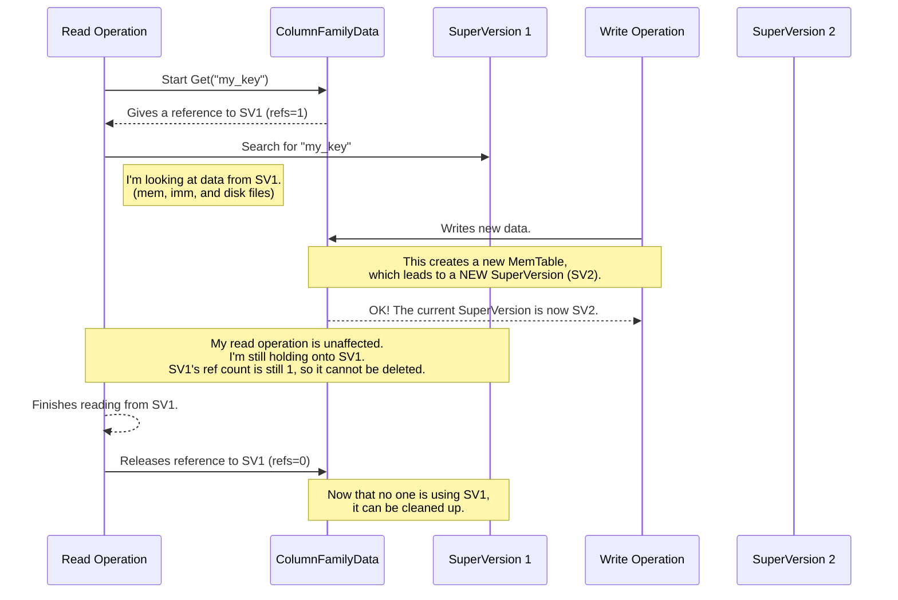

# Chapter 4: Versioning and Point-in-Time Views (SuperVersion)

In the [previous chapter](03_write_batching_and_serialization__writethread__.md), we learned how `db` can efficiently handle a storm of write requests by grouping them together. Our database is now a high-speed, durable writing machine.

But this raises a new and important question: what happens if you try to *read* from the database at the exact same moment another thread is writing to it? Or even worse, what if a background process is busy reorganizing files on disk (a process called compaction)? How do you get a stable, consistent answer without seeing a garbled, half-updated mess?

### The Challenge: Taking a Clear Photograph of a Moving Scene

Imagine you're trying to take a group photograph. If people are walking around, jumping, and changing positions while your camera shutter is open, you'll end up with a blurry, nonsensical picture. You need everyone to freeze for that one instant to get a clear shot.

A database faces the same problem. A "read" operation is like taking a photograph of the data. If writes are happening concurrently, the "scene" is constantly changing. A simple read could see a key before it's deleted, but miss the value that was just written somewhere else. This leads to inconsistent and incorrect results.

`db` solves this by giving every read operation its own perfect, frozen-in-time snapshot of the database. This is achieved through a clever versioning system, much like the version control system Git that programmers use for source code.

### Concept 1: `Version` - A Commit for Your On-Disk Data

Let's start with the data that's already been saved to disk in files called SSTs. A **`Version`** is simply a list of all the SST files that make up the database's state at a single point in time.

Think of it exactly like a **commit in Git**. A Git commit points to a specific state of all your code files. It doesn't contain the files themselves, just a manifest of which versions of which files belong together.

Similarly, a `db` `Version` is a lightweight object that says, "At this moment, the database consists of `file-A.sst`, `file-B.sst`, and `file-C.sst`."

When a background process like a flush or a [compaction](07_compaction_and_data_organization_.md) runs, it might merge `file-B.sst` and `file-C.sst` into a new `file-D.sst`. When this operation is complete, `db` creates a *new* `Version` object that says, "The database now consists of `file-A.sst` and `file-D.sst`." The old `Version` is kept around as long as something might need to read from it.

### Concept 2: `SuperVersion` - The Complete Snapshot

A `Version` only describes the files on disk. But what about the new data that's still in memory? As we learned in [Chapter 2](02_in_memory_writes_and_durability__memtable___wal__.md), recent writes live in the `MemTable` and immutable `MemTable`s. To get a truly complete picture, you need both the on-disk state and the in-memory state.

This is the job of the **`SuperVersion`**. It is the star of our show.

A `SuperVersion` is a critical container that bundles everything needed for a consistent view into a single package:
1.  A pointer to a **`Version`** (the on-disk files).
2.  A pointer to the active **`MemTable`** (the most recent in-memory writes).
3.  A list of **immutable `MemTable`s** (in-memory writes that are waiting to be flushed).

Let's look at the simplified structure in `column_family.h`. It's beautifully simple.

```cpp
// Simplified from column_family.h
struct SuperVersion {
  // A pointer to the active memtable (newest data).
  MemTable* mem;
  // A pointer to the list of memtables waiting to be flushed.
  MemTableListVersion* imm;
  // A pointer to the version of on-disk files.
  Version* current;

  // A reference counter to know how many operations are using me.
  std::atomic<uint32_t> refs;

  // ... other fields ...
};
```
When a read operation begins, it gets a reference to the current `SuperVersion` and increments its `refs` (reference count). This is like saying, "Hey, I'm using this snapshot! Please don't delete it yet."

### How Reads Stay Consistent

This reference counting is the key to preventing "blurry photographs." Let's see how it works step-by-step.



1.  A **Read Operation** starts. It asks its [Column Family](01_column_family_management_.md) for the current `SuperVersion` (let's call it `SV1`) and holds a reference to it.
2.  The read proceeds, looking for its key first in `SV1->mem`, then `SV1->imm`, and finally the on-disk files listed in `SV1->current`.
3.  At the same time, a **Write Operation** completes. This causes a change in the active `MemTable`, so `db` creates a brand new `SuperVersion` (`SV2`) to represent the new state of the database.
4.  The crucial part: `SV1` is **not deleted**. Even though the "current" `SuperVersion` of the database is now `SV2`, our read operation is still holding a reference to `SV1`. The reference count on `SV1` is not zero.
5.  The read operation is guaranteed to finish its work on a stable, unchanging view of the database defined by `SV1`.
6.  Once the read is finished, it releases its reference. If the reference count on `SV1` drops to zero, the system knows it's safe to garbage collect it and its associated old `Version`.

### The `VersionSet`: The Manager of All Versions

So who keeps track of all these `Version` and `SuperVersion` objects? That's the job of the **`VersionSet`**.

The `VersionSet` is a global object within the database that:
*   Knows what the "current" `Version` is.
*   Contains the logic for applying changes (like from a flush or compaction) to create new `Version`s.
*   Keeps track of all live `Version`s and helps in cleaning up old, unreferenced ones.

You can think of the `VersionSet` as the historian of the database, managing the entire timeline of changes. When a new `Version` is created, it's the `VersionSet` that links it into the history and, when an old `Version` is no longer needed by any `SuperVersion`, helps to retire it.

Here's the function in `column_family.cc` that gets called to install a new `SuperVersion`, which contains a new `Version` and new `MemTable` state.

```cpp
// Simplified from ColumnFamilyData::InstallSuperVersion in column_family.cc
void ColumnFamilyData::InstallSuperVersion(SuperVersionContext* sv_context, ...) {
  // 1. Get the new SuperVersion from the context.
  SuperVersion* new_superversion = sv_context->new_superversion;

  // 2. Set its contents (new memtable, immutables, and disk version).
  new_superversion->Init(this, mem_, imm()->GetVersion(), current_);

  // 3. Point the Column Family's 'super_version_' to this new one.
  super_version_ = new_superversion;
  super_version_number_.fetch_add(1);

  // 4. `sv_context` also holds the old SuperVersion, which can now be
  //    unreferenced and potentially cleaned up if its ref-count is zero.
}
```

This installation process is the atomic switch that moves the database from one point-in-time to the next.

### Conclusion

You've just uncovered the secret to how `db` provides incredibly strong consistency guarantees, even with many concurrent operations.

*   A **`Version`** is a snapshot of the database's on-disk files at a moment in time, like a Git commit.
*   A **`SuperVersion`** is the complete picture, bundling a `Version` with its corresponding in-memory `MemTable`s. This is the "clear photograph" that read operations use.
*   By using **reference counting**, `db` ensures that a `SuperVersion` stays alive as long as any operation is using it, providing a stable, isolated, point-in-time view.
*   The **`VersionSet`** manages the lifecycle of all `Version`s, creating new ones and helping to garbage collect old ones.

This mechanism gives you the power of "snapshot isolation" for free with every read. Now that we understand how to get a consistent view of the keys and values, how do we actually scan through them efficiently?

In the next chapter, we'll explore the primary tool for reading data in bulk: the `Iterator`.

**Next**: [Chapter 5: Iterators](05_iterators_.md)

---

Generated by [AI Codebase Knowledge Builder](https://github.com/The-Pocket/Tutorial-Codebase-Knowledge)