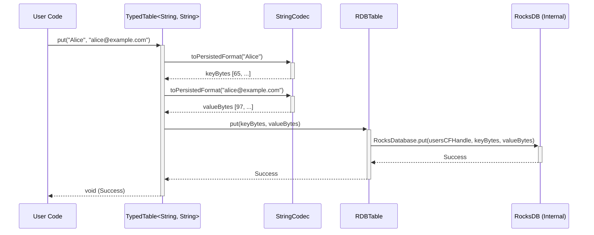

# Chapter 5: Table

In [Chapter 4: DBStore](04_dbstore_.md), we saw how the `DBStore` acts as the overall manager for our database, like the office manager for a filing cabinet system. We learned how to get a `DBStore` instance and, crucially, how to ask it for a specific "drawer" using `store.getTable("Users", String.class, String.class)`.

But once we have that `Table` object representing the "Users" drawer, what can we actually *do* with it? How do we put a new user file (key-value pair) into the drawer? How do we find an existing user file? How do we remove one?

## The Problem: Working Inside a Drawer

Imagine you have the "Users" drawer open in front of you. You need simple, direct ways to:

1.  **Add a file:** Put a new user profile, identified by their username ("Alice"), into the drawer.
2.  **Find a file:** Look up the profile for "Alice" and read its contents.
3.  **Check for a file:** Quickly see if a profile for "Bob" even exists in the drawer.
4.  **Remove a file:** Take out the profile for "Charlie".

We need an object that lets us perform these basic actions *within* the specific context of the "Users" drawer (or table).

## The Solution: `Table` - Your Drawer Handle

The `Table` object you get from `DBStore.getTable(...)` is exactly this handle to a specific drawer! It represents a logical collection of key-value pairs within the database, dedicated to storing data of a specific kind (like user profiles).

Think of the `Table` object as the **handle on the drawer** itself. You use this handle to perform all the fundamental operations *inside* that specific drawer: putting data in, getting data out, and deleting data.

There are two main "flavors" of `Table` you might encounter:

1.  **`RDBTable` (Raw Bytes):** This is the lower-level implementation. It works directly with raw `byte[]` arrays for both keys and values. It gives you maximum control but requires you to manually convert your Java objects (like `String`s or `Long`s) into bytes using [Codec / CodecRegistry](01_codec___codecregistry_.md) yourself.
2.  **`TypedTable<KEY, VALUE>` (Type-Safe):** This is a wrapper around `RDBTable` that makes life much easier! When you get a table using `store.getTable("Users", String.class, String.class)`, you get a `TypedTable<String, String>`. It automatically uses the correct [Codec / CodecRegistry](01_codec___codecregistry_.md) (that were set up by the [DBStoreBuilder](03_dbstorebuilder_.md)) to handle the conversion between your Java types (`String`, `Long`, etc.) and the raw bytes stored by `RDBTable`. You work directly with your familiar Java types!

For most application development, you'll be working with `TypedTable` because it's much more convenient and less error-prone.

## How to Use It: Basic Operations on the "Users" Table

Let's continue with our `Users` table example, assuming it stores usernames (`String`) as keys and user emails (`String`) as values.

**Step 1: Get the `Table` Instance (Recap)**

First, we need to get the `TypedTable` from the `DBStore`.

```java
import org.apache.hadoop.hdds.conf.OzoneConfiguration;
import org.apache.hadoop.hdds.utils.db.DBStore;
import org.apache.hadoop.hdds.utils.db.DBStoreBuilder;
import org.apache.hadoop.hdds.utils.db.Table;
import java.io.File;
import java.io.IOException;

// Assume MyApplicationDBDefinition exists from Chapter 2

public class WorkingWithTable {

    public static void main(String[] args) {
        OzoneConfiguration conf = new OzoneConfiguration();
        conf.set(MyApplicationDBDefinition.DB_LOCATION_CONFIG_KEY, "./my-app-db-dir");
        File dbDir = new File("./my-app-db-dir");
        dbDir.mkdirs();

        MyApplicationDBDefinition dbDefinition = new MyApplicationDBDefinition();

        try (DBStore store = DBStoreBuilder.newBuilder(conf, dbDefinition).build()) {

            // Get the type-safe handle for the "Users" table
            Table<String, String> usersTable = store.getTable(
                "Users",         // The name we defined
                String.class,    // Key type is String
                String.class     // Value type is String
            );

            System.out.println("Got Table handle for 'Users'");

            // Now we can use usersTable for operations...

        } catch (IOException e) {
            System.err.println("Error: " + e.getMessage());
            e.printStackTrace();
        }
    }
}
```

*Explanation:*
*   This sets up the `DBStore` as before.
*   `store.getTable("Users", String.class, String.class)` gives us our `TypedTable<String, String>` instance, ready to work with usernames and emails.

**Step 2: Add Data (`put`)**

Let's add a user named "Alice" with the email "alice@example.com".

```java
// Inside the try-with-resources block, after getting usersTable:

try {
    String username = "Alice";
    String email = "alice@example.com";

    System.out.println("Putting user: " + username);
    usersTable.put(username, email); // Add the key-value pair
    System.out.println("User 'Alice' added successfully.");

    // Add another user
    usersTable.put("Bob", "bob@sample.org");
    System.out.println("User 'Bob' added successfully.");

} catch (IOException e) {
    System.err.println("Error putting data: " + e.getMessage());
}
```

*Explanation:*
*   `usersTable.put(key, value)` is the method to insert or update data.
*   We provide the `String` key ("Alice") and the `String` value ("alice@example.com").
*   The `TypedTable` automatically uses its `StringCodec` to convert these `String`s into byte arrays before storing them in the underlying database table.
*   If a key already exists, `put` will overwrite the existing value.

**Step 3: Retrieve Data (`get`)**

Now, let's retrieve Bob's email address.

```java
// Inside the try-with-resources block:

try {
    String usernameToFind = "Bob";
    System.out.println("Getting user: " + usernameToFind);

    String bobsEmail = usersTable.get(usernameToFind); // Retrieve by key

    if (bobsEmail != null) {
        System.out.println("Found Bob's email: " + bobsEmail);
    } else {
        System.out.println("User 'Bob' not found.");
    }

    // Try getting a user who doesn't exist
    String charliesEmail = usersTable.get("Charlie");
    System.out.println("Getting 'Charlie': " + (charliesEmail == null ? "Not Found" : charliesEmail));

} catch (IOException e) {
    System.err.println("Error getting data: " + e.getMessage());
}
```

*Explanation:*
*   `usersTable.get(key)` retrieves the value associated with the given key.
*   We provide the `String` key ("Bob").
*   The `TypedTable` gets the raw bytes from the database, uses its `StringCodec` to convert them back into a `String`, and returns the result.
*   If the key does not exist in the table, `get` returns `null`.

**Step 4: Check for Existence (`isExist`)**

Sometimes, you just need to know if a key is present without fetching the actual value (which might be large).

```java
// Inside the try-with-resources block:

try {
    String userToCheck1 = "Alice";
    boolean aliceExists = usersTable.isExist(userToCheck1);
    System.out.println("Does user '" + userToCheck1 + "' exist? " + aliceExists);

    String userToCheck2 = "Charlie";
    boolean charlieExists = usersTable.isExist(userToCheck2);
    System.out.println("Does user '" + userToCheck2 + "' exist? " + charlieExists);

} catch (IOException e) {
    System.err.println("Error checking existence: " + e.getMessage());
}
```

*Explanation:*
*   `usersTable.isExist(key)` returns `true` if the key exists in the table, and `false` otherwise.
*   This can be more efficient than `get(key) != null` if you don't need the value, especially for certain database optimizations.

**Step 5: Delete Data (`delete`)**

Let's remove Bob from the table.

```java
// Inside the try-with-resources block:

try {
    String userToDelete = "Bob";
    System.out.println("Deleting user: " + userToDelete);
    usersTable.delete(userToDelete); // Remove the key-value pair
    System.out.println("User 'Bob' deleted.");

    // Verify deletion
    boolean bobExistsNow = usersTable.isExist(userToDelete);
    System.out.println("Does user 'Bob' exist now? " + bobExistsNow);

} catch (IOException e) {
    System.err.println("Error deleting data: " + e.getMessage());
}
```

*Explanation:*
*   `usersTable.delete(key)` removes the key and its associated value from the table.
*   If the key doesn't exist, the operation does nothing (it doesn't throw an error).

These (`put`, `get`, `isExist`, `delete`) are the fundamental operations you'll perform using a `Table` object.

## Under the Hood: `TypedTable` -> `RDBTable` -> RocksDB

What happens when you call `usersTable.put("Alice", "alice@example.com")` on your `TypedTable<String, String>`?

1.  **`TypedTable` Receives Call:** Your code calls `put` with the `String` key and `String` value.
2.  **Key Encoding:** The `TypedTable` uses the `keyCodec` (a `StringCodec` instance provided during setup) to call `toPersistedFormat("Alice")`. This converts the `String` "Alice" into a `byte[]` array (e.g., `[65, 108, 105, 99, 101]`).
3.  **Value Encoding:** Similarly, it uses the `valueCodec` (`StringCodec`) to call `toPersistedFormat("alice@example.com")`, converting the email `String` into another `byte[]` array.
4.  **Call `RDBTable`:** The `TypedTable` now has the key and value as byte arrays. It calls the `put` method on the underlying `RDBTable` object, passing these byte arrays.
5.  **`RDBTable` Calls RocksDB:** The `RDBTable` knows which specific column family ("Users") it represents within the actual RocksDB database. It takes the byte arrays and calls the appropriate RocksDB C++ library function (`RocksDatabase.put(columnFamilyHandle, keyBytes, valueBytes)`) to store the data persistently.

The process for `get` is similar but in reverse: `RDBTable` gets bytes from RocksDB, and `TypedTable` uses the codecs' `fromPersistedFormat` method to convert the bytes back into your Java `String` objects.

Let's visualize the `put` operation:



*Explanation:* The user code interacts with the convenient `TypedTable`. `TypedTable` uses the `StringCodec` to translate the `String`s into byte arrays. It then delegates the actual byte-level storage operation to the `RDBTable`, which in turn calls the underlying RocksDB database functions with the correct column family handle (`usersCFHandle`).

**Code Glimpse:**

*   `Table.java` (Interface): Defines the core methods any Table must implement.

    ```java
    // From Table.java (Simplified Interface)
    public interface Table<KEY, VALUE> extends AutoCloseable {

        void put(KEY key, VALUE value) throws IOException;

        boolean isExist(KEY key) throws IOException;

        VALUE get(KEY key) throws IOException;

        void delete(KEY key) throws IOException;

        // ... other methods like iterator(), putWithBatch(), deleteRange() ...
    }
    ```

*   `TypedTable.java` (Implementation): Wraps a raw table and uses codecs.

    ```java
    // From TypedTable.java (Simplified Implementation)
    public class TypedTable<KEY, VALUE> implements Table<KEY, VALUE> {
        private final RDBTable rawTable; // The underlying byte table
        private final Codec<KEY> keyCodec;
        private final Codec<VALUE> valueCodec;
        // ... constructor stores these ...

        @Override
        public void put(KEY key, VALUE value) throws IOException {
            // Encode Java objects to bytes using codecs
            byte[] keyBytes = keyCodec.toPersistedFormat(key);
            byte[] valueBytes = valueCodec.toPersistedFormat(value);
            // Delegate to the raw table
            rawTable.put(keyBytes, valueBytes);
        }

        @Override
        public VALUE get(KEY key) throws IOException {
            byte[] keyBytes = keyCodec.toPersistedFormat(key);
            // Get raw bytes from the underlying table
            byte[] valueBytes = rawTable.get(keyBytes);
            // Decode bytes back to Java object using codec
            return valueCodec.fromPersistedFormat(valueBytes);
        }

        @Override
        public boolean isExist(KEY key) throws IOException {
            // Encode key and ask raw table
            return rawTable.isExist(keyCodec.toPersistedFormat(key));
        }

        @Override
        public void delete(KEY key) throws IOException {
            // Encode key and tell raw table to delete
            rawTable.delete(keyCodec.toPersistedFormat(key));
        }
        // ... other methods delegate similarly ...
    }
    ```

*   `RDBTable.java` (Implementation): Interacts directly with RocksDB using byte arrays.

    ```java
    // From RDBTable.java (Simplified Implementation)
    class RDBTable implements Table<byte[], byte[]> {
        private final RocksDatabase db; // The actual RocksDB instance
        private final RocksDatabase.ColumnFamily family; // Handle for this specific table

        RDBTable(RocksDatabase db, RocksDatabase.ColumnFamily family, ...) {
            this.db = db;
            this.family = family;
        }

        @Override
        public void put(byte[] key, byte[] value) throws IOException {
            // Directly call RocksDB API with the column family handle
            db.put(family, key, value);
        }

        @Override
        public byte[] get(byte[] key) throws IOException {
            return db.get(family, key);
        }

        @Override
        public boolean isExist(byte[] key) throws IOException {
            // Uses keyMayExist or get under the hood
            return db.keyMayExist(family, key) != null || get(key) != null;
        }

        @Override
        public void delete(byte[] key) throws IOException {
            db.delete(family, key);
        }
        // ...
    }
    ```

This structure allows `TypedTable` to provide a user-friendly, type-safe API, while `RDBTable` handles the low-level byte interaction with the database engine.

## Conclusion

You've learned about the `Table` interface, the workhorse for interacting with key-value pairs within a specific part of your database.

*   `Table` represents a single "drawer" or collection (like a relational table or column family).
*   You get a `Table` instance from `DBStore.getTable(...)`.
*   `TypedTable<K, V>` is the most common way to interact, providing type safety by automatically using [Codec / CodecRegistry](01_codec___codecregistry_.md) to handle conversions between your Java types and raw bytes.
*   `RDBTable` works directly with `byte[]`.
*   The core methods are `put`, `get`, `isExist`, and `delete` for basic CRUD operations.

Now you know how to add, retrieve, check, and remove individual items from a table using their keys. But what if you want to see *all* the items in the table, or iterate through a range of keys?

Next up: [Chapter 6: TableIterator](06_tableiterator_.md)

---

Generated by [AI Codebase Knowledge Builder](https://github.com/The-Pocket/Tutorial-Codebase-Knowledge)