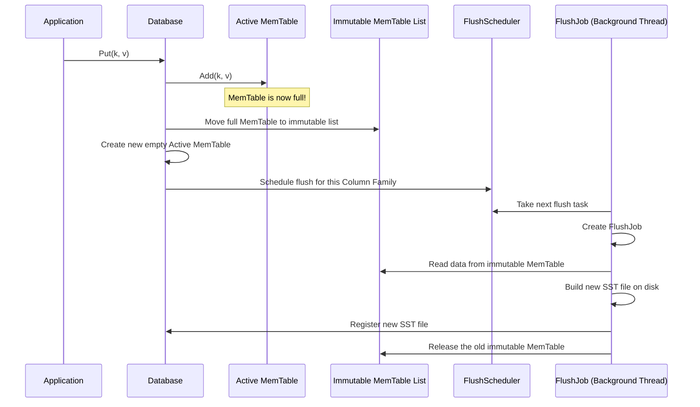

# Chapter 6: Flushing MemTables to Disk (FlushJob)

In the [previous chapter](05_iterators_.md), we learned how iterators give us a unified, sorted view of our data, seamlessly blending what's in memory with what's on disk. It's a powerful way to read data.

But this brings up a critical question. We know from [Chapter 2](02_in_memory_writes_and_durability__memtable___wal__.md) that new writes go into an in-memory `MemTable` for speed. But computer memory is finite! What happens when the `MemTable` fills up? We can't just keep adding data to it forever.

### The Problem: The Notepad is Full

Let's go back to our coffee shop analogy. The barista uses a notepad (the `MemTable`) to quickly jot down new orders. This works great, but eventually, the page gets full. The barista can't take any more orders on that page. What should they do?

They can't just stop taking orders—that would bring the whole coffee shop to a halt. And they can't just throw the filled page away—that would lose customer orders!

The only solution is to **archive** the full page. The barista tears off the full sheet, puts it on a "to be filed" spindle, and grabs a fresh, empty page to continue taking new orders. Later, a back-office worker takes the filled sheet and carefully enters the orders into a permanent, organized logbook.

This is exactly what `db` does. The process of taking a full, in-memory `MemTable` and writing its contents to a permanent file on disk is called a **flush**.

### The Solution: The `FlushJob` Archivist

A **`FlushJob`** is the "archivist" that performs this task. It is a self-contained unit of work that encapsulates all the information and logic needed to perform a flush. It's a background job that ensures the database can continue accepting new writes at high speed while old data is safely stored away.

Here's the high-level process:

1.  **The `MemTable` gets full:** When the active `MemTable` for a [Column Family](01_column_family_management_.md) reaches a certain size (configured by `write_buffer_size`), `db` knows it's time for a flush.
2.  **Swap and Freeze:** `db` makes the full `MemTable` **immutable** (read-only). It's "frozen" and moved to a special list of immutable memtables. A brand new, empty `MemTable` is immediately put in its place so that new writes can continue without interruption.
3.  **Schedule the Work:** The column family that needs flushing is added to a queue called the `FlushScheduler`. This is like putting the filled notepad page on the "to be filed" spindle.
4.  **The `FlushJob` Begins:** A background thread picks up the task from the scheduler and creates a `FlushJob` to handle it.
5.  **Write to Disk:** The `FlushJob` reads all the key-value pairs from the immutable `MemTable`(s), sorts them, and writes them into a new, permanent file on disk. This file is called an **SST (Sorted String Table)**.
6.  **Update the Records:** Once the SST file is safely on disk, the `FlushJob` updates the database's master record ([`SuperVersion`](04_versioning_and_point_in_time_views__superversion__.md)) to include the new file.
7.  **Clean Up:** Now that its contents are safely persisted in an SST file, the immutable `MemTable` is no longer needed and its memory can be freed. The handwritten page is shredded.

Let's visualize this flow:



This elegant system allows `db` to handle a continuous stream of writes without ever pausing to wait for disk I/O.

### Under the Hood: Kicking off a Flush

The whole process starts when a column family needs to be flushed. A component called the `FlushScheduler` manages a simple, thread-safe queue of which column families are waiting.

The `ScheduleWork` method, defined in `flush_scheduler.cc`, is how a column family gets added to this queue. It cleverly uses atomic operations to add an item to the front of a linked list without needing a heavy lock.

```cpp
// Simplified from FlushScheduler::ScheduleWork in flush_scheduler.cc
void FlushScheduler::ScheduleWork(ColumnFamilyData* cfd) {
  // We're adding cfd to the "to-do" list.

  // 1. Create a new "task" node.
  Node* node = new Node{cfd, head_.load()};

  // 2. Atomically try to set our new node as the head of the list.
  //    If another thread beats us, `compare_exchange_strong` will fail,
  //    update `node->next` to the new head, and we'll automatically retry.
  while (!head_.compare_exchange_strong(node->next, node)) {
    // Retry...
  }
}
```
A background flush thread simply calls `TakeNextColumnFamily()` to pop a task from this list and begin work.

### The `FlushJob` in Action

Once a task is picked up, a `FlushJob` object is created. Think of its constructor as gathering all the paperwork for our archivist. It receives everything it needs to know, like database options, the column family it's working on, and pointers to the versioning system.

The main logic resides in its `Run()` method. Here's a very simplified look at what `Run()` does, focusing on the core file-writing part in `WriteLevel0Table` from `flush_job.cc`.

```cpp
// Simplified from FlushJob::WriteLevel0Table in flush_job.cc
Status FlushJob::WriteLevel0Table() {
  // We are now running in a background thread, DB mutex is released.

  // 1. Create an iterator for each immutable memtable we need to flush.
  std::vector<InternalIterator*> memtable_iters;
  Arena arena;
  for (MemTable* m : mems_) {
    memtable_iters.push_back(m->NewIterator(ReadOptions(), &arena));
  }

  // 2. Create a MergingIterator to give us one single, sorted view
  //    of all the memtables. This is the same tool we saw in Chapter 5!
  ScopedArenaIterator iter(
      NewMergingIterator(&cfd_->internal_comparator(), memtable_iters.data(),
                         memtable_iters.size(), &arena));

  // 3. Set up the options for building our new table file.
  TableBuilderOptions tboptions(...);

  // 4. Build the table! This reads from our iterator and writes
  //    the compressed, sorted data into a new SST file on disk.
  Status s = BuildTable(
      dbname_, ..., iter.get(), ..., &meta_ /* output file metadata */);

  // ... After this, re-acquire DB mutex and install the results ...
  return s;
}
```

This is where several concepts we've learned come together beautifully:
*   The `FlushJob` takes one or more **immutable `MemTable`s**.
*   It uses a **[`MergingIterator`](05_iterators_.md)** to read their contents in perfect sorted order.
*   It feeds this data into a `TableBuilder`, which creates a new **SST file**.
*   Finally (not shown in the snippet), it registers this new file with the **[`VersionSet`](04_versioning_and_point_in_time_views__superversion__.md)**, making it part of the official database state.

The `FlushJob` class itself (from `flush_job.h`) is the container that holds all the state for this operation.

```cpp
// Simplified from flush_job.h
class FlushJob {
 public:
  // Constructor gathers all necessary context.
  FlushJob(const std::string& dbname, ColumnFamilyData* cfd,
           const ImmutableDBOptions& db_options, ...);

  // The main entry point to execute the flush.
  Status Run(...);

  // ... other methods ...
 private:
  // The column family we are flushing.
  ColumnFamilyData* cfd_;

  // The memtables we need to write to disk.
  // This is filled by PickMemTable().
  autovector<MemTable*> mems_;

  // The metadata for the new SST file we are creating.
  FileMetaData meta_;

  // A pointer to the database's version manager.
  VersionSet* versions_;

  // ... many other fields for options and state ...
};
```

### Conclusion

You've just learned about the critical background process that makes `db`'s write performance possible!

*   A **flush** is the process of writing a full, in-memory `MemTable` to a permanent **SST file** on disk.
*   When a `MemTable` fills up, it's marked as **immutable**, and a new one is created so writes can continue without blocking.
*   A **`FlushScheduler`** keeps track of which column families need flushing.
*   A **`FlushJob`** is the "archivist" that runs in the background, reading data from the immutable `MemTable` and building the new SST file.
*   This moves data from the fast, temporary write path to the permanent, read-optimized storage layer.

Flushing keeps our `MemTable`s from overflowing and creates new SST files in what's called "Level 0" of our storage. But this creates a new problem: over time, we could end up with hundreds of small SST files in Level 0, which would make reads slow. How do we keep our files neat and organized?

In the next chapter, we'll explore the process that cleans up this mess: compaction.

**Next**: [Chapter 7: Compaction and Data Organization](07_compaction_and_data_organization_.md)

---

Generated by [AI Codebase Knowledge Builder](https://github.com/The-Pocket/Tutorial-Codebase-Knowledge)