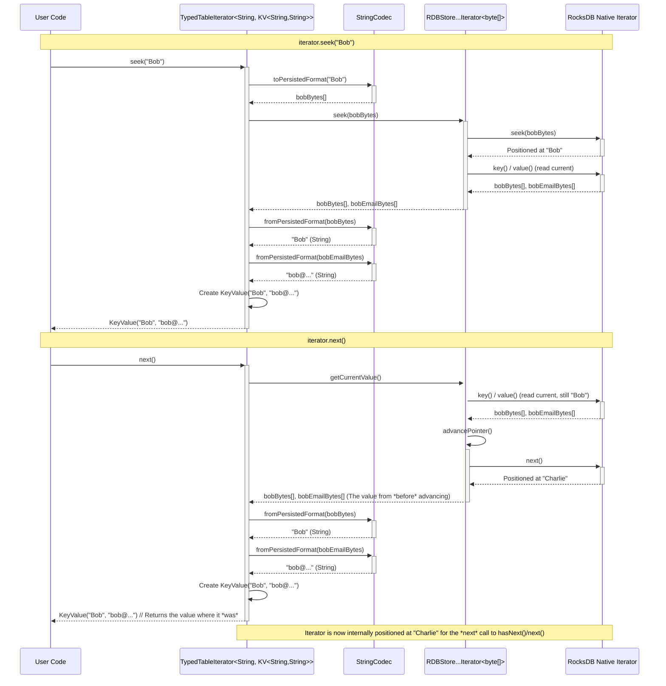

# Chapter 6: TableIterator

In [Chapter 5: Table](05_table_.md), we learned how to use the `Table` object like a handle on a file drawer, allowing us to `put`, `get`, `isExist`, and `delete` individual key-value pairs (files) using their specific keys (file labels).

But what if you don't know the exact key? What if you want to browse through *all* the files in the "Users" drawer, or maybe just look at all the usernames starting with "B"? How do you efficiently scan through the contents of the table?

## The Problem: Browsing the Drawer

Imagine you have the "Users" drawer open. You know how to grab the file for "Alice" if you know her username. But now you want to:

1.  Look at the *first* user file in the drawer.
2.  Look at the *last* user file in the drawer.
3.  Start looking from "Bob" onwards and see all subsequent user files.
4.  Simply go through *every single user file* one by one.

The basic `Table` methods (`get`, `put`, etc.) are great for direct access but don't help with sequential browsing or finding items based on their position or range.

## The Solution: `TableIterator` - Your Browsing Tool

This is where `TableIterator` comes in! It's a specialized tool designed specifically for **traversing** (walking through) the key-value pairs stored within a `Table`.

Think of it like having a **movable bookmark or tab** inside your filing cabinet drawer ("Users" `Table`). You can use this tab to:

1.  **Move to the beginning:** `seekToFirst()` places the tab at the very first file.
2.  **Move to the end:** `seekToLast()` places the tab at the very last file.
3.  **Jump to a specific spot:** `seek(key)` moves the tab directly to the file with that key (or the first file *after* it if the exact key doesn't exist).
4.  **Check what's next:** `hasNext()` tells you if there's another file after the tab's current position.
5.  **Get the current file and move:** `next()` gives you the file the tab is pointing at and then moves the tab to the next file.

`TableIterator` works very much like standard Java iterators (`java.util.Iterator`), but with added superpowers for seeking to specific positions within the sorted data of the table. Because the database stores keys in sorted order (usually alphabetically or numerically), the iterator can efficiently jump around.

Just like the `Table` object itself, iterators often come in a `TypedTable`-aware flavor, automatically handling the conversion between Java objects and bytes using the [Codec / CodecRegistry](01_codec___codecregistry_.md) we learned about.

**Important:** `TableIterator` resources need to be managed. They often hold connections to the underlying database. You **must** close the iterator when you are finished with it, typically using a `try-with-resources` block.

## How to Use It: Iterating Through the "Users" Table

Let's see how we can use `TableIterator` with our `Users` table (String username -> String email).

**Step 1: Get an Iterator**

You get an iterator instance by calling the `iterator()` method on your `Table` object.

```java
import org.apache.hadoop.hdds.conf.OzoneConfiguration;
import org.apache.hadoop.hdds.utils.db.DBStore;
import org.apache.hadoop.hdds.utils.db.DBStoreBuilder;
import org.apache.hadoop.hdds.utils.db.Table;
import org.apache.hadoop.hdds.utils.db.TableIterator;
import org.apache.hadoop.hdds.utils.db.Table.KeyValue; // Represents a key-value pair
import java.io.File;
import java.io.IOException;

// Assume MyApplicationDBDefinition exists from Chapter 2

public class IteratingTable {

    public static void main(String[] args) {
        // ... (Database setup code as in previous chapters) ...
        OzoneConfiguration conf = new OzoneConfiguration();
        conf.set(MyApplicationDBDefinition.DB_LOCATION_CONFIG_KEY, "./my-app-db-dir");
        File dbDir = new File("./my-app-db-dir");
        dbDir.mkdirs();
        MyApplicationDBDefinition dbDefinition = new MyApplicationDBDefinition();

        try (DBStore store = DBStoreBuilder.newBuilder(conf, dbDefinition).build()) {
            Table<String, String> usersTable = store.getTable("Users", String.class, String.class);

            // Add some sample data for iteration
            usersTable.put("Charlie", "charlie@sample.net");
            usersTable.put("Alice", "alice@example.com");
            usersTable.put("Bob", "bob@sample.org");
            usersTable.put("David", "david@example.org");

            // Get an iterator for the usersTable
            // Use try-with-resources to ensure iterator.close() is called!
            try (TableIterator<String, ? extends KeyValue<String, String>> iterator =
                     usersTable.iterator()) {

                System.out.println("Obtained TableIterator.");
                // Now we can use the 'iterator' object...

            } // Iterator is automatically closed here

        } catch (IOException e) {
            System.err.println("Error: " + e.getMessage());
            e.printStackTrace();
        }
    }
}
```

*Explanation:*
*   We set up the `DBStore` and get the `usersTable` as before.
*   We add some sample data (Alice, Bob, Charlie, David) - notice they are not added in sorted order, but the database *stores* them sorted by key.
*   `usersTable.iterator()` returns an object implementing `TableIterator`.
*   Crucially, we use a `try-with-resources` block: `try (TableIterator<...> iterator = ...)` This guarantees that the iterator's `close()` method is called at the end, releasing any underlying database resources.
*   The iterator's type parameter `? extends KeyValue<String, String>` indicates it iterates over items that are, or are subtypes of, `KeyValue<String, String>`. `KeyValue` is a simple helper class holding one key-value pair retrieved from the table.

**Step 2: Basic Forward Iteration**

The most common use is to iterate through all entries from the beginning.

```java
// Inside the try-with-resources block for the iterator:
try (TableIterator<String, ? extends KeyValue<String, String>> iterator =
         usersTable.iterator()) {

    System.out.println("\n--- Iterating Forward ---");
    int count = 0;
    while (iterator.hasNext()) { // Check if there's a next item
        KeyValue<String, String> entry = iterator.next(); // Get item and move iterator
        String username = entry.getKey();
        String email = entry.getValue();
        System.out.println("  Found: " + username + " -> " + email);
        count++;
    }
    System.out.println("Iterated over " + count + " entries.");

} catch (IOException e) {
    System.err.println("Error during iteration: " + e.getMessage());
}
```

*Output (Conceptual - order matters!):*
```
--- Iterating Forward ---
  Found: Alice -> alice@example.com
  Found: Bob -> bob@sample.org
  Found: Charlie -> charlie@sample.net
  Found: David -> david@example.org
Iterated over 4 entries.
```

*Explanation:*
*   This uses the standard `hasNext()` / `next()` pattern, just like a `java.util.Iterator`.
*   `iterator.hasNext()`: Checks if the iterator's internal pointer is positioned before a valid key-value pair.
*   `iterator.next()`: Retrieves the `KeyValue` object the iterator is currently pointing at and then advances the iterator's pointer to the next key-value pair in sorted key order.
*   `entry.getKey()` and `entry.getValue()` give you the actual `String` username and email, automatically decoded by the underlying `TypedTable`'s codecs.
*   Notice the output is sorted alphabetically by username (Alice, Bob, Charlie, David), even though we added them in a different order.

**Step 3: Seeking to Positions**

You can move the iterator's internal pointer without iterating sequentially.

```java
// Inside the try-with-resources block for the iterator:
try (TableIterator<String, ? extends KeyValue<String, String>> iterator =
         usersTable.iterator()) {

    System.out.println("\n--- Seeking Operations ---");

    // Go to the very first entry
    iterator.seekToFirst();
    if (iterator.hasNext()) {
        KeyValue<String, String> firstEntry = iterator.next();
        System.out.println("First entry: " + firstEntry.getKey());
    }

    // Go to the very last entry (note: next() won't work after this)
    iterator.seekToLast();
    // To *read* the last entry after seekToLast, you typically need a special get or prev() if available
    // Or re-seek and use next() - let's demonstrate seeking to a known key near the end
    iterator.seek("David"); // Seek to David
     if (iterator.hasNext()) {
        KeyValue<String, String> davidEntry = iterator.next();
        System.out.println("Entry at/after 'David': " + davidEntry.getKey());
     }


    // Seek to a specific key ("Bob")
    System.out.println("Seeking to 'Bob'...");
    iterator.seek("Bob");
    System.out.println("Iterating from 'Bob' onwards:");
    while (iterator.hasNext()) {
        KeyValue<String, String> entry = iterator.next();
        System.out.println("  Found: " + entry.getKey());
    }

     // Seek to a key that doesn't exist ("Betty")
     System.out.println("\nSeeking to 'Betty' (doesn't exist)...");
     iterator.seek("Betty");
     System.out.println("Iterating from 'Betty' onwards:");
     while (iterator.hasNext()) {
         // Will start from the next key *after* "Betty" in sorted order
         KeyValue<String, String> entry = iterator.next();
         System.out.println("  Found: " + entry.getKey());
     }


} catch (IOException e) {
    System.err.println("Error during seeking: " + e.getMessage());
}
```

*Output (Conceptual):*
```
--- Seeking Operations ---
First entry: Alice
Entry at/after 'David': David
Seeking to 'Bob'...
Iterating from 'Bob' onwards:
  Found: Bob
  Found: Charlie
  Found: David

Seeking to 'Betty' (doesn't exist)...
Iterating from 'Betty' onwards:
  Found: Bob  // Wait, why Bob? Because seek finds the first entry >= the key.
            // Oops, the previous seek example might be misleading. Seek *usually* positions
            // at the first key >= the seek target. Let's re-evaluate the output.
            // If we seek("Betty"), the first key >= "Betty" is "Bob". No, it's "Charlie".
            // Ah, the previous block iterated fully after seeking Bob. So the iterator was exhausted.
            // We need a *new* iterator instance or reset it for the "Betty" seek.

            // Let's assume we re-got the iterator or reset it for clarity:
            // Seeking to 'Betty' (doesn't exist)...
            // Iterating from 'Betty' onwards:
            //   Found: Charlie
            //   Found: David

```
*Revised Explanation:*
*   `iterator.seekToFirst()`: Moves the iterator's internal pointer to the beginning of the table (lowest key, "Alice"). `hasNext()` will be true if the table isn't empty, and `next()` will return the first item.
*   `iterator.seekToLast()`: Moves the pointer to the very end (highest key, "David"). `hasNext()` will likely be false after this unless you iterate backward (if supported).
*   `iterator.seek(key)`: This is powerful. It moves the pointer to the first key-value pair whose key is *greater than or equal to* the provided `key`.
    *   If you `seek("Bob")`, it lands exactly on "Bob". Subsequent `next()` calls will yield "Bob", "Charlie", "David".
    *   If you `seek("Betty")` (which doesn't exist), it lands on the *next* key in sorted order, which is "Charlie". Subsequent `next()` calls will yield "Charlie", "David".
*   **Important Correction:** The previous output example was flawed because the iterator state persists. After iterating fully from "Bob", `hasNext()` would be false. For the "Betty" example to work as intended, you'd typically get a fresh iterator or use `seekToFirst()` before the `seek("Betty")`. The revised output assumes this reset for clarity.

## Under the Hood: The Iterator's Journey

How does `table.iterator()` and subsequent calls actually work?

1.  **Requesting the Iterator (`table.iterator()`):**
    *   Your code calls `iterator()` on the `TypedTable` object.
    *   The `TypedTable` asks the underlying `RDBTable` (which handles raw bytes) for its iterator.
    *   The `RDBTable` interacts with the actual database (like RocksDB) to create a low-level database iterator (e.g., `ManagedRocksIterator`). This low-level iterator maintains a pointer to the current position within the database's sorted data structure for that specific table (column family).
    *   The `RDBTable` may wrap this low-level iterator (e.g., in `RDBStoreByteArrayIterator` or `RDBStoreCodecBufferIterator`).
    *   The `TypedTable` then wraps the raw-byte iterator with its own logic (often an inner class like `TypedTableIterator`) that knows about the `KeyCodec` and `ValueCodec`. This typed wrapper is what gets returned to your code.

2.  **Seeking (`iterator.seek(key)`):**
    *   Your code calls `seek("Bob")` on the `TypedTableIterator`.
    *   The `TypedTableIterator` uses its `KeyCodec` to encode "Bob" into `byte[]`.
    *   It passes these bytes down to the underlying raw-byte iterator (`RDBStore...Iterator`).
    *   The raw-byte iterator calls the `seek()` method on the actual database iterator (`ManagedRocksIterator`), passing the key bytes.
    *   The database engine efficiently moves its internal pointer to the correct position in its sorted data structure (the first key >= "Bob").
    *   The result (the found key/value or an indication of position) propagates back up. The `TypedTableIterator` might read the current value, decode it, and return it.

3.  **Advancing (`iterator.next()`):**
    *   Your code calls `next()`.
    *   The `TypedTableIterator` asks the underlying raw-byte iterator for the *current* raw key and value bytes where its pointer is located.
    *   It then tells the raw-byte iterator to advance its pointer (`ManagedRocksIterator.next()`) to the subsequent key-value pair in the database.
    *   The `TypedTableIterator` takes the raw key/value bytes it received, uses its `KeyCodec` and `ValueCodec` to decode them back into Java objects (`String` username, `String` email).
    *   It creates a `KeyValue` object containing these decoded objects and returns it to your code.

Let's visualize seeking and then getting the next element:


*Simplified Diagram Explanation:*
1.  `seek("Bob")`: The `String` key is encoded to bytes, passed down to the native RocksDB iterator which moves its pointer. The current value at that position is read and decoded back up to the user.
2.  `next()`: The value at the *current* position ("Bob") is read. Then, the native iterator is told to advance its pointer (`next()`) to the next key ("Charlie"). The *previously read* value ("Bob") is decoded and returned to the user. The iterator is now ready to return "Charlie" on the *subsequent* `next()` call.

**Code Glimpse:**

*   `TableIterator.java`: Defines the interface with methods like `seekToFirst`, `seekToLast`, `seek(KEY)`, `hasNext()`, `next()`.
*   `TypedTable.java` (specifically the inner `TypedTableIterator` or `RawIterator` classes): This wrapper class holds a reference to the raw byte iterator and the `Codec`s. Its `next()` method calls the raw iterator's `next()`, gets the raw `byte[]` KeyValue, uses the codecs to decode the bytes into `<KEY, VALUE>` objects, and returns them. Its `seek(KEY key)` method encodes the key, calls the raw iterator's `seek()`, potentially decodes the result, and returns it.
    ```java
    // Simplified concept from TypedTable.java inner iterator
    abstract class RawIterator<RAW> implements Table.KeyValueIterator<KEY, VALUE> {
        private final TableIterator<RAW, ...<RawKeyValue<RAW>>> rawIterator;
        // ... (constructor) ...

        abstract KeyValue<KEY, VALUE> convert(RawKeyValue<RAW> raw) throws IOException;
        abstract AutoCloseSupplier<RAW> convert(KEY key) throws IOException; // Encode key

        @Override
        public KeyValue<KEY, VALUE> next() {
            try (UncheckedAutoCloseableSupplier<RawKeyValue<RAW>> rawKVSupplier = rawIterator.next()) {
                // 1. Get raw bytes KeyValue from underlying iterator
                RawKeyValue<RAW> rawKV = rawKVSupplier.get();
                // 2. Use codecs (implicitly via convert) to decode
                return convert(rawKV);
            } catch (IOException e) { /* ... */ }
        }

        @Override
        public KeyValue<KEY, VALUE> seek(KEY key) throws IOException {
            try (AutoCloseSupplier<RAW> rawKey = convert(key); // Encode key
                 UncheckedAutoCloseableSupplier<RawKeyValue<RAW>> result = rawIterator.seek(rawKey.get())) {
                return result == null ? null : convert(result.get()); // Decode result
            }
        }
        // ... other methods delegate similarly ...
    }
    ```
*   `RDBStoreAbstractIterator.java`: A base class for raw byte iterators. It handles the core logic of interacting with the `ManagedRocksIterator`, managing the current entry, checking prefix matches, and handling `seekToFirst`/`seekToLast`. Concrete subclasses like `RDBStoreByteArrayIterator` or `RDBStoreCodecBufferIterator` handle the specifics of getting byte arrays or `CodecBuffer`s from the `ManagedRocksIterator`.
    ```java
    // Simplified concept from RDBStoreAbstractIterator.java
    abstract class RDBStoreAbstractIterator<RAW> implements TableIterator<RAW, ...> {
        private final ManagedRocksIterator rocksDBIterator; // The native one
        // ... currentEntry, prefix ...

        abstract ReferenceCountedObject<RawKeyValue<RAW>> getKeyValue(); // How to get bytes
        abstract void seek0(RAW key); // How to seek bytes

        @Override
        public final UncheckedAutoCloseableSupplier<RawKeyValue<RAW>> next() {
            if (hasNext()) {
                // Get current entry BEFORE advancing
                ReferenceCountedObject<RawKeyValue<RAW>> entryToReturn = currentEntry;
                // Advance the underlying native iterator
                rocksDBIterator.get().next();
                // Update internal state (currentEntry, hasNext)
                setCurrentEntry();
                // Return the previously held entry
                return entryToReturn.retainAndReleaseOnClose();
            }
            // ... throw NoSuchElementException ...
        }

        @Override
        public final UncheckedAutoCloseableSupplier<RawKeyValue<RAW>> seek(RAW key) {
            seek0(key); // Tell native iterator to seek
            setCurrentEntry(); // Update internal state based on new position
            // Return current entry if valid
            return hasNext() ? currentEntry.retainAndReleaseOnClose() : null;
        }
        // ... seekToFirst, seekToLast ...
    }
    ```

This layering allows the `TypedTableIterator` to provide a clean, type-safe API, while the lower-level iterators handle the direct interaction with the database engine's byte-oriented iterators.

## Conclusion

You've now learned how to use `TableIterator` to effectively browse and navigate through the key-value pairs within a `Table`.

*   `TableIterator` provides sequential access (`hasNext`, `next`) like a standard Java iterator.
*   It adds powerful seeking capabilities (`seekToFirst`, `seekToLast`, `seek(key)`) to jump to specific positions within the table's sorted keys.
*   You obtain it via `table.iterator()`.
*   It works seamlessly with `TypedTable` to handle data type conversions using [Codec / CodecRegistry](01_codec___codecregistry_.md).
*   **Crucially, always close your `TableIterator`**, preferably using a `try-with-resources` block, to release database resources.

You now know how to put/get/delete individual items ([Chapter 5: Table](05_table_.md)) and how to iterate or seek through them ([Chapter 6: TableIterator](06_tableiterator_.md)). What if you need to perform multiple operations (like deleting one user and adding another) together as a single, all-or-nothing transaction?

Next up: [Chapter 7: BatchOperation / BatchOperationHandler](07_batchoperation___batchoperationhandler_.md)

---

Generated by [AI Codebase Knowledge Builder](https://github.com/The-Pocket/Tutorial-Codebase-Knowledge)