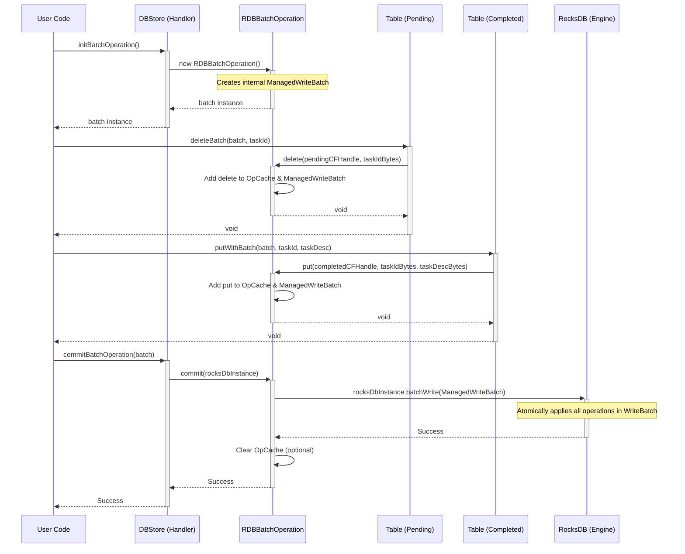

# Chapter 7: BatchOperation / BatchOperationHandler

In the last chapters, we learned how to manage our database with [DBStore](04_dbstore_.md), access specific tables (drawers) using [Table](05_table_.md), and perform basic operations like `put`, `get`, and `delete` on individual entries. We also saw how to browse through entries using [TableIterator](06_tableiterator_.md).

These operations are great, but they happen one at a time. What if you need to make *multiple* changes together, and you need to be absolutely sure that *either all of them succeed, or none of them do*?

## The Problem: Keeping Things Consistent

Imagine you have two tables: "PendingTasks" and "CompletedTasks". When a task is finished, you want to:

1.  **Remove** the task from the "PendingTasks" table.
2.  **Add** the task to the "CompletedTasks" table.

What happens if your program successfully removes the task from "PendingTasks", but then crashes *before* it can add it to "CompletedTasks"? The task is lost! It's neither pending nor completed. This is bad – our data is now inconsistent.

We need a way to group these two operations (the delete and the put) so they happen as a single, indivisible unit. This is called an **atomic operation**.

## The Solution: Submitting Changes in a Batch

This is exactly what `BatchOperation` and `BatchOperationHandler` are for! They allow you to bundle multiple database write operations (like `put` and `delete`, even across different tables) into a single "batch".

Think of it like gathering several documents you need to file or remove. Instead of giving them to the filing clerk one by one (risking interruption), you put them all in a single folder with instructions ("file this", "remove that") and hand the entire folder to the clerk. The clerk promises to process the *entire folder* as one job: either all instructions are completed successfully, or if something goes wrong (like a missing file), *none* of the changes are made permanent.

1.  **`BatchOperationHandler` (The Clerk/Manager):** This is typically your main [DBStore](04_dbstore_.md) object. It's responsible for starting a new batch and for finally executing (committing) the entire batch of operations. It implements the `BatchOperationHandler` interface.

2.  **`BatchOperation` (The Instruction Folder):** When you start a batch using the handler, you get a `BatchOperation` object. This object acts like the folder – it holds the list of operations you want to perform (`put` this, `delete` that). You add operations to this object. It implements the `BatchOperation` interface, which is also `AutoCloseable`.

**The Guarantee (Atomicity):** When you tell the `BatchOperationHandler` to commit the `BatchOperation`, the database guarantees that *either all operations within the batch are successfully applied, or none of them are*. If any single operation fails, the database automatically undoes any changes made by other operations within that same batch. This keeps your data consistent!

## How to Use It: Atomically Moving a Task

Let's implement our "move task" scenario using a batch. Assume we have our `DBStore` and two tables: `pendingTable` (String taskId -> String taskDescription) and `completedTable` (String taskId -> String taskDescription).

**Step 1: Get the Handler and Start a Batch**

The `DBStore` usually acts as the `BatchOperationHandler`. We use it to initialize a batch.

```java
import org.apache.hadoop.hdds.conf.OzoneConfiguration;
import org.apache.hadoop.hdds.utils.db.*; // Import necessary DB classes
import java.io.File;
import java.io.IOException;

// Assume a DB definition with "PendingTasks" and "CompletedTasks" tables exists
// Assume MyApplicationDBDefinition exists, containing these two tables

public class BatchExample {

    public static void main(String[] args) {
        // ... (Standard DBStore setup code) ...
        OzoneConfiguration conf = new OzoneConfiguration();
        conf.set(MyApplicationDBDefinition.DB_LOCATION_CONFIG_KEY, "./batch-db-dir");
        File dbDir = new File("./batch-db-dir");
        dbDir.mkdirs();
        MyApplicationDBDefinition dbDefinition = new MyApplicationDBDefinition(); // Assume this defines the tables

        try (DBStore store = DBStoreBuilder.newBuilder(conf, dbDefinition).build()) {

            // The DBStore acts as the handler
            BatchOperationHandler handler = store;

            // Start a new batch operation. Use try-with-resources!
            try (BatchOperation batch = handler.initBatchOperation()) {
                System.out.println("Batch operation initialized.");

                // We'll add operations to 'batch' inside this block

            } // Batch is automatically closed here if not committed or error occurs

        } catch (IOException e) {
            System.err.println("Error setting up DB or batch: " + e.getMessage());
            e.printStackTrace();
        }
    }
}
```

*Explanation:*
*   We get our `DBStore` instance as usual.
*   Since `DBStore` implements `BatchOperationHandler`, we can assign `store` to a `BatchOperationHandler` variable.
*   `handler.initBatchOperation()` creates a new `BatchOperation` object.
*   **Crucially**, `BatchOperation` is `AutoCloseable`. We use a `try-with-resources` block (`try (BatchOperation batch = ...)`) to ensure its `close()` method is called. This is important for cleaning up resources, especially if the batch isn't committed (e.g., due to an error before the commit step).

**Step 2: Add Operations to the Batch**

Now, inside the `try` block for the batch, we get our table handles and add the delete and put operations *to the batch*. We use special `Table` methods that accept the `BatchOperation` object.

```java
// Inside the try (DBStore store = ...) block:
try (DBStore store = DBStoreBuilder.newBuilder(conf, dbDefinition).build()) {
    // Get table handles (assuming they are defined in MyApplicationDBDefinition)
    Table<String, String> pendingTable = store.getTable("PendingTasks", String.class, String.class);
    Table<String, String> completedTable = store.getTable("CompletedTasks", String.class, String.class);

    // Sample task data
    String taskId = "task-123";
    String taskDesc = "Write chapter 7";
    pendingTable.put(taskId, taskDesc); // Put it in pending initially
    System.out.println("Task added to pending initially.");

    // Now, move it using a batch
    BatchOperationHandler handler = store;
    try (BatchOperation batch = handler.initBatchOperation()) {
        System.out.println("Starting atomic move...");

        // 1. Delete from PendingTasks *within the batch*
        pendingTable.deleteBatch(batch, taskId);
        System.out.println(" -> Added delete from pending to batch.");

        // 2. Put into CompletedTasks *within the batch*
        completedTable.putWithBatch(batch, taskId, taskDesc);
        System.out.println(" -> Added put to completed to batch.");

        // Operations are now queued in the batch, but NOT YET applied.

        // Step 3: Commit the batch (see next snippet)

    } catch (IOException e) {
        System.err.println("Error adding operations to batch: " + e.getMessage());
        // Batch is automatically closed here due to try-with-resources
    }

} catch (IOException e) { /* ... outer error handling ... */ }
```

*Explanation:*
*   We get our `pendingTable` and `completedTable` handles.
*   We use `pendingTable.deleteBatch(batch, taskId)` to add the delete operation for `taskId` to our `batch` object.
*   We use `completedTable.putWithBatch(batch, taskId, taskDesc)` to add the put operation to the same `batch` object.
*   **Important:** At this point, the database hasn't actually been changed! The operations are just recorded inside the `batch` object, waiting to be committed.

**Step 3: Commit the Batch**

Finally, we tell the handler to execute all the operations collected in the batch atomically.

```java
// Inside the try (BatchOperation batch = ...) block, after adding operations:
try (BatchOperation batch = handler.initBatchOperation()) {
    System.out.println("Starting atomic move...");
    pendingTable.deleteBatch(batch, taskId);
    System.out.println(" -> Added delete from pending to batch.");
    completedTable.putWithBatch(batch, taskId, taskDesc);
    System.out.println(" -> Added put to completed to batch.");

    // 3. Commit all operations in the batch atomically
    System.out.println("Committing batch...");
    handler.commitBatchOperation(batch);
    System.out.println("Batch committed successfully!");

    // Now the changes are permanent in the database.

} catch (IOException e) {
    System.err.println("Error during batch operation or commit: " + e.getMessage());
    // If error occurred *before* commit, no changes were made.
    // If error occurred *during* commit, RocksDB attempts to ensure atomicity.
}

// Verify the move (outside the batch block)
boolean stillPending = pendingTable.isExist(taskId);
String completedDesc = completedTable.get(taskId);

System.out.println("\nVerification:");
System.out.println("Is task still in pending? " + stillPending); // Should be false
System.out.println("Task description in completed: " + completedDesc); // Should be "Write chapter 7"
```

*Explanation:*
*   `handler.commitBatchOperation(batch)` is the crucial call. It tells the database: "Execute all the operations currently listed in this `batch` object."
*   The database engine (like RocksDB) then performs the delete and the put as a single atomic transaction.
*   If `commitBatchOperation` completes without throwing an `IOException`, you can be sure that *both* the delete from `pendingTable` *and* the put into `completedTable` have succeeded.
*   If an error occurs during the commit, the database ensures that *neither* operation has a lasting effect, leaving the database in the state it was before the commit attempt.
*   The final verification confirms that the task is gone from pending and present in completed.

## Under the Hood: How Batches Work

What happens internally when you use a batch?

1.  **`initBatchOperation()`:** Your `DBStore` (likely an `RDBStore`) creates an `RDBBatchOperation` object. This object internally creates and holds onto a special native database object called a `WriteBatch` (specifically `ManagedWriteBatch` in this implementation). Think of the `WriteBatch` as the actual list of instructions for the database engine.

2.  **`table.deleteBatch(batch, key)` / `table.putWithBatch(batch, key, value)`:**
    *   When you call these methods on your `TypedTable`, it first uses the [Codec / CodecRegistry](01_codec___codecregistry_.md) to convert your Java keys and values into raw `byte[]` arrays.
    *   It then calls the corresponding method on the underlying `RDBTable` (e.g., `rdbTable.deleteBatch(rdbBatch, keyBytes)`).
    *   The `RDBTable` calls the `delete` or `put` method directly on the `RDBBatchOperation` object (`rdbBatch`), passing the raw `byte[]` key (and value for put) along with the specific `ColumnFamily` handle representing the table ("PendingTasks" or "CompletedTasks").
    *   The `RDBBatchOperation` does two things:
        *   It adds the operation details (table handle, key bytes, value bytes/delete marker) to its own internal Java map (`OpCache`) for potential de-duplication or logging.
        *   It adds the corresponding low-level operation (e.g., `put`, `delete`) to the native `ManagedWriteBatch` object it's holding.

3.  **`handler.commitBatchOperation(batch)`:**
    *   Your `DBStore` (`RDBStore`) calls the `commit` method on the `RDBBatchOperation` object (`rdbBatch`).
    *   The `RDBBatchOperation` takes the native `ManagedWriteBatch` (which now contains all the low-level put/delete instructions added in step 2) and tells the main RocksDB database instance to execute it using a command like `rocksDatabase.batchWrite(managedWriteBatch)`.
    *   The RocksDB engine performs all the operations within that native `WriteBatch` atomically. This is a highly optimized, built-in feature of the underlying database.
    *   After the `batchWrite` succeeds, the `RDBBatchOperation` might clear its internal `OpCache`.

Let's visualize the process:



**Code Glimpse:**

*   `BatchOperationHandler.java`: Interface defining `initBatchOperation` and `commitBatchOperation`. `DBStore` implements this.
*   `BatchOperation.java`: Interface, primarily marks the object as `AutoCloseable`.
*   `RDBBatchOperation.java`: The concrete implementation.
    ```java
    // Simplified concept from RDBBatchOperation.java
    public class RDBBatchOperation implements BatchOperation {
        private final ManagedWriteBatch writeBatch; // Native batch object
        private final OpCache opCache = new OpCache(); // Internal cache/tracker

        public RDBBatchOperation() {
            writeBatch = new ManagedWriteBatch();
        }

        // Called by RDBTable.putWithBatch/deleteBatch
        public void put(ColumnFamily family, byte[] key, byte[] value) {
            opCache.put(family, key, value); // Track in Java cache
            // Add to the actual native batch
            family.batchPut(writeBatch, key, value);
        }

        public void delete(ColumnFamily family, byte[] key) {
            opCache.delete(family, key); // Track in Java cache
            // Add to the actual native batch
            family.batchDelete(writeBatch, key);
        }

        // Called by DBStore/Handler.commitBatchOperation
        public void commit(RocksDatabase db) throws IOException {
            // Execute the native batch atomically
            db.batchWrite(writeBatch);
            // OpCache might be cleared here or in close()
        }

        @Override
        public void close() {
            writeBatch.close(); // Release native resources
            opCache.clear();    // Clear Java cache
        }
    }
    ```
*   `RDBTable.java` / `TypedTable.java`: Contain the `putWithBatch` and `deleteBatch` methods.
    ```java
    // Simplified concept from RDBTable.java
    class RDBTable implements Table<byte[], byte[]> {
        private final RocksDatabase db;
        private final RocksDatabase.ColumnFamily family; // Handle for this table

        // ... constructor ...

        public void putWithBatch(BatchOperation batch, byte[] key, byte[] value)
            throws IOException {
            // Cast to the concrete implementation to call its methods
            ((RDBBatchOperation) batch).put(family, key, value);
        }

        public void deleteBatch(BatchOperation batch, byte[] key)
            throws IOException {
            ((RDBBatchOperation) batch).delete(family, key);
        }
        // ... other methods ...
    }

    // TypedTable delegates to RDBTable after encoding/decoding
    ```

This shows how the batch operations are collected in the `RDBBatchOperation` (specifically in its `ManagedWriteBatch`) and then committed in one go via the `DBStore`.

## Conclusion

You've learned about the critical concept of atomic batch operations using `BatchOperation` and `BatchOperationHandler`!

*   They solve the problem of needing multiple database writes to succeed or fail together, ensuring **data consistency**.
*   The `DBStore` usually acts as the `BatchOperationHandler` to `initBatchOperation()` and `commitBatchOperation()`.
*   You get a `BatchOperation` object (which must be closed, preferably with `try-with-resources`).
*   You add operations using methods like `table.putWithBatch(batch, ...)` and `table.deleteBatch(batch, ...)`.
*   `commitBatchOperation(batch)` executes all queued operations atomically – **all or nothing**.

Using batches is essential for many database tasks where consistency across multiple steps or tables is required.

So far, we've focused on real-time operations. But what if you need to create a backup or a consistent snapshot of the entire database at a specific point in time?

Next up: [Chapter 8: DBCheckpoint / RDBCheckpointManager](08_dbcheckpoint___rdbcheckpointmanager_.md)

---

Generated by [AI Codebase Knowledge Builder](https://github.com/The-Pocket/Tutorial-Codebase-Knowledge)