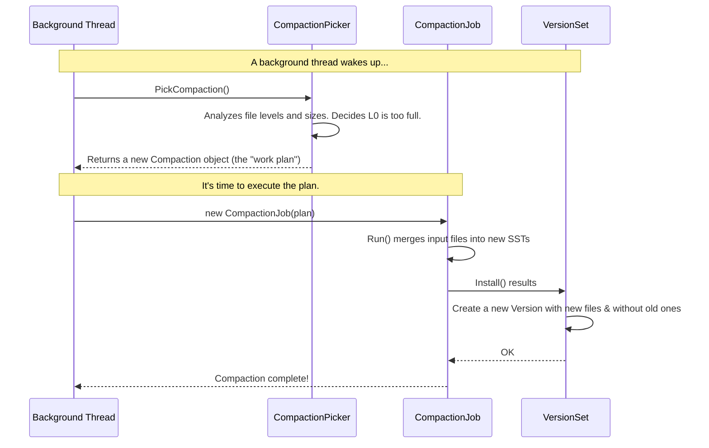

# Chapter 7: Compaction and Data Organization

In the [previous chapter](06_flushing_memtables_to_disk__flushjob__.md), we saw how `db` takes a full in-memory `MemTable` and writes its contents to a new SST file on disk using a `FlushJob`. This is essential for preventing memory from overflowing and for making our writes permanent.

But this creates a new challenge. If your database is busy, you might have hundreds of flushes happening over time. This would leave you with hundreds or even thousands of small SST files. How would this affect performance?

### The Problem: A Messy Desk Slows You Down

Imagine your desk is your database. Every time you finish working with a new document (a `MemTable`), you just place it on your desk. This is like a "flush". At first, it's fine. But after a few days, your desk is covered in hundreds of separate papers and small stacks (SST files).

Now, if someone asks you to find all the information about "Project X", you have a huge task ahead of you. You have to look through every single paper on your desk to find what you need. This is slow and inefficient. Your read performance grinds to a halt.

Furthermore, many of these papers might be old drafts or duplicates of the same information. This clutter wastes precious desk space.

This is exactly the problem `db` faces. Too many small SST files make reads slow because an [Iterator](05_iterators_.md) might have to check many files to find a key. Deleted or overwritten data also wastes disk space.

### The Solution: Compaction, The Tidy Librarian

The solution is to periodically clean up the mess. You would take all the papers on your desk, merge related ones, throw away old drafts, and organize them into larger, neatly-labeled binders in a filing cabinet.

In `db`, this cleanup process is called **Compaction**. It's a background job that works like a tidy librarian. Its main goals are:
1.  **Merge Files:** Combine many small SST files into fewer, larger ones. This makes reads much faster.
2.  **Purge Old Data:** Get rid of data that has been deleted or overwritten by a newer value. This reclaims disk space.
3.  **Organize by Level:** Move data through a series of "levels" in the database, like moving from an "inbox" tray to a permanent filing cabinet.

Data in `db` is organized in a structure called a Log-Structured Merge-Tree (LSM-Tree). Flushes create files in "Level 0" (L0), which is like our messy desk. Compactions then merge L0 files into Level 1 (L1), L1 files into Level 2 (L2), and so on. As data moves to deeper levels, it becomes more organized.

The entire process is a collaboration between three key components:
*   The **`CompactionPicker`**: The decision-maker.
*   The **`Compaction`**: The work plan.
*   The **`CompactionJob`**: The worker.

Let's see how they work together.



### 1. The Decision-Maker: `CompactionPicker`

The **`CompactionPicker`** is the head librarian. It's responsible for looking at the state of all the files in the database and deciding *what* to compact next. It has a set of rules based on the chosen compaction strategy (like Leveled, Universal, or FIFO).

For example, a Leveled compaction picker might have rules like:
*   "If Level 0 has more than 4 files, pick them all to be merged into Level 1."
*   "If the total size of files in Level 1 exceeds its target size, pick a file from Level 1 and its overlapping files in Level 2 to be merged together."

The `CompactionPicker` is an abstract class, meaning different strategies can provide their own logic. Its main job is to create a "work plan".

Here's the simplified interface from `compaction_picker.h`.

```cpp
// Simplified from compaction_picker.h
class CompactionPicker {
 public:
  // Pick level and inputs for a new compaction.
  // Returns nullptr if no compaction is needed.
  // Otherwise, returns a plan for what to do.
  virtual Compaction* PickCompaction(/*...*/) = 0;

  // ... other methods ...
};
```

When a background thread asks for work, it calls `PickCompaction()`. If the picker decides a compaction is needed, it returns a `Compaction` object.

### 2. The Plan: `Compaction`

A **`Compaction`** object is the "work plan" created by the picker. It's a simple data structure that contains all the information needed to perform one specific compaction task. Think of it as a work order saying: "Take these files from these shelves and merge them into a new file on that shelf."

Here is a simplified view of the `Compaction` class from `compaction.h`.

```cpp
// Simplified from compaction.h
class Compaction {
 public:
  // The files to be compacted, grouped by level.
  const std::vector<CompactionInputFiles>* inputs() { return &inputs_; }

  // The level where the new merged files will be placed.
  int output_level() const { return output_level_; }

  // ... other methods and fields ...

 private:
  // The input files for the compaction.
  const std::vector<CompactionInputFiles> inputs_;

  // The output level.
  const int output_level_;

  // Maximum size for any new output file.
  uint64_t max_output_file_size_;

  // The database version this compaction is based on.
  Version* input_version_;

  // A list of changes (file additions/deletions) to apply when done.
  VersionEdit edit_;

  // ... and much more ...
};
```
This `Compaction` object perfectly describes the job: what files go in, where the results go, and what the size limits are.

### 3. The Worker: `CompactionJob`

The **`CompactionJob`** is the worker that takes the `Compaction` plan and does the actual heavy lifting. It runs in a background thread so it doesn't block incoming writes from your application.

Here's what its `Run()` method does:
1.  **Creates Iterators:** It creates an iterator for each input SST file.
2.  **Merges Inputs:** It uses a `MergingIterator` (the same tool from the [Iterators chapter](05_iterators_.md)!) to get a single, sorted view of all the key-value pairs from all input files.
3.  **Processes Keys:** It steps through this merged view one key at a time.
    *   If it sees a key `"cat" -> "meow"` with sequence number 100, and later sees `"cat" -> "purr"` with sequence number 90, it knows the second one is older and discards it.
    *   If it sees a delete marker for a key, it discards the marker and all older versions of that key.
4.  **Builds New Files:** It writes the surviving, "live" key-value pairs into one or more new SST files.
5.  **Installs Results:** Once the new files are safely written to disk, it tells the `VersionSet` to create a new [version](04_versioning_and_point_in_time_views__superversion__.md) of the database. This new version will reference the new output files and no longer reference the old, now-obsolete input files. The old files are then deleted.

The core logic for this process is in `CompactionJob::ProcessKeyValueCompaction` in `compaction_job.cc`.

```cpp
// Simplified from CompactionJob::ProcessKeyValueCompaction in compaction_job.cc
void CompactionJob::ProcessKeyValueCompaction(SubcompactionState* sub_compact) {
  // 1. Create a MergingIterator over all input files.
  auto c_iter = std::make_unique<CompactionIterator>(/* ... all inputs ... */);

  // 2. Prepare to write to a new output file.
  OpenCompactionOutputFile(sub_compact, /* ... */);

  // 3. Iterate through all keys from all inputs in sorted order.
  for (c_iter->SeekToFirst(); c_iter->Valid(); c_iter->Next()) {
    // The CompactionIterator handles dropping old/deleted keys internally.
    // It only yields the live keys we need to keep.
    
    // 4. Add the live key-value to the new SST file.
    sub_compact->AddToOutput(*c_iter, /* ... */);
  }

  // 5. Finalize the new SST file.
  FinishCompactionOutputFile(/* ... */);
}
```

This elegant process not only reduces the number of files but also naturally cleans up old data, reclaiming disk space and making future reads more efficient.

### Conclusion

You've just learned about the essential background process that keeps `db` performant and organized over time. Without it, the database would quickly become a cluttered mess.

*   **Compaction** is the process of merging smaller SST files into larger ones, removing obsolete data, and organizing files into levels.
*   The **`CompactionPicker`** is the "head librarian" that decides which files to compact next based on a set of rules.
*   The **`Compaction`** object is the "work plan" that describes a single compaction task.
*   The **`CompactionJob`** is the "worker" that executes the plan in the background, using a `MergingIterator` to produce new, clean SST files.

We've talked a lot about comparing keys, seeing newer vs. older versions, and identifying delete markers. But what does a key *actually* look like inside `db` to make all this possible? It's more than just the string you provide.

In our next and final chapter, we'll dissect the structure of an internal key.

**Next**: [Chapter 8: Internal Key Structure](08_internal_key_structure_.md)

---

Generated by [AI Codebase Knowledge Builder](https://github.com/The-Pocket/Tutorial-Codebase-Knowledge)