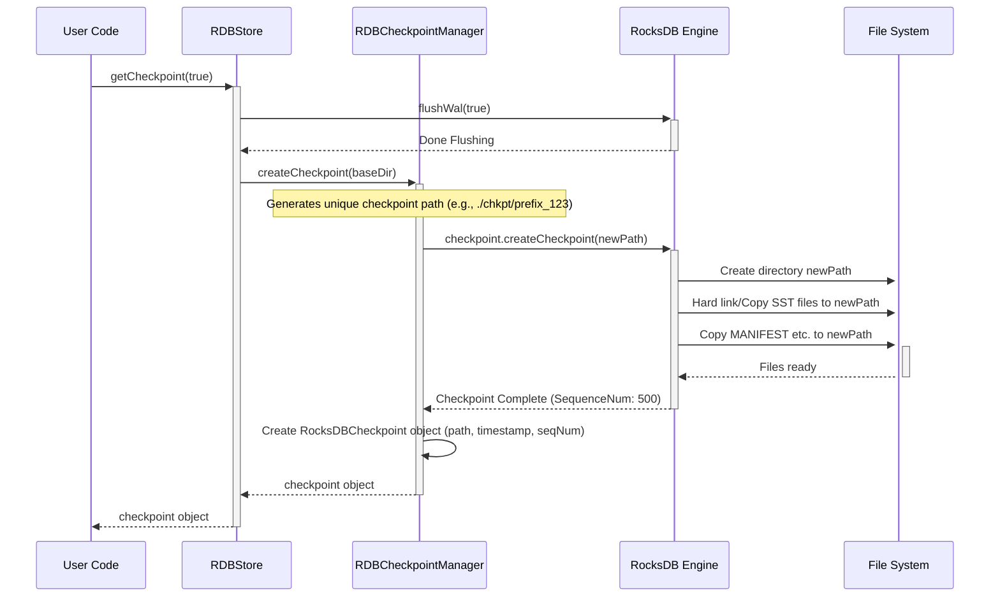

# Chapter 8: DBCheckpoint / RDBCheckpointManager

In [Chapter 7: BatchOperation / BatchOperationHandler](07_batchoperation___batchoperationhandler_.md), we learned how to group multiple database changes together to ensure they all succeed or fail as one atomic unit. That's great for keeping data consistent during complex updates.

But what if something bigger goes wrong? Maybe a disk fails, or a bug corrupts some data. How can we recover the entire database to a previously known good state? Or what if we want to make a copy of the database to analyze offline without affecting the live system?

## The Problem: Needing a Safety Copy

Imagine your carefully organized filing cabinet represents your database. You're constantly adding, updating, and removing files ([Table](05_table_.md) operations). What happens if there's a fire drill (a system crash) or someone accidentally shreds a whole drawer (data corruption)? Or maybe the auditors need a complete copy of the cabinet *exactly as it was* at the end of last month to review?

Doing individual `put` or `get` operations won't help you restore everything. You need a way to create a complete, point-in-time **snapshot** or **backup** of the *entire* filing cabinet.

## The Solution: Photocopying the Database

This is where `DBCheckpoint` and `RDBCheckpointManager` come in. They provide the mechanism to create these full database snapshots.

1.  **`DBCheckpoint` (The Photocopy):** This represents the actual snapshot itself. Think of it as the stack of photocopies you made of every single file in the cabinet at a specific moment. It contains information about *where* this copy is stored (its location on disk) and *when* it was taken.

2.  **`RDBCheckpointManager` (The Photocopier):** This is the tool responsible for *creating* the checkpoint. It interacts with the underlying database engine (like RocksDB) to efficiently copy or link the necessary files to a new location, effectively generating the `DBCheckpoint`. You usually don't interact with the manager directly; the [DBStore](04_dbstore_.md) uses it behind the scenes.

So, you use the database system (which internally uses `RDBCheckpointManager`) to request a snapshot, and you get back a `DBCheckpoint` object that points to the complete copy.

## How to Use It: Creating a Database Snapshot

Creating a checkpoint is typically done through your main [DBStore](04_dbstore_.md) object.

**Step 1: Get the `DBStore` (Recap)**

As always, we start with our configured `DBStore`.

```java
import org.apache.hadoop.hdds.conf.OzoneConfiguration;
import org.apache.hadoop.hdds.utils.db.*; // Import DB classes
import java.io.File;
import java.io.IOException;
import java.nio.file.Path;

// Assume MyApplicationDBDefinition exists from Chapter 2

public class CreateCheckpoint {

    public static void main(String[] args) {
        // ... (Standard DBStore setup code) ...
        OzoneConfiguration conf = new OzoneConfiguration();
        // Usually, checkpoint dir comes from config, but we'll define manually
        String checkpointBaseDir = "./db-checkpoints";
        conf.set(MyApplicationDBDefinition.DB_LOCATION_CONFIG_KEY, "./my-app-db-dir");

        File dbDir = new File("./my-app-db-dir");
        dbDir.mkdirs();
        File checkpointParentDir = new File(checkpointBaseDir);
        checkpointParentDir.mkdirs(); // Ensure checkpoint parent dir exists

        MyApplicationDBDefinition dbDefinition = new MyApplicationDBDefinition();

        try (DBStore store = DBStoreBuilder.newBuilder(conf, dbDefinition).build()) {
            System.out.println("DBStore obtained.");

            // Step 2: Create the checkpoint (see next snippet)

        } catch (IOException e) {
            System.err.println("Error: " + e.getMessage());
            e.printStackTrace();
        }
    }
}
```

*Explanation:*
*   We set up the `DBStore` like in previous chapters.
*   We also define a directory (`checkpointBaseDir`) where we want our checkpoints to be stored. Usually, this path would also come from configuration. We ensure this directory exists.

**Step 2: Request a Checkpoint**

The `DBStore` interface provides a method to create checkpoints.

```java
// Inside the try (DBStore store = ...) block:

DBCheckpoint checkpoint = null; // To hold the result
try {
    System.out.println("Requesting checkpoint creation...");

    // Create a checkpoint. 'true' means flush data to disk first for consistency.
    // The store internally uses RDBCheckpointManager.
    checkpoint = store.getCheckpoint(true);

    if (checkpoint != null) {
        System.out.println("Checkpoint created successfully!");
        Path location = checkpoint.getCheckpointLocation();
        long timestamp = checkpoint.getCheckpointTimestamp();
        System.out.println(" -> Location: " + location);
        System.out.println(" -> Timestamp: " + timestamp);
        System.out.println(" -> Creation Time (ms): " + checkpoint.checkpointCreationTimeTaken());
    } else {
        System.err.println("Checkpoint creation failed (returned null).");
    }

} catch (IOException e) {
    System.err.println("Error creating checkpoint: " + e.getMessage());
} finally {
    // Step 3: Optional cleanup (see next snippet)
    if (checkpoint != null) {
       // ... cleanup logic ...
    }
}

```

*Explanation:*
*   `store.getCheckpoint(true)` is the key method call.
    *   The `true` argument is important. It tells the database to first **flush** any pending writes from memory to disk before creating the snapshot. This ensures the checkpoint represents a consistent state.
*   If successful, this method returns a `DBCheckpoint` object.
*   The `DBCheckpoint` object gives you access to:
    *   `getCheckpointLocation()`: The `Path` (directory) where the snapshot files are stored. This is a *new directory* containing a copy or links to the database state.
    *   `getCheckpointTimestamp()`: A timestamp indicating approximately when the checkpoint was created.
    *   `checkpointCreationTimeTaken()`: How long the creation process took.
*   If creation fails, it might throw an `IOException` or return `null`.

**Step 3: (Optional) Clean Up Checkpoint Files**

Checkpoints consume disk space because they are essentially copies of your database. Once you are done with a checkpoint (e.g., after successfully restoring from it or archiving it elsewhere), you might want to delete its files.

```java
// Inside the finally block after creating the checkpoint:

if (checkpoint != null) {
    try {
        System.out.println("Cleaning up checkpoint directory: " + checkpoint.getCheckpointLocation());
        // This deletes the directory and all its contents
        checkpoint.cleanupCheckpoint();
        System.out.println("Checkpoint cleaned up successfully.");
    } catch (IOException e) {
        System.err.println("Error cleaning up checkpoint: " + e.getMessage());
    }
}
```

*Explanation:*
*   `checkpoint.cleanupCheckpoint()` is a convenience method provided by the `DBCheckpoint` interface.
*   It deletes the directory returned by `getCheckpointLocation()` and all the snapshot files within it.
*   You would typically call this only when you are certain you no longer need that specific checkpoint on disk.

## Under the Hood: The Checkpointing Process

What happens when you call `store.getCheckpoint(true)`?

1.  **Request Received:** Your code calls `getCheckpoint` on the `DBStore` (likely an `RDBStore` instance).
2.  **Flush (if requested):** If the argument was `true`, the `RDBStore` first tells the underlying RocksDB engine to flush its memory buffers (memtables) and write-ahead logs (WAL) to disk. This makes the on-disk files consistent.
3.  **Checkpoint Manager:** The `RDBStore` typically has an instance of `RDBCheckpointManager`. It calls a method like `createCheckpoint` on this manager, often passing a base directory where checkpoints should be created.
4.  **Native Checkpoint:** The `RDBCheckpointManager` uses RocksDB's built-in checkpoint functionality. It tells the RocksDB engine: "Create a checkpoint in this new directory: `../db-checkpoints/checkpoint_prefix_timestamp_xyz`".
5.  **File Linking/Copying:** RocksDB efficiently creates the checkpoint. It might:
    *   Create **hard links** to the existing database files (SST files) in the new checkpoint directory. This is very fast and space-efficient initially, as it doesn't duplicate the data files themselves.
    *   Copy any necessary metadata files (like `MANIFEST`, `CURRENT`).
    *   If hard links aren't possible or configured off, it might copy the actual data files, which takes longer and uses more disk space.
6.  **Result Packaging:** Once RocksDB finishes, the `RDBCheckpointManager` gets the path to the newly created checkpoint directory and the latest sequence number (a marker of database state). It packages this information, along with a timestamp and duration, into a `RocksDBCheckpoint` object (which implements the `DBCheckpoint` interface).
7.  **Return:** The `RDBStore` returns the `DBCheckpoint` object to your code.

Let's visualize this:



*Explanation:* The user asks the `Store` for a checkpoint. The `Store` flushes data, then asks the `CheckpointManager`. The manager tells the `RocksDB Engine` to create the snapshot files in a new directory on the `FileSystem`. Once done, the manager wraps the result info in a `DBCheckpoint` object and returns it.

**Code Glimpse:**

*   `DBCheckpoint.java`: Interface defining what info a checkpoint provides.
    ```java
    // Simplified from DBCheckpoint.java
    public interface DBCheckpoint {
      Path getCheckpointLocation();
      long getCheckpointTimestamp();
      long getLatestSequenceNumber(); // Represents DB state
      long checkpointCreationTimeTaken();
      void cleanupCheckpoint() throws IOException; // Deletes files
    }
    ```
*   `RDBStore.java`: Implements `getCheckpoint` using the manager.
    ```java
    // Simplified concept from RDBStore.java
    public class RDBStore implements DBStore {
        private final RDBCheckpointManager checkpointManager;
        // ... other fields ...

        // Constructor often initializes checkpointManager
        public RDBStore(...) {
            // ... db opening logic ...
            this.checkpointManager = new RDBCheckpointManager(this.db, "myPrefix_");
        }

        @Override
        public DBCheckpoint getCheckpoint(boolean flush) throws IOException {
            if (flush) {
                // Optional: db.flushWal(true); db.flush();
            }
            // Delegate to the manager, providing the configured base dir
            String checkpointParentDir = "..."; // Get from config usually
            return checkpointManager.createCheckpoint(checkpointParentDir);
        }
        // ...
    }
    ```
*   `RDBCheckpointManager.java`: Orchestrates the creation using RocksDB's native features.
    ```java
    // Simplified concept from RDBCheckpointManager.java
    public class RDBCheckpointManager implements Closeable {
        private final RocksDatabase db;
        private final RocksCheckpoint nativeCheckpointTool; // RocksDB's tool
        private final String checkpointNamePrefix;

        public RDBCheckpointManager(RocksDatabase db, String prefix) {
            this.db = db;
            this.nativeCheckpointTool = db.createCheckpoint(); // Get native tool
            this.checkpointNamePrefix = prefix;
        }

        public RocksDBCheckpoint createCheckpoint(String parentDir, String name) {
            try {
                // ... Generate unique checkpoint directory path 'checkpointPath' ...
                Instant start = Instant.now();

                // Tell RocksDB's native tool to create files at the path
                nativeCheckpointTool.createCheckpoint(checkpointPath);
                long seqNum = nativeCheckpointTool.getLatestSequenceNumber();

                // ... Calculate duration ...
                // ... Wait for directory to appear (RDBCheckpointUtils) ...

                // Create our wrapper object
                return new RocksDBCheckpoint(checkpointPath, /*...*/, seqNum, /*...*/);
            } catch (IOException e) { /* Handle error */ return null; }
        }
        // ... close() cleans up nativeCheckpointTool ...
    }
    ```
*   `RocksDBCheckpoint.java`: Concrete implementation holding the path and metadata. Its `cleanupCheckpoint` uses standard file utilities (`FileUtils.deleteDirectory`).

This layering allows the `DBStore` to offer a simple `getCheckpoint` method while the manager handles the specifics of interacting with RocksDB's native checkpointing.

## Conclusion

You've learned about creating point-in-time snapshots of your entire database using checkpoints!

*   **`DBCheckpoint`:** Represents the snapshot itself – a consistent copy of the database stored in a separate directory. It provides the location and timestamp.
*   **`RDBCheckpointManager`:** The underlying tool (often used internally by `DBStore`) that interacts with the database engine to create the checkpoint files.
*   You typically create checkpoints via `dbStore.getCheckpoint(true)`.
*   Checkpoints are crucial for **backups**, **recovery**, and creating copies for **offline analysis**.
*   Remember to manage checkpoint files (e.g., using `cleanupCheckpoint()`) as they consume disk space.

Now that you know how to manage the database, perform basic operations, iterate, use batches, and create full backups, what about optimizing read performance? How can we keep frequently accessed data readily available in memory?

Next up: [Chapter 9: TableCache](09_tablecache_.md)

---

Generated by [AI Codebase Knowledge Builder](https://github.com/The-Pocket/Tutorial-Codebase-Knowledge)