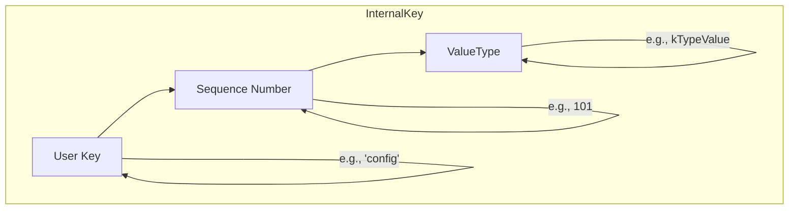

# Chapter 8: Internal Key Structure

In the [previous chapter on Compaction](07_compaction_and_data_organization_.md), we learned how `db` cleans up and organizes its data files in the background. We saw that compaction needs to be smart enough to discard old, overwritten, or deleted data. This begs a fundamental question: how does `db` know that one piece of data is "older" than another, or that a key has been deleted?

When you call `db->Put("my_key", "hello")`, what does `db` *really* store? The answer is the key to understanding how versioning, snapshots, and deletions all work. It's time to look under the hood at the `InternalKey`.

### The Problem: A Simple Key Isn't Enough

Imagine you're keeping a logbook. You write down:
- `Page 1: Set 'config' to 'blue'`

Later, you change your mind:
- `Page 5: Set 'config' to 'red'`

And then later, you decide you don't need it:
- `Page 10: Delete 'config'`

If you only searched for the last mention of `'config'`, you might find the "Delete" entry. But what if you wanted to know what the value was back on Page 7? The answer should be `'red'`. A simple key like `'config'` doesn't carry enough information to answer these kinds of questions. We need more context.

### The Solution: The `InternalKey` - An Annotated Key

What you store as a "key" is just one part of what `db` uses internally. `db` creates a more detailed version called an **`InternalKey`**.

Think of it like a full mailing address. The **user key** (`'config'`) is just the street address. The `InternalKey` is the *full* address, which also includes:
1.  A **Sequence Number**: A unique, ever-increasing number for every operation. This acts like a timestamp or version number. Higher numbers are newer.
2.  A **Value Type**: An identifier that tells `db` what kind of operation this is. Is it a `Put` (a new value), or a `Delete`?

So, every key you write is actually stored as a trio: **(user key, sequence number, type)**.

Let's visualize the structure of an `InternalKey`:



This combination gives `db` all the context it needs to correctly manage your data.

### `ValueType`: What Kind of Operation Is This?

The `ValueType` is a simple enum that defines the operation type. It's defined in `dbformat.h`. While there are many types for special cases, the two most important ones for our purposes are:

```cpp
// Simplified from dbformat.h
enum ValueType : unsigned char {
  kTypeDeletion = 0x0,  // A deletion marker, also called a "tombstone"
  kTypeValue = 0x1,     // A normal Put operation with a value
  // ... other types for Merge, SingleDelete, etc. ...
};
```

*   `kTypeValue`: This is a standard key-value pair.
*   `kTypeDeletion`: This is a "tombstone". It's a special entry that says "this user key was deleted at this sequence number". This is how `db` remembers that a key is gone.

### `ParsedInternalKey`: The Key in Its Natural Form

Internally, `db` often works with these three parts as separate fields in a simple struct called `ParsedInternalKey`. This makes it easy to read and compare the different components.

```cpp
// Simplified from dbformat.h
struct ParsedInternalKey {
  Slice user_key;
  SequenceNumber sequence;
  ValueType type;

  ParsedInternalKey(const Slice& u, const SequenceNumber& seq, ValueType t)
      : user_key(u), sequence(seq), type(t) {}
};
```

This struct is the "natural" representation of an internal key before it gets encoded and packed together for storage on disk.

### How Internal Keys Make Everything Work

Let's revisit our logbook example. Assume our sequence number starts at 100.

1.  `db->Put("config", "blue")`
    - `db` is assigned sequence number `100`.
    - It creates the internal key: `("config", 100, kTypeValue)`.

2.  `db->Put("config", "red")`
    - `db` is assigned the next sequence number, `101`.
    - It creates the internal key: `("config", 101, kTypeValue)`.

3.  `db->Delete("config")`
    - `db` gets sequence number `102`.
    - It creates a tombstone: `("config", 102, kTypeDeletion)`.

Now, imagine an [Iterator](05_iterators_.md) is reading the data with a snapshot taken at sequence `103`. When it encounters keys for `'config'`, it sees all three versions. How does it decide which one is right?

This is where the `InternalKeyComparator` comes in. It compares two internal keys using a strict set of rules:
1.  First, compare the **user keys**. (`'config'` vs `'user'`).
2.  If the user keys are the same, compare the **sequence numbers** in **descending order**. This is the magic trick! It means *newer versions are considered smaller* and come first during an iteration.
3.  If sequence numbers are also the same (which is rare), it compares by type.

So, when the iterator looks for `'config'`, it sees `("config", 102, kTypeDeletion)` first. Because the type is `kTypeDeletion`, the iterator knows the key is deleted and stops, reporting that `'config'` does not exist. It doesn't even need to look at the older versions with sequence numbers 101 and 100.

If our snapshot was taken at sequence `101`, the iterator would ignore the deletion at `102` (it's too new!). It would see `("config", 101, kTypeValue)` first, report the value `'red'`, and ignore the older version at sequence `100`.

### Packing It All Together

For efficiency, `db` doesn't store three separate fields on disk. It packs the sequence number and `ValueType` together into a single 8-byte (64-bit) "footer" that is appended to the user key.

A helper function `PackSequenceAndType` in `dbformat.h` does this with a simple bitwise operation.

```cpp
// Simplified from dbformat.h
inline uint64_t PackSequenceAndType(uint64_t seq, ValueType t) {
  // Shift the sequence number over by 8 bits and add the type.
  return (seq << 8) | t;
}
```

This packed footer is then appended to the user key to form the final, serialized internal key that gets written to `MemTable`s and SST files. The `ExtractUserKey` function does the reverse, simply returning the key minus the last 8 bytes.

```cpp
// Simplified from dbformat.h
inline Slice ExtractUserKey(const Slice& internal_key) {
  assert(internal_key.size() >= 8);
  return Slice(internal_key.data(), internal_key.size() - 8);
}
```

This elegant and efficient encoding is what allows `db` to manage a complex, versioned history of your data while keeping the on-disk format compact.

### Conclusion

You've reached the end of our journey and uncovered the final, fundamental piece of the puzzle!

*   The key you provide (`user_key`) is combined with a **`SequenceNumber`** and a **`ValueType`** to form an **`InternalKey`**.
*   This internal structure is the foundation for almost everything we've learned:
    *   It enables [Versioning and Point-in-Time Views (SuperVersion)](04_versioning_and_point_in_time_views__superversion__.md) by giving every operation a unique version.
    *   It allows [Compaction](07_compaction_and_data_organization_.md) to correctly discard older or deleted data.
    *   It lets [Iterators](05_iterators_.md) present a correct, merged view of the database at a specific snapshot.

From [Column Families](01_column_family_management_.md) for organization, to the [MemTable and WAL](02_in_memory_writes_and_durability__memtable___wal__.md) for fast and durable writes, all the way to background flushing and compaction, you now have a complete picture of how `db` stores, manages, and retrieves your data.

Congratulations on completing this deep dive! We hope this tour has given you a newfound appreciation for the elegant and powerful machinery working behind your simple `Put` and `Get` calls.

---

Generated by [AI Codebase Knowledge Builder](https://github.com/The-Pocket/Tutorial-Codebase-Knowledge)