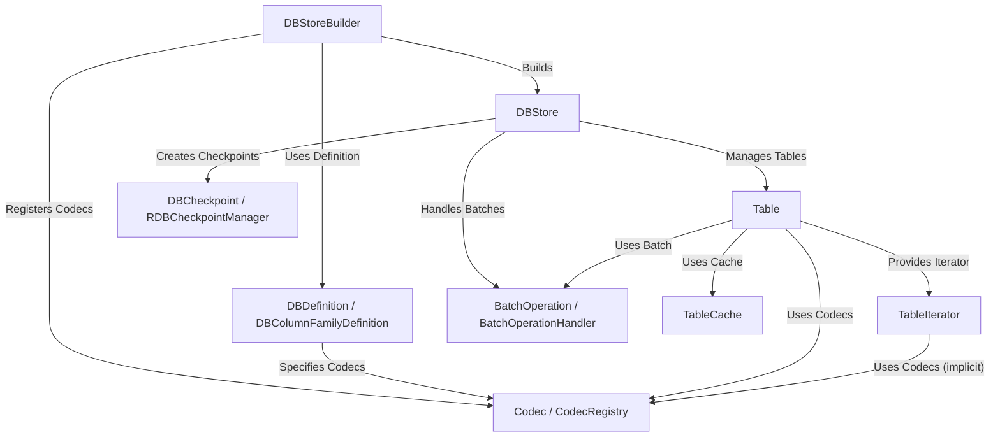

# Tutorial: db

This project provides a **key-value database** system, like a digital filing cabinet (*DBStore*).
You can create different **Tables** (like drawers) to store specific types of data (key-value pairs).
It uses *Codecs* to convert your Java objects into a format the database can store and back again.
You can group multiple changes together in a *batch* to ensure they all succeed or fail together, iterate through data efficiently using *TableIterators*, create *checkpoints* (snapshots) for backups, and speed up access with an optional in-memory *TableCache*.

**Source Repository:** [None](None)

## Chapters

1. [Codec / CodecRegistry
](01_codec___codecregistry_.md)
2. [DBDefinition / DBColumnFamilyDefinition
](02_dbdefinition___dbcolumnfamilydefinition_.md)
3. [DBStoreBuilder
](03_dbstorebuilder_.md)
4. [DBStore
](04_dbstore_.md)
5. [Table
](05_table_.md)
6. [TableIterator
](06_tableiterator_.md)
7. [BatchOperation / BatchOperationHandler
](07_batchoperation___batchoperationhandler_.md)
8. [DBCheckpoint / RDBCheckpointManager
](08_dbcheckpoint___rdbcheckpointmanager_.md)
9. [TableCache
](09_tablecache_.md)

---

Generated by [AI Codebase Knowledge Builder](https://github.com/The-Pocket/Tutorial-Codebase-Knowledge)