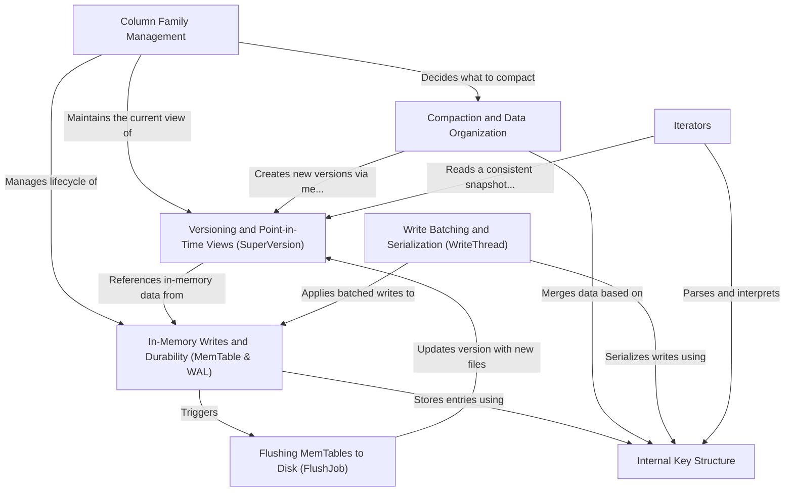

# Tutorial: db

This project is a high-performance, embeddable key-value database, similar to a supercharged dictionary that stores data on disk. It's designed to handle very large amounts of data efficiently. When you write data, it first goes into a fast, in-memory table called a **MemTable** and is also recorded in a **Write-Ahead Log (WAL)** to prevent data loss. Later, these in-memory tables are *flushed* to disk as permanent, sorted files. A background process called **compaction** continuously organizes these files to ensure reads remain fast and to reclaim space. The database supports grouping data into **Column Families**, much like tables, and uses a powerful **versioning** system to provide consistent, point-in-time views of your data.

**Source Repository:** [None](None)

## Chapters

1. [Column Family Management
](01_column_family_management_.md)
2. [In-Memory Writes and Durability (MemTable & WAL)
](02_in_memory_writes_and_durability__memtable___wal__.md)
3. [Write Batching and Serialization (WriteThread)
](03_write_batching_and_serialization__writethread__.md)
4. [Versioning and Point-in-Time Views (SuperVersion)
](04_versioning_and_point_in_time_views__superversion__.md)
5. [Iterators
](05_iterators_.md)
6. [Flushing MemTables to Disk (FlushJob)
](06_flushing_memtables_to_disk__flushjob__.md)
7. [Compaction and Data Organization
](07_compaction_and_data_organization_.md)
8. [Internal Key Structure
](08_internal_key_structure_.md)

---

Generated by [AI Codebase Knowledge Builder](https://github.com/The-Pocket/Tutorial-Codebase-Knowledge)