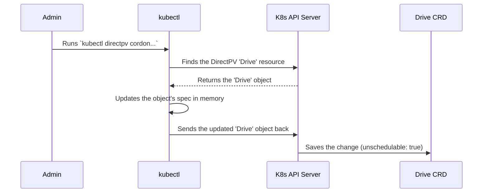

# Chapter 1: Admin Client and Operations

Welcome to the DirectPV tutorial! If you're looking to understand how DirectPV works from the ground up, you're in the right place. In this first chapter, we'll start with the most visible part of the system: the administrator's toolkit.

Imagine you're a car mechanic. You have a toolbox filled with wrenches, screwdrivers, and diagnostic tools. You use these tools to install new parts, check the engine's health, and perform routine maintenance. The DirectPV **Admin Client** is your digital toolbox for managing the storage in your Kubernetes cluster. It lets you perform all the essential "mechanic" tasks for your drives.

Let's say you need to perform maintenance on a physical drive in one of your servers. You can't just unplug it! You first need to tell Kubernetes to stop sending new data its way. The Admin Client is how you do that. This chapter will introduce you to this toolkit and show you how to use it for common tasks.

## What is the Admin Client?

The Admin Client is the user-facing control plane for DirectPV. It's how you, the human operator, communicate your intentions to the DirectPV system.

You'll primarily interact with it through a `kubectl` plugin. The commands will look like this:
`kubectl directpv <command> <options...>`

The Go code that powers these commands lives in the `pkg/admin` directory. This package contains all the logic for installing DirectPV, discovering new drives, preparing them for use, and performing maintenance.

### The Admin Toolkit: Key Operations

Your toolkit comes with several powerful commands. Here are the most important ones:

*   **`install`**: This is the first command you'll ever run. It sets up all the necessary components for DirectPV in your Kubernetes cluster.
*   **`init`**: After installation, this command discovers the physical drives attached to your nodes and prepares them to be managed by DirectPV.
*   **`cordon`**: This is like putting a temporary "Do Not Disturb" sign on a drive. It tells Kubernetes not to schedule any new storage on that drive, which is essential before you perform maintenance.
*   **`uncordon`**: This removes the "Do Not Disturb" sign, making the drive available for new storage again.
*   **`repair`**: This runs a health check on a drive's filesystem and attempts to fix any issues it finds.
*   **`suspend`**: This is a more forceful "pause" button for a drive or a specific volume on it. It can be used to temporarily halt I/O operations for advanced maintenance scenarios.

## A Practical Walkthrough: Taking a Drive Offline

Let's walk through our use case: you need to safely take a drive offline for maintenance and then bring it back.

### Step 1: Cordon the Drive

First, we need to tell DirectPV to stop using the drive for any *new* volumes. We use the `cordon` command.

```bash
# Example command
kubectl directpv cordon drive <drive-id>
```

This command finds the drive you specified and flags it as "unschedulable." Existing workloads using that drive will continue to run, but no new workloads will be placed on it.

### Step 2: (Optional) Repair the Drive

Now that the drive is safely cordoned, you can perform maintenance. For example, if you suspect filesystem corruption, you can run the `repair` command.

```bash
# Example command
kubectl directpv repair <drive-id>
```

Behind the scenes, this command creates a special Kubernetes Job that runs directly on the node where the drive is located. This job executes the necessary filesystem repair tools.

### Step 3: Uncordon the Drive

Once your maintenance is complete and the drive is healthy again, you can bring it back into service with the `uncordon` command.

```bash
# Example command
kubectl directpv uncordon drive <drive-id>
```

This removes the "unschedulable" flag, and the DirectPV scheduler will now consider it a valid target for new volumes.

## Under the Hood: How `cordon` Works

It's helpful to understand what happens when you run a command like `cordon`. It's not magic; it's a clear, logical flow.

First, let's visualize the high-level interaction.



The key takeaway is that the `cordon` command finds a specific Kubernetes object representing our drive and simply flips a switch on it.

### Diving into the Code

Let's look at a simplified view of the Go code in `pkg/admin/cordon.go` that makes this happen.

The process starts with the `Cordon` function. It takes arguments that specify which drives to act on.

```go
// from: pkg/admin/cordon.go

func (client *Client) Cordon(ctx context.Context, args CordonArgs, ...) (results []CordonResult, err error) {
    // ...
}
```
This function is part of the `Client` object, which is our main connection to the Kubernetes cluster.

Next, the code needs to find the specific drive(s) we want to cordon. It uses a helper called `DriveLister` to search for them based on the provided IDs or names.

```go
// from: pkg/admin/cordon.go

// Find the drive(s) matching the user's request.
resultCh := client.NewDriveLister().
    DriveIDSelector(args.DriveIDs).
    List(ctx)
```

The code then loops through the found drives. For each drive, it first checks if it's already cordoned. There's no need to cordon a drive twice!

```go
// from: pkg/admin/cordon.go

// For each drive found...
for result := range resultCh {
    // ...
    if result.Drive.IsUnschedulable() {
        continue // Skip if already cordoned
    }
    // ...
}
```

Finally, we get to the core of the operation. The code updates the drive object in memory and then sends this change to the Kubernetes API server to be saved permanently.

```go
// from: pkg/admin/cordon.go

// Set the 'unschedulable' flag on the object.
result.Drive.Unschedulable()

// If this is not a dry run, save the change to Kubernetes.
if !args.DryRun {
    _, err = client.Drive().Update(ctx, &result.Drive, ...)
    if err != nil {
        // ... handle error
    }
}
```
Notice the `!args.DryRun` check. The Admin Client tools almost always include a `--dry-run` flag. This lets you see what a command *would* do without making any actual changes—a very safe way to operate!

All these operations—cordon, repair, suspend—work by modifying the state of [DirectPV Custom Resources (CRDs)](03_directpv_custom_resources__crds__.md). These CRDs are the central "source of truth" for the state of every drive and volume in the system. When you use the admin client, you are simply a user-friendly way to read and write to these CRD objects.

## Conclusion

In this chapter, we introduced the Admin Client, your primary toolkit for managing DirectPV. We saw how commands like `cordon`, `repair`, and `uncordon` provide a simple yet powerful interface for day-to-day storage operations. You learned that these commands work by interacting with the Kubernetes API to modify DirectPV's custom resources.

Now that you understand *how* to manage drives, you might be wondering: how does DirectPV find these drives in the first place? And how does it prepare them for use? We'll answer those questions in our next chapter.

Next: [Chapter 2: Device Discovery and Initialization](02_device_discovery_and_initialization_.md)

---

Generated by [AI Codebase Knowledge Builder](https://github.com/The-Pocket/Tutorial-Codebase-Knowledge)