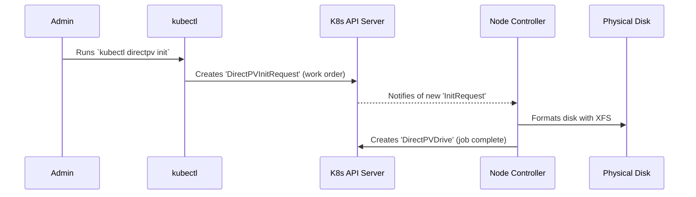

# Chapter 2: Device Discovery and Initialization

In the last chapter, [Admin Client and Operations](01_admin_client_and_operations_.md), we learned how to use the admin toolkit to manage drives that are already part of our storage pool. But how does DirectPV know about those drives in the first place? How does a raw, physical disk attached to a server become a managed piece of storage that Kubernetes can use?

This chapter answers that question. We'll explore the two-phase process that DirectPV uses: first, finding all the available disks, and second, preparing them for use.

Think of it like stocking a professional kitchen.
1.  **Reconnaissance (Discovery):** A truck delivers raw ingredients (potatoes, onions, etc.). The first step is to take inventory: count everything, check its quality, and list it on a clipboard. You don't cook anything yet; you just figure out what you have.
2.  **Preparation (Initialization):** The chef looks at the inventory list and decides which ingredients to use. They then take the raw potatoes, wash them, peel them, and put them in a "ready-to-cook" bin. The ingredient is now prepped and ready for any recipe.

DirectPV follows this exact same pattern for your disks.

## The Reconnaissance Phase: Taking Inventory

When you install DirectPV, it deploys a `DaemonSet`. This means a special DirectPV pod runs on every single node (server) in your Kubernetes cluster. Inside this pod is a container called the **`node-controller`**.

The `node-controller`'s job is to act as our inventory clerk. It continuously scans the host machine it's running on, looking for any attached block devices (disks, drives, SSDs, etc.).

For every disk it finds, it gathers information:
*   How big is it? (e.g., 1TB)
*   Is it already partitioned or formatted?
*   Is it a removable drive like a USB stick?
*   Is it a system disk that we shouldn't touch?

All this information is compiled into a Kubernetes resource called a **`DirectPVNode`**. You can think of this as the inventory clipboard for that specific node. It's a read-only list of all potential storage hardware.

### Under the Hood: How Scanning Works

The `node-controller` doesn't use magic. It uses standard Linux tools to probe the system. The Go code for this lives in the `pkg/device` and `pkg/node` directories.

The main process is handled by a `Sync` function.

```go
// from: pkg/node/sync.go

// Sync probes the local devices and syncs the DirectPVNode CRD.
func Sync(ctx context.Context, nodeID directpvtypes.NodeID) error {
	// Step 1: Probe the hardware to get a list of devices.
	devices, err := probeDevices(nodeID)
	if err != nil {
		return err
	}
	
	// ... code to update the Node object ...
	updateFunc := func() error {
		// Step 2: Find the DirectPVNode object for this node.
		node, err := client.NodeClient().Get(ctx, string(nodeID), ...)

		// Step 3: Update its status with the fresh list of devices.
		node.Status.Devices = devices
		_, err = client.NodeClient().Update(ctx, node, ...)
		return err
	}
	// ...
}
```
This is a simplified view, but it shows the three key steps:
1.  **Probe:** Call `probeDevices` to get a fresh list of physical disks.
2.  **Get:** Fetch the current `DirectPVNode` inventory object from Kubernetes.
3.  **Update:** Update the object with the new list and save it back to Kubernetes.

The `probe` function itself looks at low-level system details. It checks for things that would make a drive unsuitable, like being too small, read-only, or already in use by the operating system.

```go
// from: pkg/device/probe.go

// DeniedReason returns the reason if the device is denied for initialization.
func (d Device) DeniedReason() string {
	var reasons []string
	if d.Size < minSupportedDeviceSize {
		reasons = append(reasons, "Too small")
	}
	if d.ReadOnly {
		reasons = append(reasons, "Read only")
	}
	if len(d.MountPoints) != 0 {
		reasons = append(reasons, "Mounted")
	}
	// ... and several other checks
	return strings.Join(reasons, "; ")
}
```
This built-in safety logic prevents you from accidentally trying to format your main operating system drive!

## The Preparation Phase: Prepping the Ingredients

Now that we have our inventory in the `DirectPVNode` objects, it's time for the administrator (the chef) to decide what to use. This is a deliberate, manual action. You don't want DirectPV to automatically format every disk it finds!

To prepare a disk, you run the admin command `kubectl directpv init`.

```bash
# This command tells DirectPV to initialize all available drives
# across all nodes.
kubectl directpv init
```
When you run this command, you're not formatting the disk directly. Instead, you are creating a **`DirectPVInitRequest`**. This is a "work order" that you submit to the Kubernetes system.

The `node-controller` on each node is always watching for these work orders. When it sees an `InitRequest` that applies to a disk on its host, it picks up the job and performs the following actions:

1.  **Formats the disk** with a high-performance XFS filesystem.
2.  **Mounts the newly formatted disk** to a special directory inside `/var/lib/directpv/`.
3.  **Creates a `DirectPVDrive` resource** to signal that the disk is officially prepped, formatted, and ready to be managed by DirectPV.

This `DirectPVDrive` resource is the final product. It represents a drive that is now part of the managed storage pool. It's the object you were interacting with in Chapter 1 when you ran commands like `cordon`.

Let's visualize this flow:



### Under the Hood: Handling the Work Order

The logic for processing these work orders is in `pkg/initrequest/event.go`. A controller listens for new `InitRequest` objects.

```go
// from: pkg/initrequest/event.go

// Handle is called when a new or updated InitRequest is detected.
func (handler *initRequestEventHandler) Handle(ctx context.Context, eventType controller.EventType, object runtime.Object) error {
	initRequest := object.(*types.InitRequest)

	// Check if the work order is new and needs processing.
	if initRequest.Status.Status == directpvtypes.InitStatusPending {
		// If so, start initializing the devices listed in the request.
		return handler.initDevices(ctx, initRequest)
	}
	return nil
}
```

The `initDevices` function then does the real work for each device in the request.

```go
// from: pkg/initrequest/event.go

func (handler *initRequestEventHandler) initDevice(device pkgdevice.Device, force bool) error {
	// ... safety checks to make sure the device is not mounted ...

	// Step 1: Format the device with an XFS filesystem.
	_, _, _, _, err := handler.makeFS(devPath, fsuuid, force, handler.reflink)
	if err != nil {
		return err
	}
	
	// Step 2: Mount the newly formatted filesystem.
	if err = handler.mount(devPath, fsuuid); err != nil {
		return err
	}
	
	// ... other setup steps ...

	// Step 3: Create the final DirectPVDrive object in Kubernetes.
	drive := types.NewDrive(...)
	if _, err = client.DriveClient().Create(context.Background(), drive, ...); err != nil {
		return err
	}
	return nil
}
```

As you can see, the process is straightforward: format, mount, and then create a Kubernetes resource to announce that the drive is ready.

## Conclusion

In this chapter, we followed a physical disk on its journey from raw hardware to a fully managed DirectPV drive. We learned about the crucial two-phase process:

1.  **Discovery:** The `node-controller` automatically scans each node and creates a `DirectPVNode` inventory.
2.  **Initialization:** The administrator runs `kubectl directpv init`, which creates a `DirectPVInitRequest` work order. The `node-controller` picks up this order, formats the disk, and creates the final `DirectPVDrive` resource.

This separation of discovery and initialization is a key design feature. It gives administrators full control, ensuring that no disk is ever formatted or altered without their explicit command.

Now that we understand how these fundamental `Node` and `Drive` objects come into existence, it's time to look more closely at what they are. In the next chapter, we'll explore all the custom building blocks that make up the DirectPV system.

Next: [Chapter 3: DirectPV Custom Resources (CRDs)](03_directpv_custom_resources__crds__.md)

---

Generated by [AI Codebase Knowledge Builder](https://github.com/The-Pocket/Tutorial-Codebase-Knowledge)