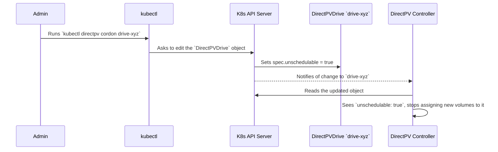

# Chapter 3: DirectPV Custom Resources (CRDs)

In the last chapter, [Device Discovery and Initialization](02_device_discovery_and_initialization_.md), we saw how DirectPV finds raw disks and, with your command, prepares them for use. This process resulted in the creation of objects like `DirectPVNode` and `DirectPVDrive`. But what *are* these objects?

This chapter dives into the very foundation of the DirectPV system: its **Custom Resource Definitions (CRDs)**. These are the special "nouns" that we teach Kubernetes so it can understand the language of storage.

## What's a CRD? The Kubernetes Dictionary

Imagine you're trying to use a software that only understands the words `Car` and `Engine`. It knows how to manage them perfectly. But you want it to manage a `Bicycle`. The software has no idea what a `Bicycle` is, what parts it has (`Wheels`, `Frame`), or what you can do with it (`Pedal`, `Brake`).

Kubernetes is like this software. Out of the box, it knows about `Pods`, `Deployments`, and `Services`. It does *not* know what a `DirectPVDrive` is.

A **Custom Resource Definition (CRD)** is how we add new words to Kubernetes's dictionary. By installing DirectPV, we provide a set of definitions that teach Kubernetes about our special storage concepts. Once taught, Kubernetes can store and manage these new objects just like its built-in ones.

These custom resources become the **central source of truth** for the entire system. Every action, from formatting a drive to provisioning a volume, is recorded in one of these custom objects.

## The Nouns of DirectPV

DirectPV introduces a few key nouns (CRDs) to your cluster's vocabulary. Let's meet the most important ones.

### `DirectPVDrive`
This is the star of the show. A `DirectPVDrive` object represents a single, physical disk that has been initialized and is now part of the DirectPV storage pool.

*   **Analogy:** A `DirectPVDrive` is like a large, empty water jug.
*   **It knows:** Its total capacity, how much space is free, its unique ID (`fsuuid`), and its health status (`Online`, `Offline`, etc.).
*   **You can:** `cordon` it to stop new uses, or `repair` it if something is wrong.

### `DirectPVVolume`
A `DirectPVVolume` represents a logical chunk of storage carved out from a `DirectPVDrive`. This is what your applications actually use for persistent storage.

*   **Analogy:** A `DirectPVVolume` is a glass of water poured from the jug.
*   **It knows:** Which `DirectPVDrive` (jug) it came from, its requested size, and where it's being used by a pod.

### `DirectPVNode`
As we saw in the last chapter, this is an inventory list. A `DirectPVNode` object represents a server in your cluster and lists all the block devices attached to it, whether they are managed by DirectPV or not.

*   **Analogy:** An inventory sheet for one shelf in a warehouse, listing every box on it.

### `DirectPVInitRequest`
This is a temporary "work order". When you run `kubectl directpv init`, you're creating one of these objects to tell the system: "Please format these specific disks."

*   **Analogy:** A sticky note telling a worker to "Prep this ingredient." Once the job is done, the note is thrown away.

## The "Source of Truth" in Action

Let's revisit a simple command from Chapter 1 to see how these CRDs work as the source of truth. When you run `kubectl directpv cordon drive-xyz`, you are *not* directly telling a server to stop using a disk.

Instead, you are simply editing the `DirectPVDrive` object in the Kubernetes database.



This is the core pattern of Kubernetes:
1.  A user or process defines the **desired state** (e.g., "I want this drive to be unschedulable"). This is written to a resource's `spec`.
2.  A **controller** (a program that's always running and watching) sees the change.
3.  The controller takes action to make the **actual state** of the world match the desired state.
4.  The controller updates the resource's `status` to report what it sees.

The CRD object is the central meeting point for this entire process.

## Under the Hood: The Blueprint (YAML)

So, how do we "teach" Kubernetes a new word? We provide a blueprint in a YAML file. This is the `CustomResourceDefinition` itself. Let's look at a simplified version for `DirectPVDrive`.

```yaml
# from: resources/base/directpvdrives.directpv.min.io.yaml

apiVersion: apiextensions.k8s.io/v1
kind: CustomResourceDefinition
metadata:
  name: directpvdrives.directpv.min.io # The full name of our new resource
spec:
  group: directpv.min.io
  names:
    kind: DirectPVDrive # The short name we use, like 'Pod'
  scope: Cluster
  versions:
  - name: v1beta1
    schema:
      openAPIV3Schema:
        properties:
          spec: # What the user WANTS (Desired State)
            properties:
              unschedulable:
                type: boolean
          status: # What the system SEES (Actual State)
            properties:
              freeCapacity:
                format: int64
              status:
                type: string
```
This YAML file defines the structure of a `DirectPVDrive`. The most important parts are:
*   **`names.kind`**: This defines the `Kind` you'll see in YAML files, like `kind: DirectPVDrive`.
*   **`spec`**: This is the "specification" or desired state. It contains fields that users can set, like `unschedulable`.
*   **`status`**: This reports the observed, actual state. This field is managed by the DirectPV controllers, not by you. It tells you the `freeCapacity` and current `status`.

## Under the Hood: The Blueprint (Go)

DirectPV is written in Go, so these YAML blueprints correspond directly to Go data structures (structs). This makes it easy for the code to work with these custom objects.

Here's the simplified Go code that matches the `DirectPVDrive` YAML we just saw.

```go
// from: pkg/apis/directpv.min.io/v1beta1/drive.go

// DirectPVDrive denotes drive CRD object.
type DirectPVDrive struct {
	metav1.TypeMeta   `json:",inline"`
	metav1.ObjectMeta `json:"metadata"`

	Spec   DriveSpec   `json:"spec,omitempty"`
	Status DriveStatus `json:"status"`
}
```
This is the top-level struct. It contains the standard Kubernetes `TypeMeta` and `ObjectMeta` (for name, labels, etc.), and our custom `Spec` and `Status`.

```go
// from: pkg/apis/directpv.min.io/v1beta1/drive.go

// DriveSpec represents DirectPV drive specification values.
type DriveSpec struct {
	Unschedulable bool `json:"unschedulable,omitempty"`
	//...
}

// DriveStatus denotes drive information.
type DriveStatus struct {
	FreeCapacity      int64             `json:"freeCapacity"`
	Status            types.DriveStatus `json:"status"`
	//...
}
```
As you can see, the Go structs are a near-perfect mirror of the YAML definition. The `json` tags tell the Go compiler how to convert this struct to and from the YAML or JSON that the Kubernetes API server understands.

## Conclusion

In this chapter, we pulled back the curtain on the "magic" of DirectPV. We learned that the system is built on a set of custom nouns, or **CRDs**, that extend the Kubernetes language.

*   `DirectPVDrive`, `DirectPVVolume`, and `DirectPVNode` are the core objects.
*   They act as the **central source of truth** for the entire storage cluster.
*   The system works by changing the **`spec`** (desired state) of an object and letting a controller reconcile the **`status`** (actual state).

Now that we understand the data—the nouns—of the system, it's time to meet the workers who act on that data. In the next chapter, we'll look at our first major controller.

Next: [Chapter 4: CSI Controller Service](04_csi_controller_service_.md)

---

Generated by [AI Codebase Knowledge Builder](https://github.com/The-Pocket/Tutorial-Codebase-Knowledge)