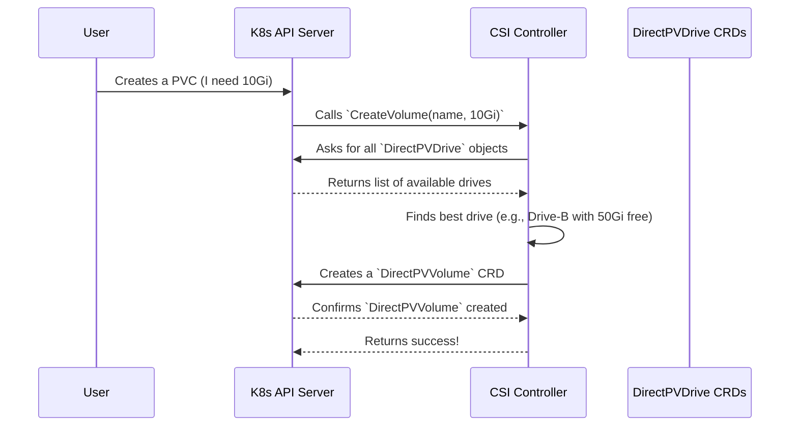

# Chapter 4: CSI Controller Service

In the last chapter, we learned about [DirectPV Custom Resources (CRDs)](03_directpv_custom_resources__crds__.md). We now know that objects like `DirectPVDrive` and `DirectPVVolume` are the "nouns" of our storage system—they represent the data and the state.

But who reads these nouns and decides what to do? If a user asks for storage, who is responsible for finding a suitable drive and creating a volume?

Meet the **CSI Controller Service**. This is the central "scheduler" or "matchmaker" of the system. It's the brains of the operation that handles storage requests.

## The Matchmaker's Job

Imagine you're managing a large factory with many different machines (our `DirectPVDrive`s). A new job order comes in (a user's request for storage). The job order has specific requirements: "I need a machine that can handle a 10kg block and is located in the north wing."

You wouldn't just assign it to any random machine. You'd need a central dispatcher to:
1.  Receive the job order.
2.  Scan all available machines.
3.  Find one that meets all the requirements (capacity, location, etc.).
4.  Assign the job to that specific machine and mark it as "in use".

The CSI Controller Service is this dispatcher. It runs as a Kubernetes `Deployment` and its primary job is to watch for new storage requests, called `PersistentVolumeClaims` (PVCs), and fulfill them by creating [DirectPVVolume](03_directpv_custom_resources__crds__.md) resources.

## What is CSI?

Before we dive deeper, it's important to know what "CSI" stands for: **Container Storage Interface**.

CSI is a standard API that Kubernetes uses to talk to any storage system. Think of it like a USB port. You can plug in any device (a keyboard, a mouse, a flash drive) as long as it follows the USB standard. Similarly, any storage provider (like DirectPV, AWS EBS, Google Persistent Disk, etc.) can "plug into" Kubernetes by implementing the CSI standard.

The DirectPV `CSI Controller Service` is our implementation of the controller-side functions of this standard.

## A Practical Walkthrough: Requesting Storage

Let's follow a storage request from start to finish. A user's application needs a 10 GiB volume. To get this, the user creates a `PersistentVolumeClaim` (PVC) object in Kubernetes.

This is the user's "job order":

```yaml
# A user's request for storage
apiVersion: v1
kind: PersistentVolumeClaim
metadata:
  name: my-app-pvc
spec:
  accessModes:
    - ReadWriteOnce
  resources:
    requests:
      storage: 10Gi # I need 10 GiB of space!
  storageClassName: directpv-min-io
```

When Kubernetes sees this PVC, it doesn't know how to create the storage itself. But because the `storageClassName` points to DirectPV, it knows who to ask. It calls the `CreateVolume` function on our **CSI Controller Service**.

### The Matchmaking Process

Here's what happens behind the scenes when the controller gets the call.



The CSI Controller Service acts as the intelligent intermediary. It translates a generic Kubernetes request into a specific DirectPV action.

## Under the Hood: The Code

Let's peek into the code that makes this happen. The core logic lives in `pkg/csi/controller/server.go`.

### 1. Receiving the Request: `CreateVolume`

When Kubernetes calls our service, it triggers the `CreateVolume` function. This is the entry point for the entire process.

```go
// from: pkg/csi/controller/server.go

// CreateVolume - Creates a volume
func (c *Server) CreateVolume(ctx context.Context, req *csi.CreateVolumeRequest) (*csi.CreateVolumeResponse, error) {
	// ... some validation checks ...

	// Step 1: Find a suitable drive for the request.
	drive, err := selectDrive(ctx, req)
	if err != nil {
		return nil, err
	}
	
    // ... continues below
```

The first and most important step is to call a helper function, `selectDrive`, which does the actual matchmaking.

### 2. Finding the Perfect Match: `selectDrive` and `matchDrive`

The `selectDrive` helper, located in `pkg/csi/controller/utils.go`, is responsible for finding the best drive. It first gets a list of all possible drives and then filters them.

The filtering logic is in a function called `matchDrive`. This function is like a bouncer at a club, checking each drive to see if it meets the requirements.

```go
// from: pkg/csi/controller/utils.go

func matchDrive(drive *types.Drive, req *csi.CreateVolumeRequest) bool {
	// Reject drives that are being deleted.
	if !drive.GetDeletionTimestamp().IsZero() {
		return false
	}
	// Reject drives that aren't ready.
	if drive.Status.Status != directpvtypes.DriveStatusReady {
		return false
	}
	// Reject drives that are cordoned.
	if drive.IsUnschedulable() {
		return false
	}
	// Reject drives that don't have enough free space.
	if req.GetCapacityRange() != nil && drive.Status.FreeCapacity < req.GetCapacityRange().GetRequiredBytes() {
		return false
	}
	
	// If all checks pass, it's a match!
	return true
}
```
This function runs through a series of checks. If a drive fails any check, it's out of the running. This ensures we only consider healthy, available drives with enough capacity.

### 3. Reserving the Slice: Creating a `DirectPVVolume`

Once `selectDrive` returns a winning drive, the `CreateVolume` function proceeds. It now needs to officially reserve a slice of that drive. It does this by creating a [DirectPVVolume](03_directpv_custom_resources__crds__.md) object.

```go
// from: pkg/csi/controller/server.go (continued from above)

	// Step 2: Define the new volume object.
	newVolume := types.NewVolume(
		req.GetName(), // The name of the volume
		drive.Status.FSUUID, // The ID of the parent drive
		// ... other details ...
	)

	// Step 3: Create the DirectPVVolume object in Kubernetes.
	if _, err := client.VolumeClient().Create(ctx, newVolume, ...); err != nil {
		// ... handle error ...
	}

	// ... continues below
```

This creates the "glass of water" from our analogy in the previous chapter. It's a record that a specific amount of storage has been claimed.

### 4. Updating the Drive's Capacity

Finally, to ensure our accounting is correct, we must update the parent `DirectPVDrive` to reflect that some of its space is now allocated.

```go
// from: pkg/csi/controller/server.go (continued from above)

	// Step 4: Update the drive's capacity information.
	drive.Status.FreeCapacity -= size
	drive.Status.AllocatedCapacity += size

	// Step 5: Save the updated drive object to Kubernetes.
	_, err = client.DriveClient().Update(ctx, drive, ...)
	if err != nil {
		// ... handle error
	}
	
	return &csi.CreateVolumeResponse{ /* ... */ }, nil
}
```

This final step is crucial. It prevents the system from over-committing a drive's capacity. The `DirectPVDrive`'s `status` is our single source of truth for how much space is left.

## Conclusion

In this chapter, we met the **CSI Controller Service**, the central scheduler for DirectPV. We learned that:

*   It implements the standard **Container Storage Interface (CSI)**, allowing it to work seamlessly with Kubernetes.
*   Its main job is to handle `PersistentVolumeClaim` requests from users.
*   It acts as a **matchmaker**, scanning all available `DirectPVDrive`s to find one that meets the request's capacity and other requirements.
*   Once a match is found, it creates a `DirectPVVolume` resource to reserve the storage and updates the parent drive's capacity.

The CSI Controller is a critical component that connects the abstract world of Kubernetes storage requests to the concrete world of physical drives managed by DirectPV. But creating the `DirectPVVolume` resource is only half the story. Something needs to watch for these new volume objects and actually make them available on the correct node. That's the job of another type of controller.

Next: [Chapter 5: Generic Controller Loop](05_generic_controller_loop_.md)

---

Generated by [AI Codebase Knowledge Builder](https://github.com/The-Pocket/Tutorial-Codebase-Knowledge)