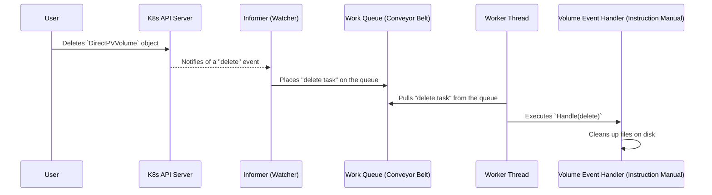

# Chapter 5: Generic Controller Loop

In the last chapter, [CSI Controller Service](04_csi_controller_service_.md), we saw how the "matchmaker" of DirectPV handles a user's request for storage. It finds a suitable drive and creates a `DirectPVVolume` resource. But creating this resource is like writing down a plan. It's a record of intent, not the action itself.

So, who reads this plan and carries out the work? If a `DirectPVVolume` is created, what process actually creates a directory on the physical disk? If a user deletes a `DirectPVVolume`, what cleans up the files?

The answer is the **Generic Controller Loop**, the tireless engine that powers all of DirectPV's automation. It's the central nervous system of the project, constantly watching for changes and making sure reality matches the plan.

## The Factory Analogy: From Plan to Action

Imagine a busy factory. The main office receives orders (like creating a `DirectPVVolume`). The office doesn't build anything itself; it just puts the order form into a "new orders" tray.

How does this order become a finished product?

1.  **Watcher:** A dedicated clerk continuously watches the "new orders" tray.
2.  **Queue:** When the clerk sees a new order, they don't stop everything to process it. They place it on a conveyor belt. This ensures orders are handled in an organized way and nothing gets lost if there's a sudden rush.
3.  **Worker:** A factory worker stands at the end of the conveyor belt, picking up one order at a time.
4.  **Handler:** For each order, the worker consults an instruction manual to see what to do. If the order is "Create Widget A", they follow the steps for that. If it's "Scrap Widget B", they follow a different set of steps.

This is exactly how the Generic Controller Loop works in DirectPV. It's a standard pattern in Kubernetes known as **Watch, Diff, Reconcile**.
*   **Watch:** Watch for changes to resources (like `DirectPVVolume`s).
*   **Diff:** Notice the difference between the desired state (the "order") and the actual state.
*   **Reconcile:** Take action to make the actual state match the desired state.

## The Components of the Loop

The generic controller is the engine, but it's made of a few key parts. It lives in the `pkg/controller/controller.go` file and is used by all the automated actors in the system.

Let's visualize the flow when a user deletes a `DirectPVVolume` object.



*   **Informer:** This is our "watcher" clerk. It's an efficient component from Kubernetes that watches for any changes (Create, Update, Delete) to a specific type of resource.
*   **Work Queue:** This is the "conveyor belt". Events from the Informer are placed here as small tasks. This is great because if a worker fails to process a task, it can be put back on the queue to be retried later.
*   **Worker Threads:** These are our factory workers. They are Go routines that run in a loop, constantly pulling tasks from the work queue.
*   **Event Handler:** This is the "instruction manual". It's a piece of code with the specific logic for a specific resource. There's a `volumeEventHandler`, a `driveEventHandler`, and an `initRequestEventHandler`. The generic controller doesn't care what the logic is; it just knows how to call it.

## Under the Hood: The Generic Engine

The code for this generic engine is in `pkg/controller/controller.go`. It's designed to be reusable for any type of resource.

### Creating a New Controller

When DirectPV starts, it creates a controller for each resource it needs to manage. For example, the `volume` controller is created like this:

```go
// from: pkg/volume/event.go

// StartController starts volume controller.
func StartController(ctx context.Context, nodeID directpvtypes.NodeID) {
    // 1. Create the specific "instruction manual" for volumes.
	handler := newVolumeEventHandler(nodeID)
    
    // 2. Create the generic engine, passing in the handler.
	ctrl := controller.New("volume", handler, workerThreads, resyncPeriod)

    // 3. Start the engine.
	ctrl.Run(ctx)
}
```
The `controller.New` function wires up the informer, work queue, and handler, creating our complete factory workflow.

### The Worker's Loop

Inside the generic controller, each worker thread runs a simple loop. This is the core of its "pull from the conveyor belt" logic.

```go
// from: pkg/controller/controller.go

func (c *Controller) runWorker(ctx context.Context) {
	// Keep processing items until the program is told to stop.
	for c.processNextItem(ctx) {
	}
}

func (c *Controller) processNextItem(ctx context.Context) bool {
	// 1. Get the next task from the queue (conveyor belt).
	event, quit := c.queue.Get()
	if quit {
		return false
	}
	defer c.queue.Done(event)

	// 2. Process the task using the handler.
	if err := c.processItem(ctx, event); err != nil {
		// If it fails, put it back on the queue to retry.
		c.queue.AddRateLimited(event)
	} else {
		// If it succeeds, forget about it.
		c.queue.Forget(event)
	}

	return true
}
```
This loop is the heart of the controller's reliability. If processing an event fails (maybe due to a temporary network issue), it's not lost. It's simply put back in the queue to be tried again in a little while.

## Under the Hood: A Specific Handler

The generic engine provides the "how", but the **Event Handler** provides the "what". Let's look at the `volumeEventHandler` in `pkg/volume/event.go` to see how it works.

It has one primary job: implement the `Handle` function. This function is the entry point that the generic controller calls.

```go
// from: pkg/volume/event.go

// Handle is called by the generic controller when a volume event occurs.
func (handler *volumeEventHandler) Handle(ctx context.Context, eventType controller.EventType, object runtime.Object) error {
	volume := object.(*types.Volume)

	// Is this a delete event?
	if !volume.GetDeletionTimestamp().IsZero() {
		// If so, run our specific cleanup logic.
		return handler.delete(ctx, volume)
	}

	// ... logic for other events like 'Add' ...

	return nil
}
```
This is the "instruction manual". The controller calls `Handle`, and the handler looks at the event type to decide which "chapter" of the manual to follow. If it's a deletion event, it calls its own internal `delete` function.

The `delete` function contains the actual logic for cleaning up a volume's resources on the node.

```go
// from: pkg/volume/event.go

func (handler *volumeEventHandler) delete(ctx context.Context, volume *types.Volume) error {
	// ... unmount any paths associated with the volume ...

	// Rename the directory to mark it for deletion, so it's not in use.
	deletedDir := volume.Status.DataPath + ".deleted"
	if err := os.Rename(volume.Status.DataPath, deletedDir); err != nil {
		// ... handle error ...
	}

	// In the background, remove the directory and all its contents.
	go func() {
		os.RemoveAll(deletedDir)
	}()

	// ... update the parent drive to free up the capacity ...

	return nil
}
```
This is where the real work happens! The handler interacts with the filesystem, unmounting paths and removing directories to ensure the actual state on the disk reflects the desired state (which is that the volume no longer exists).

## Conclusion

In this chapter, we explored the core engine of DirectPV: the **Generic Controller Loop**. We learned that:

*   It's based on the standard Kubernetes **Watch, Diff, Reconcile** pattern.
*   It works like a factory, using an **Informer** (watcher), a **Work Queue** (conveyor belt), and **Worker Threads** to process events reliably.
*   The generic engine in `pkg/controller` provides the reusable machinery.
*   Specific **Event Handlers** (like `volumeEventHandler`) provide the "instruction manuals" with the business logic for each resource.

This powerful, generic pattern is what allows DirectPV to automatically manage the lifecycle of drives, volumes, and initialization requests. It's the mechanism that translates your desired state (written in a CRD) into real actions on your servers.

We've now seen how a volume is requested, how the `DirectPVVolume` resource is created, and how a controller acts on that resource. But there's one final step: making that volume available inside your application's pod. That's the job of the component we'll explore next.

Next: [Chapter 6: CSI Node Service](06_csi_node_service_.md)

---

Generated by [AI Codebase Knowledge Builder](https://github.com/The-Pocket/Tutorial-Codebase-Knowledge)