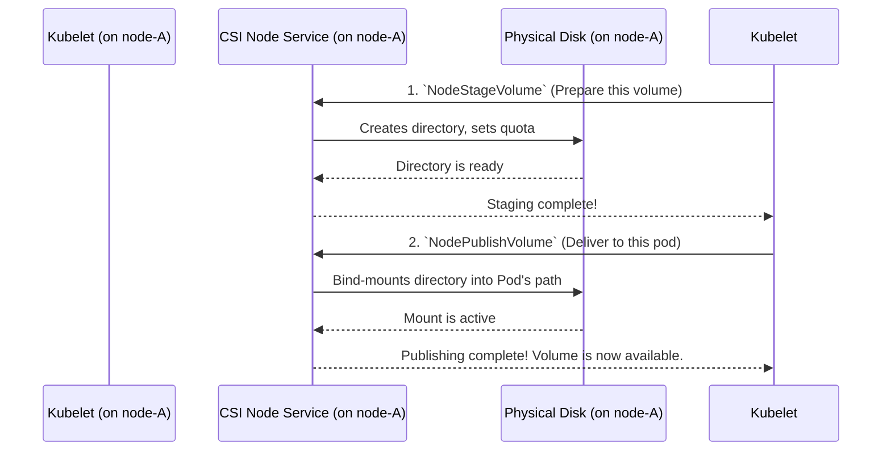

# Chapter 6: CSI Node Service

In the last two chapters, we saw how the [CSI Controller Service](04_csi_controller_service_.md) acts as a central "matchmaker," creating a `DirectPVVolume` resource as a plan for storage. Then, we learned how the [Generic Controller Loop](05_generic_controller_loop_.md) tirelessly watches for these plans and acts on them.

But so far, everything has been paperwork and planning. We have a `DirectPVVolume` object, but it's not actually available to an application yet. Who does the final, hands-on work of making that volume usable on a specific server?

Meet the **CSI Node Service**, the "field agent" of DirectPV.

## The Field Agent on Every Node

Imagine a large logistics company. The central office ([CSI Controller Service](04_csi_controller_service_.md)) decides that a package (`DirectPVVolume`) should be delivered from `Warehouse-A`. They send out the order.

The **CSI Node Service** is the delivery driver who works at `Warehouse-A`. They receive the order, find the package on the shelf, load it onto their truck, and drive it to the customer's doorstep (the application `Pod`). They perform the physical, last-mile delivery.

This service runs as a `DaemonSet` in Kubernetes, which is a fancy way of saying that a copy of this "field agent" pod is running on every single node (server) in your cluster. This is essential because it needs to perform operations directly on the local node's disks and filesystem.

## The Two-Step Delivery: Staging and Publishing

The Container Storage Interface (CSI) standard splits the "delivery" process into two distinct phases. Our field agent performs both.

1.  **Staging (`NodeStageVolume`):** This is the "preparation" step.
    *   **Analogy:** The delivery driver finds the correct shelf (the parent `DirectPVDrive`), gets the specific package (the `DirectPVVolume`), and prepares it on a loading dock. This might involve creating a directory for it and setting rules on its size (a quota). This preparation only needs to happen once for a given package on that truck.
2.  **Publishing (`NodePublishVolume`):** This is the final "delivery" step.
    *   **Analogy:** The driver takes the prepared package from the loading dock and places it on the customer's front porch (the application's `Pod` filesystem). Now, the customer can open their door and see the package.

This two-step process allows for efficiency. A volume can be "staged" once on a node and then "published" to multiple pods on that same node if needed, without repeating the preparation work.

## A Practical Walkthrough: Delivering a Volume to a Pod

Let's see how this works when Kubernetes decides to start a new pod that needs our volume on `node-A`.



The process is orchestrated by the `kubelet` (Kubernetes's own agent on each node) but carried out by our DirectPV CSI Node Service.

1.  **`NodeStageVolume`:** The kubelet tells our Node Service to prepare the volume. The Node Service finds the parent `DirectPVDrive`, creates a directory for our `DirectPVVolume`, and sets a filesystem quota to enforce its size.
2.  **`NodePublishVolume`:** The kubelet then tells our Node Service the exact path inside the pod where the volume should appear. The Node Service performs a **bind mount**, which is a Linux trick that makes one directory appear as if it's inside another. This makes the volume visible to the application.

## Under the Hood: The Staging Process

When the kubelet calls `NodeStageVolume`, it triggers the corresponding function in our Go code.

```go
// from: pkg/csi/node/stage_unstage.go

// NodeStageVolume is the request handler for staging a volume.
func (server *Server) NodeStageVolume(ctx context.Context, req *csi.NodeStageVolumeRequest) (*csi.NodeStageVolumeResponse, error) {
	// ... validation checks ...

	volume, err := client.VolumeClient().Get(ctx, req.GetVolumeId(), ...)
	if err != nil {
		return nil, status.Error(codes.NotFound, err.Error())
	}

	// Delegate the actual work to the StageVolume helper function.
	code, err := drive.StageVolume(ctx, volume, req.GetStagingTargetPath(), ...)
	if err != nil {
		return nil, status.Error(code, err.Error())
	}

	return &csi.NodeStageVolumeResponse{}, nil
}
```
This function is mostly a wrapper. It finds the `DirectPVVolume` object and then calls a helper function, `drive.StageVolume`, to do the real work.

The `StageVolume` helper performs the key steps of preparation.

```go
// from: pkg/drive/event.go

// StageVolume creates and mounts the staging path for a volume.
func StageVolume(ctx context.Context, volume *types.Volume, ...) (codes.Code, error) {
	// 1. Figure out the path for the volume's directory.
	volumeDir := types.GetVolumeDir(volume.Status.FSUUID, volume.Name)

	// 2. Create the directory on the disk.
	if err := mkdir(volumeDir); err != nil && !os.IsExist(err) {
		return codes.Internal, err
	}

	// 3. Set a quota to enforce the volume's size.
	quota := xfs.Quota{HardLimit: uint64(volume.Status.TotalCapacity)}
	if err := setQuota(ctx, device, volumeDir, volume.Name, quota, false); err != nil {
		return codes.Internal, err
	}
	
	// 4. Bind-mount the volume directory to the staging path.
	if err := stageVolumeMount(...); err != nil {
		return codes.Internal, err
	}

	// ... update the volume's status ...
	return codes.OK, nil
}
```
This is where the hands-on work happens. The Node Service interacts directly with the node's filesystem to create a directory (`mkdir`), set an XFS quota (`setQuota`), and perform the staging mount.

## Under the Hood: The Publishing Process

Once staging is complete, the kubelet calls `NodePublishVolume`. This is the final step.

```go
// from: pkg/csi/node/publish_unpublish.go

// NodePublishVolume handles the request to publish a volume.
func (server *Server) NodePublishVolume(ctx context.Context, req *csi.NodePublishVolumeRequest) (*csi.NodePublishVolumeResponse, error) {
	// ... validation checks ...

	// The actual logic for publishing is in this helper.
	if err := server.publishVolume(req, isSuspended); err != nil {
		return nil, status.Errorf(codes.Internal, "unable to publish volume; %v", err)
	}

	// ... update the volume status with the final target path ...

	return &csi.NodePublishVolumeResponse{}, nil
}
```
Again, this function delegates to a helper, `publishVolume`.

The `publishVolume` function is surprisingly simple. All the hard preparation is already done. Now, it just needs to make the staged directory visible to the pod.

```go
// from: pkg/csi/node/publish_unpublish.go

func (server *Server) publishVolume(req *csi.NodePublishVolumeRequest, isSuspended bool) error {
	// Create the final target directory if it doesn't exist.
	if err := server.mkdir(req.GetTargetPath()); err != nil && !os.IsExist(err) {
		return err
	}

	// ... logic to check if it's already mounted ...

	// Perform the final bind mount!
	if err := server.bindMount(req.GetStagingTargetPath(), req.GetTargetPath(), req.GetReadonly()); err != nil {
		return fmt.Errorf("unable to bind mount staging target path to target path; %v", err)
	}
	return nil
}
```
The most important line here is `server.bindMount(...)`. This command tells the Linux kernel: "Make the contents of the `stagingTargetPath` also appear at the `targetPath` (inside the pod)." After this command succeeds, the application can read and write to its volume.

## Conclusion

In this chapter, we met the **CSI Node Service**, DirectPV's "field agent." We learned that:

*   It runs as a **`DaemonSet`**, with one instance on every node, ready to perform local disk operations.
*   It implements the CSI-mandated two-step process:
    1.  **`NodeStageVolume` (Preparation):** Creates the volume directory and sets quotas on the physical drive.
    2.  **`NodePublishVolume` (Delivery):** Bind-mounts the prepared directory into the application's pod, making it usable.
*   It is the component that does the final, "last-mile" work of connecting a logical `DirectPVVolume` to a running application.

We've talked a lot about mounting filesystems and setting "quotas." These operations are specific to the type of filesystem DirectPV uses: XFS. In our final chapter, we'll take a closer look at the tools DirectPV uses to manage XFS.

Next: [Chapter 7: XFS Utilities](07_xfs_utilities_.md)

---

Generated by [AI Codebase Knowledge Builder](https://github.com/The-Pocket/Tutorial-Codebase-Knowledge)