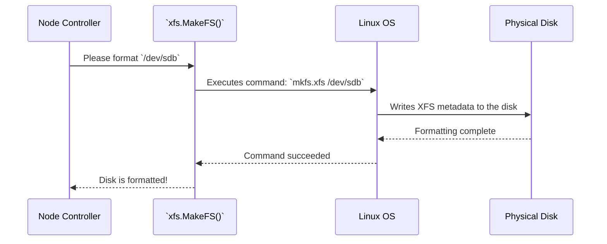

# Chapter 7: XFS Utilities

Welcome to the final chapter of our deep dive into DirectPV! In the last chapter, [CSI Node Service](06_csi_node_service_.md), we saw how the "field agent" on each node does the hands-on work of preparing volumes. We mentioned that it performs tasks like creating directories and setting "quotas" to enforce volume sizes.

But how does it *actually* do that? How does a Go program running in a container talk to the low-level filesystem on the host machine to format a disk or set a size limit?

This is the job of the **XFS Utilities**, the specialized, low-level toolkit that DirectPV uses for all its disk operations.

## The Specialist's Toolbox

Imagine you're the main mechanic for a racing team. You know *what* needs to be done: "Format the drive," "Mount the filesystem," "Set a 10 GiB limit." This is the job of the [CSI Node Service](06_csi_node_service_.md).

However, to perform these tasks, you need a specific set of tools. You can't use a generic wrench; you need the exact tool designed for that specific engine part.

The `pkg/xfs` package is this specialized toolbox. DirectPV made a design decision to exclusively use the high-performance **XFS filesystem**. This package provides a clean Go interface that wraps the necessary Linux command-line tools (like `mkfs.xfs`) and low-level system calls needed to manage XFS.

It's the toolbox that our CSI field agent uses to get its hands dirty and do its job on the host machine.

## Why Only XFS?

Standardizing on a single filesystem has huge benefits. XFS is a mature, high-performance filesystem that is excellent for large files and parallel I/O, which is common in cloud-native workloads.

Most importantly, it has a feature called **Project Quotas**. This feature allows DirectPV to assign a unique ID to each volume's directory and tell the filesystem, "Never let the files under this specific ID grow larger than X gigabytes." This is how DirectPV enforces the volume sizes that users request, a crucial feature for a storage system.

## The Tools in the Box

The `pkg/xfs` toolbox provides several functions, but let's look at the three most important ones that correspond to actions we've already seen in previous chapters.

*   `MakeFS`: Formats a raw device with a new XFS filesystem. This is used during the [Device Discovery and Initialization](02_device_discovery_and_initialization_.md) phase.
*   `Mount`: Mounts a formatted device to a directory so it can be used. This happens during initialization and volume staging.
*   `SetQuota`: Sets a project quota on a directory to enforce a volume's size. This is a key part of the `NodeStageVolume` process we saw in the last chapter.

## Under the Hood: Making a Filesystem

How does DirectPV format a brand new disk? It uses the `MakeFS` function. At its core, this Go function is just a wrapper that calls the standard Linux command `mkfs.xfs`.



This is possible because the DirectPV container image includes the necessary tools. If you look at the `Dockerfile`, you'll see a line that installs them.

```dockerfile
# from: Dockerfile

# Install the package that contains mkfs.xfs, xfs_quota, etc.
RUN microdnf install xfsprogs --nodocs
```

This ensures our Go program can call these commands. The Go code that does this is very straightforward.

```go
// from: pkg/xfs/mkfs_linux.go

func makeFS(ctx context.Context, device, uuid string, ...) (..., err error) {
	// Prepare the arguments for the command.
	args := []string{
		"-m", fmt.Sprintf("uuid=%v", uuid),
		"-L", FSLabel, // Set a friendly label
		device,
	}

	// Execute the command: mkfs.xfs <args...>
	output, err := exec.CommandContext(ctx, "mkfs.xfs", args...).CombinedOutput()
	if err != nil {
		return ..., fmt.Errorf("command failed: %w", err)
	}

	// ...
}
```
This function in `pkg/xfs` builds a list of command-line arguments and uses Go's standard `exec` package to run `mkfs.xfs`, just as you would from a terminal.

## Under the Hood: Enforcing Volume Size

Setting a quota is more advanced than just running a command. It involves speaking directly to the Linux kernel using low-level system calls.

The key is the `prjquota` (Project Quota) option. When DirectPV first mounts a drive, it enables this feature.

```go
// from: pkg/xfs/mount_linux.go

func mount(device, target string) error {
	// ...
	
	// Mount the device with the "prjquota" option enabled.
	err := sys.Mount(device, target, "xfs", []string{"noatime"}, "prjquota")
	
	// ...
	return err
}
```
With `prjquota` enabled, we can now use the `SetQuota` function. Here's how it works:

1.  **Create a unique ID:** It takes the volume name (e.g., `my-app-pvc-123`) and hashes it to create a unique number, the `ProjectID`. This is like giving the project a unique account number.
2.  **Tag the directory:** It "tags" the volume's directory with this `ProjectID`. This is like putting a special sticker on a folder.
3.  **Set the rule:** It makes a system call to the Linux kernel, saying, "For the `ProjectID` with this number, do not allow it to use more than 10 GiB of disk space."

Let's look at the (very simplified) code for step 2, tagging the directory.

```go
// from: pkg/xfs/quota_linux.go

// setProjectID assigns a project ID to a directory path.
func setProjectID(path string, projectID uint32) error {
	// ... open the directory ...

	var fsx fsXAttr // A special data structure for XFS attributes.
	fsx.fsXProjID = projectID // Set the project ID field.
	fsx.fsXXFlags |= flagProjectInherit // Make sub-directories inherit it.

	// Make a low-level system call (ioctl) to set the attribute.
	_, _, errno := syscall.Syscall(syscall.SYS_IOCTL, ...)
	
	// ... handle error ...
	return nil
}
```
This function uses `ioctl`, a powerful system call, to write the `ProjectID` directly into the filesystem's metadata for that directory.

Next, it needs to tell the kernel the rule for that ID.

```go
// from: pkg/xfs/quota_linux.go

// setProjectQuota sets the quota limits for a given project ID.
func setProjectQuota(device string, projectID uint32, quota Quota) error {
	// Prepare a special data structure with the quota information.
	fsQuota := &fsDiskQuota{
		id:              projectID,
		hardLimitBlocks: quota.HardLimit / 512, // Convert bytes to blocks
		// ...
	}
	
	// Make a low-level system call (quotactl) to set the quota.
	_, _, errno := syscall.Syscall6(syscall.SYS_QUOTACTL, ...)
	
	// ... handle error ...
	return nil
}
```
This function uses another system call, `quotactl`, to send the rule to the kernel. Once this is done, the kernel itself will enforce the size limit, returning a "No space left on device" error if an application tries to write past its quota.

## Conclusion

In this final chapter, we've reached the lowest level of the DirectPV stack, the **XFS Utilities**. We've learned that:

*   The `pkg/xfs` package is a specialized toolbox for managing the XFS filesystem.
*   It works by wrapping standard Linux command-line tools like `mkfs.xfs` and by making direct, low-level system calls to the Linux kernel.
*   This toolkit is what enables key DirectPV features like drive formatting and, most importantly, enforcing volume sizes using **XFS Project Quotas**.

Congratulations! You have completed the tour of DirectPV's architecture. You've journeyed from the highest level—the [Admin Client](01_admin_client_and_operations_.md) used by operators—all the way down to the system calls that manipulate bits on a physical disk. You've seen how `Custom Resources` act as the source of truth, and how various controllers and services work together to turn a user's request for storage into a reality. We hope this gives you a solid foundation for understanding, using, and even contributing to DirectPV.

---

Generated by [AI Codebase Knowledge Builder](https://github.com/The-Pocket/Tutorial-Codebase-Knowledge)