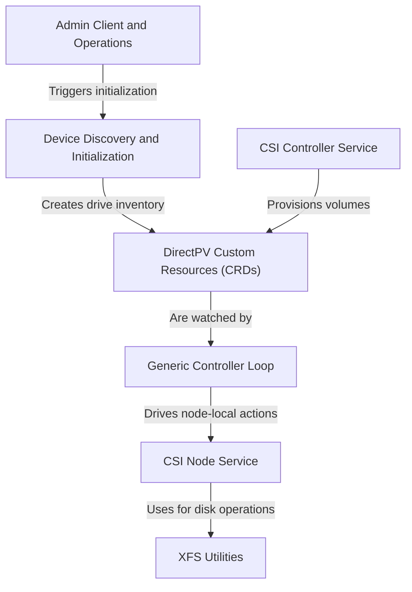

# Tutorial: directpv

DirectPV is a storage solution for Kubernetes that lets you use *local disks* on cluster nodes for persistent storage. It works by introducing new Kubernetes resources, called **Custom Resource Definitions (CRDs)**, to represent physical drives and logical volumes. An automated *controller* system watches these resources, and when a user requests storage, it finds a suitable disk, formats it with the **XFS filesystem**, and makes it available to applications. All management is done through a `kubectl` plugin, giving administrators full control.

**Source Repository:** [None](None)

## Chapters

1. [Admin Client and Operations
](01_admin_client_and_operations_.md)
2. [Device Discovery and Initialization
](02_device_discovery_and_initialization_.md)
3. [DirectPV Custom Resources (CRDs)
](03_directpv_custom_resources__crds__.md)
4. [CSI Controller Service
](04_csi_controller_service_.md)
5. [Generic Controller Loop
](05_generic_controller_loop_.md)
6. [CSI Node Service
](06_csi_node_service_.md)
7. [XFS Utilities
](07_xfs_utilities_.md)

---

Generated by [AI Codebase Knowledge Builder](https://github.com/The-Pocket/Tutorial-Codebase-Knowledge)