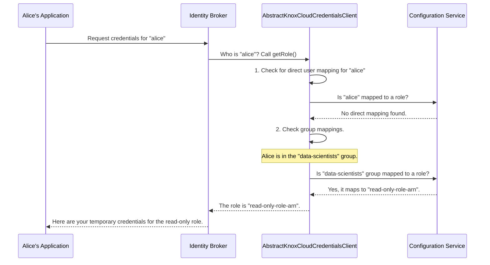

# Chapter 1: User-to-Role Mapping Logic

Welcome to the `gateway-service-idbroker` project! If you've ever wondered how a system securely decides who gets access to what in the cloud, you've come to the right place. This service acts as a smart security guard, and in this first chapter, we're going to explore its brain.

### The Problem: Who Gets the Keys?

Imagine you're building a platform that uses a cloud service like Amazon S3 for storing data. You have two types of users:
*   **Data Scientists**, who only need to *read* data for analysis.
*   **Data Engineers**, who need to *read and write* data to maintain the pipelines.

When a user like Alice (a Data Scientist) requests access, how does the system know to give her the "read-only" key and not the "read-write" key? Manually managing this is slow and prone to errors. We need an automated and secure way to map a user's identity to the correct set of permissions.

This is exactly the problem our **User-to-Role Mapping Logic** solves.

### The "HR Directory" Analogy

Think of this logic as a company's HR directory. The directory knows your name (your user identity) and your department (your group membership). Based on that information, it can instantly tell anyone your official job title (your "role") and the access level that comes with it.

Our mapping logic does the same thing: it takes an authenticated user and their groups, consults a set of rules, and resolves them to a specific cloud role, like an AWS IAM Role ARN (Amazon Resource Name). This role is the "key" that grants specific permissions in the cloud.

The core of this logic lives in a special Java class called `AbstractKnoxCloudCredentialsClient`. This class is the blueprint for how these decisions are made.

### The Rules of the Game

The mapping logic follows a clear and strict order of operations to determine a user's role. It's like a flowchart for making a decision.

1.  **Direct User Mapping (The VIP Pass):** Is this specific user mapped directly to a role? This is the most specific and highest priority rule.
2.  **Group Mapping (The Team Pass):** If there's no direct user mapping, what groups does the user belong to? Do any of those groups map to a role?
3.  **Default Group Mapping (The Fallback Plan):** For some users, you can define a "default group." If other checks don't yield a result, the system will check this default.
4.  **Ambiguity Resolution (Safety First!):** What if a user belongs to two groups that map to *different* roles? The system considers this ambiguous. To prevent accidentally giving away too much access, it will deny the request.

Let's see how this works for our Data Scientist, Alice.

### A Step-by-Step Walkthrough

When Alice, a member of the `data-scientists` group, requests credentials, here's what happens under the hood.



The diagram shows a clear, predictable process. The logic first checks for the most specific rule (a direct user mapping) and then moves to more general rules (group mappings).

### A Glimpse into the Code

This decision-making process is orchestrated by the `getRole` method in `AbstractKnoxCloudCredentialsClient.java`. Let's look at a simplified version of it.

```java
// File: src/main/java/org/apache/knox/gateway/service/idbroker/AbstractKnoxCloudCredentialsClient.java

protected String getRole(String roleType, String id) {
    String role = null;

    // Based on the request, decide which mapping to check first.
    switch (roleType) {
      // ... cases for specific user or group requests ...
      default:
        // 1. First, try to find a role mapped directly to the user.
        role = getUserRole(false);
        if (role == null) {
          // 2. If not found, try to find a role based on the user's groups.
          role = getGroupRole(id);
        }
    }
    // ...
}
```
This code shows the priority: it first calls `getUserRole`, and only if that returns nothing does it proceed to call `getGroupRole`.

#### Checking for a User Role

The `getUserRole` method is very straightforward. It simply gets the current user's name and looks it up in the configuration.

```java
// File: src/main/java/org/apache/knox/gateway/service/idbroker/AbstractKnoxCloudCredentialsClient.java

protected String getUserRole(final boolean logFailure) {
    // ... get the subject (user information) ...
    String username = getEffectiveUserName(subject);

    // Look up the username in the configuration.
    String role = getConfigProvider().getConfig().getUserRole(username);
    // ...
    return role;
}
```
*   **Input:** The current user's identity (e.g., "alice").
*   **Output:** A role string (e.g., `"special-admin-role-arn"`) if a mapping exists, or `null` if it doesn't.

#### Resolving a Group Role and Handling Ambiguity

The `getGroupRole` method is where the real magic happens, including the safety check for ambiguity.

```java
// File: src/main/java/org/apache/knox/gateway/service/idbroker/AbstractKnoxCloudCredentialsClient.java

protected String getGroupRole(String groupId, boolean logFailure) {
    // ... logic to check for a default group first ...

    // If no default, check all of the user's groups.
    Set<String> mappedRoles = new HashSet<>();
    for (String group : groups) { // 'groups' contains all groups for the user
        String mappedRole = conf.getGroupRole(group);
        if (mappedRole != null) {
            mappedRoles.add(mappedRole);
        }
    }

    // Now, check how many roles we found.
    if (mappedRoles.size() == 1) {
        return mappedRoles.stream().findFirst().get(); // Perfect, exactly one role!
    } else if (mappedRoles.size() > 1) {
        // Uh oh, more than one role. This is ambiguous! Deny the request for safety.
        throw new WebApplicationException(ERR_AMBIGUOUS_GROUP_MAPPINGS, /* ... */);
    }
    // ...
}
```
This snippet demonstrates the core safety feature.
1.  It iterates through all of the user's groups (e.g., `data-scientists`, `project-x-admins`).
2.  For each group, it finds the corresponding role and adds it to a `Set`. A `Set` automatically handles duplicates, so if two groups map to the same role, it's only stored once.
3.  Finally, it checks the size of the set.
    *   If `size == 1`, we have a clear, unambiguous winner. That role is returned.
    *   If `size > 1`, it's an ambiguous situation, and the process stops with an error.

### Conclusion

You've just learned about the brain of the `gateway-service-idbroker`! The **User-to-Role Mapping Logic**, implemented in `AbstractKnoxCloudCredentialsClient`, provides a secure and predictable system for determining what cloud permissions a user should receive. It follows a strict set of rules, prioritizing specific mappings over general ones and, most importantly, failing safely when faced with ambiguity.

But where do these rules—like "`data-scientists` maps to `read-only-role-arn`"—actually come from? The mapping logic needs a rulebook to consult. In our next chapter, we'll dive into the [Configuration Service](02_configuration_service_.md), which acts as that very rulebook.

---

Generated by [AI Codebase Knowledge Builder](https://github.com/The-Pocket/Tutorial-Codebase-Knowledge)