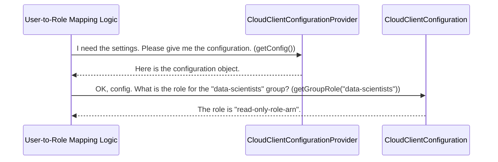

# Chapter 2: Configuration Service

In the [previous chapter on User-to-Role Mapping Logic](01_user_to_role_mapping_logic_.md), we saw how the service acts like a smart security guard, deciding which role to assign to a user. But a guard needs a rulebook to know who's on the VIP list and who gets a standard pass. Where do the rules, like "`data-scientists` maps to `read-only-role-arn`," actually come from?

This is where the **Configuration Service** comes in. It's the official, centralized rulebook for the entire Identity Broker.

### The Problem: Where Do We Store the Settings?

Imagine you're building a robot. You could solder every instruction directly onto its circuit boards. But what happens when you want to change its behavior? You'd have to take it apart and re-solder everything. That's slow and risky.

A much better approach is to store the robot's settings—like its primary mission or the list of authorized users—on a separate memory card. The robot's main logic simply reads from this card. Now, to update its behavior, you just swap the memory card.

The Configuration Service is our "memory card." It provides a clean, consistent way for other parts of the service to access settings without knowing the messy details of where or how those settings are stored.

### The Two Key Components

The Configuration Service is made up of two main parts that work together:

1.  **The "What": `CloudClientConfiguration`**
    This is an interface—a contract that defines *what* settings you can ask for. It has simple methods like `getUserRole(String user)` and `getGroupRole(String group)`. It's like the menu at a restaurant; it tells you what you can order, but not how the kitchen makes it.

2.  **The "How": `CloudClientConfigurationProvider`**
    This is the component that reads the actual settings (from a file, a database, etc.) and provides the `CloudClientConfiguration` object. It's the "chef" who reads the recipe book and prepares the meal you ordered from the menu.

### A Step-by-Step Walkthrough

Let's revisit our User-to-Role Mapping Logic from Chapter 1. When it needs to find a role for a group, it doesn't open a file itself. Instead, it follows a clean, decoupled process using the Configuration Service.



This separation is powerful. The `MappingLogic` doesn't care if the settings are stored in a simple text file or a complex database. It just knows how to ask for what it needs, and the `ConfigProvider` handles the rest.

### A Glimpse into the Code

Let's look at the "menu" first. The `CloudClientConfiguration` interface clearly defines the questions we can ask.

```java
// File: src/main/java/org/apache/knox/gateway/service/idbroker/CloudClientConfiguration.java

public interface CloudClientConfiguration {
  /**
   * Get the role mapped for the specified user identifier
   */
  String getUserRole(String user);

  /**
   * Get the role mapped for the specified group identifier
   */
  String getGroupRole(String group);

  // ... other methods for getting settings ...
}
```
This is the simple, clean interface that the rest of the application uses. Notice how it directly corresponds to the questions our mapping logic needed to ask in Chapter 1.

Now, let's peek inside the default "chef," `DefaultCloudClientConfiguration`. This class is responsible for actually finding the settings. It expects the mappings to be defined as key-value pairs.

For example, a configuration file might contain a line like this:
`idbroker.aws.group.role.mapping = data-scientists=read-only-role-arn;data-engineers=read-write-role-arn`

The `getGroupRole` method then finds and parses this line to get the answer.

```java
// File: src/main/java/org/apache/knox/gateway/service/idbroker/DefaultCloudClientConfiguration.java

public class DefaultCloudClientConfiguration implements CloudClientConfiguration {
  // ... other fields and methods ...

  @Override
  public String getGroupRole(String group) {
    // 1. Get the full mapping string from properties.
    String groupRoleMapping = getProperty("...group.role.mapping");

    // 2. Parse the string into key-value pairs.
    Properties groupMappings = stringToProperty(groupRoleMapping);

    // 3. Look up the specific group in the parsed properties.
    return groupMappings.getProperty(group);
  }
  // ...
}
```
This simplified code shows the three main steps:
1.  It fetches the long string of all group-to-role mappings.
2.  It uses a helper function to turn that string (e.g., `"group1=role1;group2=role2"`) into an easy-to-use map.
3.  It looks up the exact group (e.g., `"data-scientists"`) in that map to find the associated role.

This design means that if we ever want to change how we store our configuration (for example, move it to a secure vault), we only need to create a new implementation of `CloudClientConfigurationProvider`. The rest of the application, including the mapping logic, doesn't need to change at all!

### Conclusion

You've now seen the "rulebook" of our Identity Broker! The **Configuration Service** is a crucial abstraction that separates the application's logic from its settings.

*   It uses the **`CloudClientConfiguration`** interface as a clean "menu" of available settings.
*   It uses a **`CloudClientConfigurationProvider`** as the "chef" who knows how to prepare those settings.

This makes our system flexible, maintainable, and much easier to manage.

We now understand how a user is mapped to a role and where those mapping rules are stored. But a role can grant very broad permissions. What if we want to grant access that is temporary and limited to only the *specific* resources a user needs *right now*? In our next chapter, we'll explore exactly that with [Session Policy Scoping](03_session_policy_scoping_.md).

---

Generated by [AI Codebase Knowledge Builder](https://github.com/The-Pocket/Tutorial-Codebase-Knowledge)