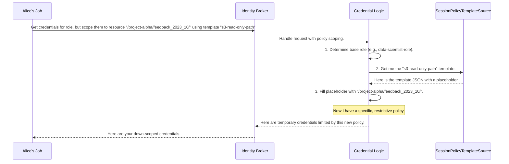

# Chapter 3: Session Policy Scoping

In the [previous chapter on the Configuration Service](02_configuration_service_.md), we learned how the Identity Broker uses a "rulebook" to map users to roles, like assigning the `data-scientist-role` to Alice. This role acts as a master key, granting her broad access—for example, read access to an entire data lake.

But what if a specific task only needs access to a single file or folder? Giving a temporary script a master key to the whole building is risky. What if we could issue a key that only works on a single door, and only for the next hour?

This is the exact problem that **Session Policy Scoping** solves.

### The Problem: The Overly Powerful Key

Let's imagine our Data Scientist, Alice, is running a job to analyze customer feedback from last month. This data is stored in a specific folder: `s3://company-data/project-alpha/feedback_2023_10/`.

Her `data-scientist-role` gives her read access to the entire `s3://company-data/` bucket, which includes data from many other projects. If the credentials for her job were to leak, they could be used to access far more data than necessary. This violates a core security principle: the **Principle of Least Privilege**, which states that you should only grant the bare minimum permissions required to perform a task.

We need a way to create temporary credentials that are "scoped down" to *only* allow access to the `feedback_2023_10` folder.

### The "Single-Door Access Card" Analogy

Session Policy Scoping is like getting a temporary access card for a large office building. Your main employee badge (your **Role**) can open many doors. But for a specific meeting, a receptionist gives you a temporary card that is programmed to *only* open the one conference room you need, and it expires in an hour.

Our Identity Broker can do the same thing. It takes the user's powerful base role and applies an additional, temporary, and much more restrictive "session policy." The final credentials combine the permissions of the role but are limited by the session policy.

### The Key Components

To make this work, we need two things:

1.  **A Policy Template:** This is a pre-written permission document with a blank space in it. It's like a Mad Libs for security policies. For example, a template might say: "Allow reading from the S3 path `____`."
2.  **A `SessionPolicyTemplateSource`:** This is the "filing cabinet" that stores all our policy templates. When a request comes in asking for the "s3-read-only" template, this component is responsible for finding and providing it.

### A Step-by-Step Walkthrough

When Alice's job starts, it now makes a more specific request to the Identity Broker. It doesn't just ask for credentials; it asks for credentials restricted to a specific resource using a specific template.



The job now receives credentials that can *only* read from that one specific folder, even though the base role was much more powerful. If these credentials leak, the potential damage is drastically reduced.

### A Glimpse into the Code

Let's see what these components look like in the code.

#### 1. The Policy Template File

A policy template is just a simple text file, usually in JSON format. It's stored where the Identity Broker can find it. Imagine a file named `s3-read-only-path.json`:

```json
{
  "Version": "2012-10-17",
  "Statement": [
    {
      "Effect": "Allow",
      "Action": ["s3:GetObject"],
      "Resource": "arn:aws:s3:::company-data__RESOURCE_PATH__"
    }
  ]
}
```

This is a standard AWS IAM policy. The magic is the `__RESOURCE_PATH__` placeholder. Our service will replace this with the path requested by the client.

#### 2. The Template "Filing Cabinet"

The `SessionPolicyTemplateSource` interface defines how we get these templates. It's a very simple contract.

```java
// File: src/main/java/org/apache/knox/gateway/service/idbroker/SessionPolicyTemplateSource.java

public interface SessionPolicyTemplateSource {
    /**
     * @param name The name of the policy template
     * @return The policy template contents.
     */
    String getPolicyTemplate(String name);
}
```

*   **Input:** The name of a template, like `"s3-read-only-path"`.
*   **Output:** The contents of the corresponding file as a string.

A common implementation, `FilePolicyTemplateSource`, simply looks for a file named `name.json` in a configured directory.

```java
// File: src/main/java/org/apache/knox/gateway/service/idbroker/FilePolicyTemplateSource.java

public class FilePolicyTemplateSource implements SessionPolicyTemplateSource {
    // ... fields for the template directory ...

    @Override
    public String getPolicyTemplate(final String name) {
        // Compute if absent is a smart way to load the file once and cache it.
        return templateCache.computeIfAbsent(name, t -> loadTemplate(name));
    }

    private String loadTemplate(final String name) {
        // ... logic to read the file 'name + ".json"' from the template directory ...
    }
}
```
This code shows how it finds the template on disk. The rest of the application doesn't need to know about files or paths; it just asks the `SessionPolicyTemplateSource` for a template by name.

#### 3. Putting It All Together

Finally, let's look at how the `AbstractKnoxCloudCredentialsClient` from Chapter 1 uses this. It has a method to get the final, filled-in policy.

```java
// File: src/main/java/org/apache/knox/gateway/service/idbroker/AbstractKnoxCloudCredentialsClient.java

protected String getSessionPolicy(final String policyRef, final String resource) {
    String sessionPolicy = null;
    if (sessionPolicyTemplateSource != null) {
      // 1. Get the template by its reference name.
      String template = sessionPolicyTemplateSource.getPolicyTemplate(policyRef);
      if (template != null) {
        // 2. Fill in the template with the specific resource.
        sessionPolicy = generateSessionPolicy(template, resource);
      }
    }
    return sessionPolicy;
}
```
This method orchestrates the whole process:
1.  It asks the `sessionPolicyTemplateSource` for the template (e.g., `"s3-read-only-path"`).
2.  If the template is found, it calls a helper (`generateSessionPolicy`) to do the simple string replacement of the placeholder with the actual resource path (e.g., `"/project-alpha/feedback_2023_10/"`).

The resulting `sessionPolicy` string is then sent along with the main role assumption request to the cloud provider, ensuring the returned credentials are appropriately restricted.

### Conclusion

You've just learned about one of the most powerful security features in the `gateway-service-idbroker`: **Session Policy Scoping**. By applying temporary, fine-grained policies on top of broader roles, we can dramatically enhance security and adhere to the Principle of Least Privilege.

*   **Policy Templates** act as reusable permission blueprints.
*   The **`SessionPolicyTemplateSource`** provides a clean way to manage and retrieve these templates.
*   The core logic dynamically generates a specific policy for each request, ensuring credentials have the minimum necessary power.

So far, we've explored the internal logic for mapping users, reading configuration, and scoping policies. But how does an external application actually talk to our service? In the next chapter, we'll look at the front door: the [Identity Broker API Endpoint](04_identity_broker_api_endpoint_.md).

---

Generated by [AI Codebase Knowledge Builder](https://github.com/The-Pocket/Tutorial-Codebase-Knowledge)