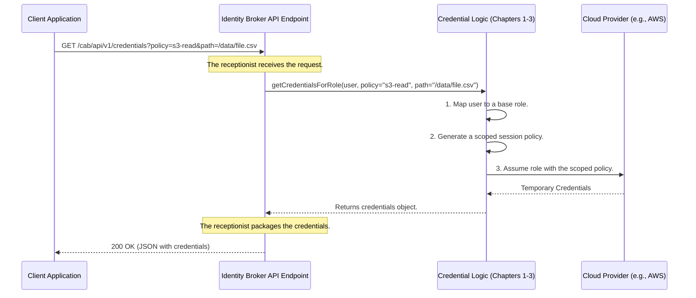

# Chapter 4: Identity Broker API Endpoint

In our previous chapters, we've built up the internal "brain" of our service. We know how to map a user to a role with the [User-to-Role Mapping Logic](01_user_to_role_mapping_logic_.md), how to look up the rules in the [Configuration Service](02_configuration_service_.md), and how to create super-secure, limited-access credentials using [Session Policy Scoping](03_session_policy_scoping_.md).

But all this amazing logic is currently locked inside our application. How does a client application—like a data processing job—actually knock on the door and ask for credentials? We need a public-facing front door, and that's exactly what the **Identity Broker API Endpoint** is.

### The Problem: How Do We Talk to the Service?

Imagine you've built the world's most secure bank vault. The internal mechanisms are perfect. But if there's no front door, no one can get in to make a deposit or withdrawal. You need a teller window—a standardized, secure place for customers to make requests.

Similarly, our internal credential-generating logic needs a well-defined way for external clients to communicate with it over the network. We can't just let them call our Java code directly. We need a web API that listens for HTTP requests and provides responses in a predictable format, like JSON.

### The "Receptionist" Analogy

Think of the API Endpoint as the receptionist at a highly secure corporate headquarters.
*   **A Visitor Arrives (Client Request):** An application sends an HTTP request, like `GET /credentials`. This is the visitor arriving at the front desk.
*   **The Receptionist Greets Them (The Endpoint Logic):** The API Endpoint code receives this request. It doesn't know how to approve access itself.
*   **Checking the Request Form (Parsing the URL):** The receptionist looks at the visitor's request form (the URL and its parameters) to understand what they want. For example, "I'm here for the `data-scientist-role` and need access to the `/project-alpha/` folder."
*   **Calling the Right Department (Delegating to Core Logic):** The receptionist uses an internal phone to call the security department (our credential logic from the previous chapters). It passes along the visitor's request.
*   **Receiving the Access Badge (Getting a Response):** The security department processes the request and sends back a temporary access badge (the cloud credentials).
*   **Handing Over the Badge (Sending the HTTP Response):** The receptionist takes the credentials, puts them in a standard envelope (formats them as JSON), and hands them to the visitor.

The receptionist's job is to manage the public-facing interaction and route requests, not to make the core security decisions. Our API Endpoint does exactly the same.

### A Step-by-Step Walkthrough

Let's see this in action. A client application needs credentials to read a specific file from a cloud bucket.



As you can see, the `APIEndpoint` is the entry point. It parses the incoming web request and translates it into a call to the `CoreLogic`. It then takes the result from the core logic and translates it back into a web response.

### A Glimpse into the Code

This "receptionist" is a Java class named `IdentityBrokerResource`, which uses standard JAX-RS annotations to define itself as a web endpoint.

```java
// File: src/main/java/org/apache/knox/gateway/service/idbroker/IdentityBrokerResource.java

@Path("/cab/api/v1") // This class handles all requests to this base path.
public class IdentityBrokerResource {
  // ... member variables ...

  @GET // This method handles HTTP GET requests.
  @Produces({APPLICATION_JSON}) // It will produce a JSON response.
  @Path("credentials") // It specifically handles GET /cab/api/v1/credentials
  public Response getCredentials(
      @QueryParam("path") String path,
      @QueryParam("policy") String policyRef) {
    // This is the core delegation!
    return getCredentialsResponse("", null, path, policyRef);
  }

  // ... other methods for different paths ...
}
```

Let's break down these annotations:
*   `@Path("/cab/api/v1")`: This tells the web server that any URL starting with this path should be handled by this class.
*   `@GET`: This marks the `getCredentials` method to handle `GET` requests.
*   `@Produces({APPLICATION_JSON})`: This promises that the response will be in JSON format.
*   `@Path("credentials")`: This maps the method to the `credentials` part of the URL.
*   `@QueryParam(...)`: These annotations automatically extract values from the URL's query string (the part after the `?`) and pass them as arguments to our Java method.

The most important line is `return getCredentialsResponse(...)`. This shows the delegation in action. The endpoint method itself is very simple; it just collects the information from the HTTP request and passes it to a helper method that does the real work of calling the internal logic.

### Dissecting the API Request

The API provides a few different "doors" depending on what the client is asking for.

*   `GET /credentials`
    This is the most common endpoint. The service uses the [User-to-Role Mapping Logic](01_user_to_role_mapping_logic_.md) to figure out the right role for the current user automatically.

*   `GET /credentials/group/{id}`
    This allows a client to explicitly request credentials for a role mapped to a specific group, for example `.../group/data-engineers`.

*   `GET /credentials/role/{id}`
    This allows a client to request credentials for an exact role ARN, bypassing the mapping logic. This is useful for trusted applications that already know precisely which role they need.

All these endpoints can also accept two very important query parameters that connect directly to our [Session Policy Scoping](03_session_policy_scoping_.md) logic from Chapter 3:
*   `?policy=<template_name>`: The name of the policy template to use (e.g., `s3-read-only-path`).
*   `?path=<resource_path>`: The resource path to fill into the template's placeholder (e.g., `/project-alpha/data.csv`).

### The Internal Dispatcher

Inside `IdentityBrokerResource`, a private helper method acts as a central dispatcher and error handler. It's the one that actually calls the core logic.

```java
// File: src/main/java/org/apache/knox/gateway/service/idbroker/IdentityBrokerResource.java

private Response getCredentialsResponse(final String roleType, final String id,
                                      final String path, final String policyRef) {
  try {
    // 1. Call the internal logic to get the credentials.
    Object responseObject = credentialsClient.getCredentialsForRole(roleType, id, path, policyRef);

    // 2. If it succeeds, wrap the result in a successful HTTP 200 OK response.
    return Response.ok().entity(responseObject.toString()).build();

  } catch (Exception e) {
    // 3. If anything goes wrong, catch the error and return a server error response.
    log.exception(e);
    return Response.serverError().entity("Could not acquire credentials").build();
  }
}
```
This simplified snippet shows the clear separation of concerns:
1.  It calls `credentialsClient.getCredentialsForRole(...)`, which contains all the complex logic we've discussed in previous chapters.
2.  If that call is successful, it builds a standard `200 OK` web response.
3.  If any part of the internal logic fails (e.g., ambiguous group mapping), it catches the exception and returns a helpful error response to the client, preventing the service from crashing.

### Conclusion

You've now met the public face of the `gateway-service-idbroker`! The **Identity Broker API Endpoint**, implemented in `IdentityBrokerResource.java`, is the crucial layer that exposes our powerful internal logic to the outside world.

*   It acts as a **receptionist**, providing a standard HTTP/JSON interface for clients.
*   It uses **JAX-RS annotations** (`@Path`, `@GET`, `@QueryParam`) to define the API structure.
*   It **delegates** all the hard work to the internal credential logic, keeping the endpoint code simple and focused on web communication.

We've seen how the endpoint calls a `credentialsClient` to do its work. But what if we want to support different cloud providers, like AWS, Azure, or Google Cloud? Each one has a completely different way of generating credentials. How does the service know which specific client logic to use? We'll uncover this pluggable architecture in our next chapter on the [Client Plugin Manager](05_client_plugin_manager_.md).

---

Generated by [AI Codebase Knowledge Builder](https://github.com/The-Pocket/Tutorial-Codebase-Knowledge)