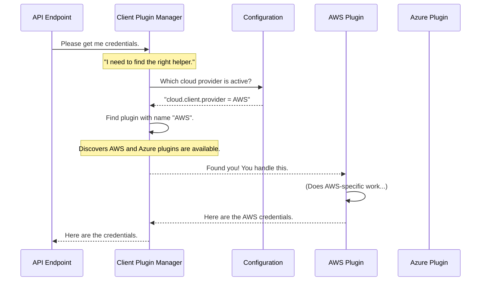

# Chapter 5: Client Plugin Manager

In the [previous chapter on the Identity Broker API Endpoint](04_identity_broker_api_endpoint_.md), we built the public-facing "front door" for our service. We saw how the API endpoint takes a web request and calls an internal `credentialsClient` to do the heavy lifting.

But this raises a crucial question: What if our platform needs to work with Amazon Web Services (AWS) today, Microsoft Azure tomorrow, and Google Cloud next month? Each cloud provider has a completely different API for generating temporary credentials. How can our service be flexible enough to support all of them without being completely rewritten each time?

This is the problem the **Client Plugin Manager** solves. It's the component that makes our service a "polyglot"—able to speak the language of any cloud provider.

### The "Universal Remote Control" Analogy

Think of the Client Plugin Manager as a high-tech universal remote control. A universal remote can control your TV, your DVD player, and your sound system, even though they are all made by different companies and speak different infrared "languages."

How does it work?
1.  **You configure it:** You tell the remote, "I have a Sony TV."
2.  **You press a button:** You press the "Power" button.
3.  **It does the magic:** The remote's internal logic knows, "Ah, the user is talking to the Sony TV right now," and it sends the correct power-on signal for a Sony TV. If you had selected the DVD player, it would have sent a completely different signal.

Our `KnoxCloudCredentialsClientManager` works exactly the same way.
*   **Configuration:** You specify `cloud.client.provider = AWS` in the settings.
*   **API Call:** The [Identity Broker API Endpoint](04_identity_broker_api_endpoint_.md) asks for credentials.
*   **Magic:** The manager reads the configuration, sees "AWS," and dynamically loads the special "AWS plugin" to handle the request. If you changed the configuration to "ADLS2," it would load the Azure plugin instead, without any code changes.

### How It Works: Manager and Delegates

The plugin system has two main parts:

1.  **The Manager (`KnoxCloudCredentialsClientManager`):** This is the "universal remote" itself. The rest of the application only ever talks to the manager. It doesn't know or care which cloud is currently active.
2.  **The Delegates (`KnoxCloudCredentialsClient` implementations):** These are the individual "language modules" or plugins for each cloud provider (e.g., one for AWS, one for Azure). The manager's only job is to pick the right delegate and pass the request on to it.

### A Step-by-Step Walkthrough

Let's trace how a request flows through this system when the service is configured to use AWS.


The diagram shows that the `APIEndpoint` is completely isolated from the details of AWS. It just talks to the `Manager`. The `Manager` acts as a smart dispatcher, using the configuration to route the request to the correct specialist plugin. The `AzureDelegate` is available but is never even touched.

### A Glimpse into the Code

So how does the manager dynamically find and load these plugins? It uses a standard Java feature called `ServiceLoader`.

#### The Manager's Initialization

When the service starts up, the `init` method of the `KnoxCloudCredentialsClientManager` is called. This is where it consults the configuration and loads the correct delegate for the entire lifetime of the service.

```java
// File: src/main/java/org/apache/knox/gateway/service/idbroker/KnoxCloudCredentialsClientManager.java

@Override
public void init(CloudClientConfigurationProvider configProvider) {
  try {
    // 1. Ask the config for the name of the active cloud provider.
    String providerName = configProvider.getConfig().getProperty(CLOUD_CLIENT_PROVIDER);

    // 2. Load the delegate plugin with that name.
    delegate = loadDelegate(providerName);
    delegate.init(configProvider); // Initialize the chosen plugin.
  } catch (Exception e) {
    // ... handle errors ...
  }
}
```
This is the "setup" phase of our universal remote.
1.  It gets the provider name (e.g., `"AWS"`) from the [Configuration Service](02_configuration_service_.md).
2.  It calls the magical `loadDelegate` method to find and instantiate the right plugin.
3.  It stores this plugin in a private `delegate` field, ready to be used.

#### Loading the Delegate with `ServiceLoader`

The `loadDelegate` method is the heart of the plugin system. It uses Java's `ServiceLoader` to discover all available implementations of `KnoxCloudCredentialsClient`.

```java
// File: src/main/java/org/apache/knox/gateway/service/idbroker/KnoxCloudCredentialsClientManager.java

public KnoxCloudCredentialsClient loadDelegate(String name) throws IdentityBrokerConfigException {
  KnoxCloudCredentialsClient delegate = null;
  // 1. ServiceLoader finds all classes that implement our client interface.
  ServiceLoader<KnoxCloudCredentialsClient> loader = ServiceLoader.load(KnoxCloudCredentialsClient.class);

  // 2. Loop through all the plugins it found.
  for (KnoxCloudCredentialsClient client : loader) {
    // 3. If a plugin's name matches what we want, we've found our winner!
    if (name.equals(client.getName())) {
      delegate = client;
      break;
    }
  }
  return delegate;
}
```
This might look complex, but it's a very powerful pattern:
1.  `ServiceLoader.load(...)` is like asking Java, "Please scan the application and find every single plugin someone has created for `KnoxCloudCredentialsClient`."
2.  The code then iterates through the list of plugins it found.
3.  It asks each plugin, "What is your name?" (by calling `client.getName()`). If the name matches the one from our configuration (e.g., `"AWS"`), it selects that plugin and stops looking.

#### Delegating the Work

Once the `delegate` is loaded, the manager's job becomes incredibly simple. All of its methods just pass the call directly to the delegate. It's a pure pass-through.

```java
// File: src/main/java/org/apache/knox/gateway/service/idbroker/KnoxCloudCredentialsClientManager.java

@Override
public Object getCredentialsForRole(String role, String path, String policyRef) {
  // Just forward the call to the real worker plugin.
  return delegate.getCredentialsForRole(role, path, policyRef);
}

@Override
public void setConfigProvider(CloudClientConfigurationProvider configProvider) {
  // Just forward the call to the real worker plugin.
  delegate.setConfigProvider(configProvider);
}
```
This design is beautiful. The manager provides a single, stable entry point, while the actual logic for handling AWS, Azure, or any other cloud is neatly encapsulated in its own delegate class.

### Conclusion

You've just unlocked the secret to the `gateway-service-idbroker`'s flexibility! The **Client Plugin Manager** (`KnoxCloudCredentialsClientManager`) is a powerful dispatcher that makes the service extensible.

*   It acts as a **universal remote**, providing a single interface for the rest of the application.
*   It reads the configuration to determine which **delegate** (plugin) to use.
*   It uses Java's **`ServiceLoader`** to dynamically discover and load the correct plugin at runtime.

This plug-and-play architecture allows developers to add support for new cloud providers simply by creating a new delegate class, without ever touching the core service logic.

Now that we know how the manager finds the right plugin, what does one of these plugins actually do? In our next and final chapter, we'll dive into the implementation of a specific delegate and see how it communicates with a real cloud provider in [Cloud Credential Client](06_cloud_credential_client_.md).

---

Generated by [AI Codebase Knowledge Builder](https://github.com/The-Pocket/Tutorial-Codebase-Knowledge)