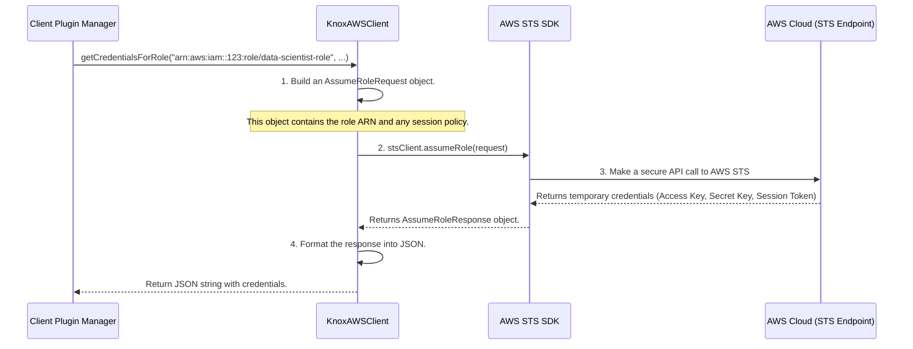

# Chapter 6: Cloud Credential Client

In the [previous chapter on the Client Plugin Manager](05_client_plugin_manager_.md), we discovered how our service acts like a universal remote, capable of finding the right "plugin" for any cloud provider, like AWS or Azure. The manager's job is to find the right helper and delegate the task.

But what exactly *is* one of these helpers? What rules must they follow to be a valid plugin? How do they actually talk to the cloud?

This is where we meet the **Cloud Credential Client**, the central contract for interacting with different cloud providers. It's the final, most important piece of the puzzle, where our service actually performs its core function: generating temporary cloud credentials.

### The Problem: Speaking Different Languages

Imagine you are building a system that needs to operate machinery from different manufacturers. One machine might have a "start" button, another might have an "engage" switch, and a third might have a "power_on" command. If your main control panel had to know the specific commands for every possible machine, it would become incredibly complex and brittle.

You need a standard. You decide that every machine you buy must have a simple, green, circular "Go" button. The machine's internal wiring can be as complex as it needs to be, but from the outside, the interaction is always the same: press the green button.

The `KnoxCloudCredentialsClient` interface is our "green Go button." It defines the standard contract that any cloud-specific implementation (like for AWS, Azure, or GCP) must follow to be used by the Identity Broker.

### The "Standard Electrical Plug" Analogy

This interface is like the standardized plug for an electrical outlet.
*   **The Wall Outlet:** This is our main Identity Broker system (including the [Client Plugin Manager](05_client_plugin_manager_.md)). It provides the power (the request for credentials).
*   **The Standard Plug:** This is the `KnoxCloudCredentialsClient` interface. It defines the shape and prongs—the methods every client *must* implement, like `getName()` and `getCredentialsForRole()`.
*   **The Appliance:** This is a specific cloud implementation, like `KnoxAWSClient`. It can be a simple toaster or a complex refrigerator internally, but to get power, it must have the standard plug.

This ensures the main system can work with any provider without needing to know its specific, internal details.

### A Glimpse into the Code: The Contract

The contract is a Java `interface`, which is a formal set of rules for a class. Let's look at a simplified version of `KnoxCloudCredentialsClient.java`.

```java
// File: src/main/java/org/apache/knox/gateway/service/idbroker/KnoxCloudCredentialsClient.java

public interface KnoxCloudCredentialsClient {
  /**
   * Returns the unique name of this cloud provider plugin, like "AWS" or "GCP".
   * This is how the Client Plugin Manager finds it.
   */
  String getName();

  /**
   * The main method: get temporary credentials for a specific role.
   * This is the "green Go button" we press.
   */
  Object getCredentialsForRole(String role, String path, String policyRef);

  // ... other helper methods ...
}
```
This interface is simple but powerful. It guarantees that any class implementing it will have:
1.  A `getName()` method, so the manager can identify it.
2.  A `getCredentialsForRole()` method, which is the universal command to generate credentials. The `Object` return type allows each client to return its own specific credential type.

### The Implementation: An Appliance with the Standard Plug

Now let's look at a specific "appliance": the `KnoxAWSClient`. This class *implements* our interface, meaning it provides the actual code for the methods defined in the contract.

```java
// File: src/main/java/org/apache/knox/gateway/service/idbroker/aws/KnoxAWSClient.java

// This class promises to follow the rules of KnoxCloudCredentialsClient.
public class KnoxAWSClient extends AbstractKnoxCloudCredentialsClient {
    private static final String NAME = "AWS";

    @Override
    public String getName() {
        // I identify myself as the "AWS" plugin.
        return NAME;
    }

    // ... more methods ...
}
```
This first snippet shows how the AWS client fulfills the `getName()` part of the contract. When the [Client Plugin Manager](05_client_plugin_manager_.md) is looking for the "AWS" plugin, this method allows it to be found.

### A Step-by-Step Walkthrough: Talking to the Cloud

So, what happens when `getCredentialsForRole()` is called on our `KnoxAWSClient`? This is where the client uses the AWS SDK (Software Development Kit) to talk directly to the AWS cloud.



This diagram shows the final step. The `KnoxAWSClient` acts as a translator, converting the internal request from our service into a real API call that the AWS cloud understands.

### Inside the `getCredentialsForRole` Logic

Let's look at a simplified version of the code that performs this translation.

```java
// File: src/main/java/org/apache/knox/gateway/service/idbroker/aws/KnoxAWSClient.java

private AssumeRoleResponse getAssumeRoleResult(String role, String sessionPolicy) {
    // 1. Build a request for the AWS Security Token Service (STS).
    AssumeRoleRequest request = AssumeRoleRequest.builder()
                                         .roleSessionName(generateRoleSessionName()) // A unique name for this session
                                         .roleArn(role)              // The role we want to assume
                                         .policy(sessionPolicy)      // Optional down-scoped policy
                                         .durationSeconds(tokenLifetime)
                                         .build();

    try {
        // 2. Use the AWS SDK to make the call to the cloud.
        AssumeRoleResponse result = getSTSClient().assumeRole(request);
        return result;
    } catch (StsException e) {
        // ... handle errors like "permission denied" from AWS ...
        throw new WebApplicationException("AWS denied the request", Response.Status.FORBIDDEN);
    }
}
```

This code is the heart of the AWS client:
1.  It creates an `AssumeRoleRequest` object using the official AWS SDK. This is the "envelope" containing our request. It includes the target `roleArn` and the `sessionPolicy` we learned about in [Chapter 3](03_session_policy_scoping_.md).
2.  It calls `getSTSClient().assumeRole(request)`. This single line makes a secure network call to AWS, asks it to generate temporary credentials, and waits for the response.

### Tying It All Together: The `AbstractKnoxCloudCredentialsClient`

You may have noticed that the `KnoxAWSClient` `extends AbstractKnoxCloudCredentialsClient`. This is a helper base class that contains all the common logic we learned about in [Chapter 1: User-to-Role Mapping Logic](01_user_to_role_mapping_logic_.md). By extending this class, the AWS, Azure, and GCP clients don't have to rewrite the same user-to-group mapping code. They get all that logic for free and can focus on their one special job: talking to their specific cloud provider.

### Conclusion

Congratulations! You've reached the end of our journey through the `gateway-service-idbroker`. You've now seen the final piece of the architecture: the **Cloud Credential Client**. This powerful contract, defined by the `KnoxCloudCredentialsClient` interface, is what makes the entire service pluggable and extensible.

*   The **interface** acts as a **standard contract**, ensuring every plugin speaks the same language.
*   **Implementations** like `KnoxAWSClient` contain the specific logic to talk to a real cloud provider using its native SDK.
*   A shared **abstract class** provides common logic, like user-to-role mapping, to all implementations.

From top to bottom, you now understand the entire flow:
1.  An application makes a request to the [Identity Broker API Endpoint](04_identity_broker_api_endpoint_.md).
2.  The API delegates to the [Client Plugin Manager](05_client_plugin_manager_.md).
3.  The manager uses the [Configuration Service](02_configuration_service_.md) to find and load the correct **Cloud Credential Client** plugin.
4.  The client plugin uses the [User-to-Role Mapping Logic](01_user_to_role_mapping_logic_.md) to determine the correct base role.
5.  If needed, it uses [Session Policy Scoping](03_session_policy_scoping_.md) to create a more restrictive, temporary policy.
6.  Finally, it makes a call to the cloud provider to generate and return the secure, temporary credentials.

You now have a complete mental model of how the `gateway-service-idbroker` works. Well done

---

Generated by [AI Codebase Knowledge Builder](https://github.com/The-Pocket/Tutorial-Codebase-Knowledge)